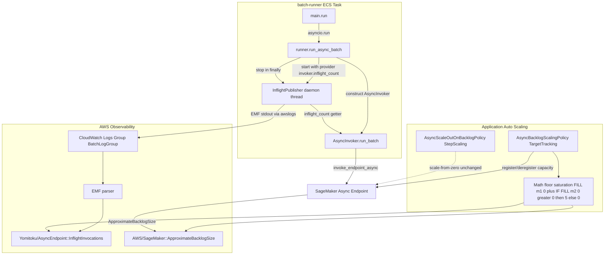
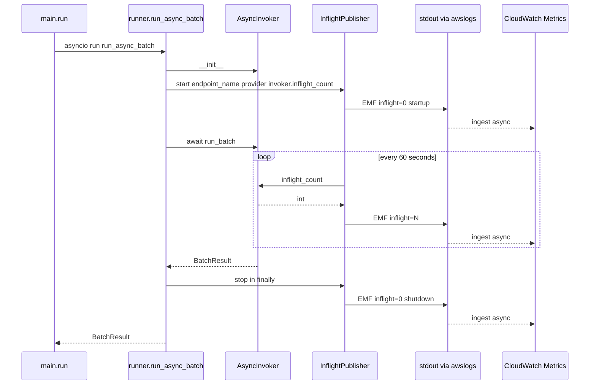
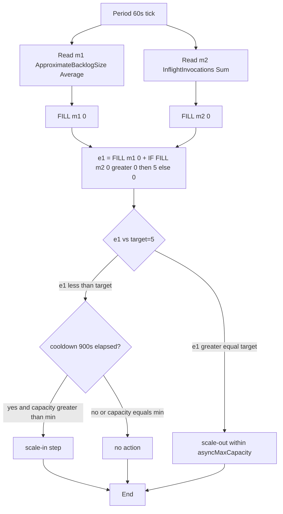
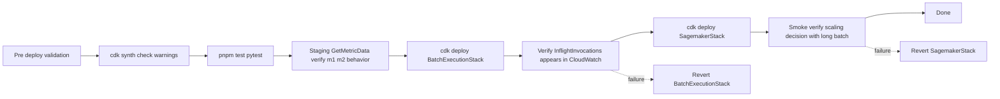

# Technical Design: async-endpoint-scale-in-protection

## Overview

**Purpose**: SageMaker Async Inference エンドポイントの Application Auto Scaling が処理中ジョブを抱えたままインスタンス数を 0 に縮退する事象を、batch-runner からの in-flight 数 CloudWatch カスタムメトリクス発信と TargetTracking ポリシーの metric math 式化によって抑止する。

**Users**: OCR バッチ利用者 (進捗停滞による体感的な不具合を解消) とインフラ運用者 (進捗停滞時の切り分け手順を獲得)。

**Impact**: `lib/sagemaker-stack.ts` の `AsyncBacklogScalingPolicy` の入力メトリクスを単一値から `(ApproximateBacklogSize + InflightInvocations)` の合算 math 式 (floor saturation 形式) へ変更する。`lambda/batch-runner` 配下に新モジュール `inflight_publisher.py` を追加し、`runner.run_async_batch` 内で `AsyncInvoker` 構築直後に起動・`run_batch` を `try/finally` で囲んだ `finally` 句で停止する。Fargate Task Role への IAM 追加は不要 (EMF 経由のため既存 awslogs パイプに乗る)。

### Goals

- 処理中ジョブが残る間 (CloudWatch 評価期間に in-flight 値が反映されている間) は scale-in 判定でインスタンス数 0 への縮退を発火させない
- batch-runner から in-flight 数を CloudWatch 標準のメトリクスとして可観測化し、進捗停滞の切り分けに使える状態を作る
- 既存の `HasBacklogWithoutCapacity` 連動 StepScaling、`scaleInCooldown=900`、`target=5`、`asyncMaxCapacity=1` のいずれも値変更しない
- `asyncMaxCapacity > 1` への将来拡張時にこの設計の前提が崩れることを、コードコメント + synth テスト + synth 警告の 3 段で検知可能にする

### Non-Goals

- `asyncMaxCapacity > 1` 環境での per-instance 化された scale-in 保護 (`batch-scale-out` spec の責務として残す)
- 本機能で発信するメトリクスのアラーム化・ダッシュボード化 (`MonitoringStack` 改修の責務)
- メトリクス発信前または取り込み遅延中に開始済みの scale-in アクションの取り消し (CloudWatch / Application Auto Scaling の到達整合性に委ねる)
- batch-runner の `max_concurrent`、`run_batch` 制御フロー、SQS ポーリング順序、`process_log.jsonl` レコード形式の変更
- `aws_embedded_metrics` Python ライブラリの依存追加 (本件規模では `json.dumps + print` の最小実装で十分)

## Boundary Commitments

### This Spec Owns

- `lib/sagemaker-stack.ts::AsyncBacklogScalingPolicy` の `customizedMetricSpecification` 構造 (単一メトリクスから metric math 式へ書き換える主体)
- `lambda/batch-runner/inflight_publisher.py` (新モジュール): in-flight 数の EMF 発信
- `lambda/batch-runner/async_invoker.py::AsyncInvoker.inflight_count()` (新規 read-only getter): publisher が `in_flight` dict を盗み見るのではなく、`AsyncInvoker` が公開する数値を参照する経路
- `lambda/batch-runner/runner.py::run_async_batch()` の orchestration 上で publisher 起動 / 停止フックを管理する責務 (publisher のライフタイムを `AsyncInvoker` の構築から `run_batch` 終了までに正確に揃える)
- `lib/sagemaker-stack.ts` および `lib/async-runtime-context.ts` 上の「`asyncMaxCapacity = 1` 前提」ガードコメントと、`bin/app.ts` の synth 警告 / `test/sagemaker-stack.test.ts` の固定 assertion
- in-flight メトリクスの解釈・障害切り分け手順を記載する Runbook (新規 `docs/runbooks/async-endpoint-scale-in-debug.md`)

### Out of Boundary

- 本機能のメトリクスを使った CloudWatch アラーム / ダッシュボードの新設 (`MonitoringStack` の責務)
- SageMaker Real-time エンドポイントへの適用 (本リポジトリは Async のみ)
- batch-runner の並列度 (`max_concurrent`)・SQS poll 順序・成果物形式の変更
- ECS タスク定義の logging ドライバ変更 (既存 awslogs を維持)
- メトリクス取り込み遅延中 / 開始済み scale-in の取り消し
- `asyncMaxCapacity > 1` 環境での scale-in 保護 (将来 spec 責務)

### Allowed Dependencies

- **Upstream**:
  - `lib/async-runtime-context.ts::AsyncRuntimeContext` (`asyncMaxCapacity` 等を read-only で参照)
  - `lib/processing-stack.ts` 既設の S3 Bucket (本機能では直接触らない、`SagemakerStack` props 経由のみ)
  - 既存の `AsyncScaleOutOnBacklogPolicy` / `AsyncHasBacklogWithoutCapacityAlarm` (scale-from-zero 経路、本機能で論理的に独立に維持)
- **Shared infrastructure**:
  - Fargate awslogs ドライバ + CloudWatch Logs Group (EMF 取り込み経路として再利用)
  - boto3 client (publisher 自身は EMF 経由のため CloudWatch boto3 client は使わない)
- **Constraint**:
  - publisher は `AsyncInvoker.inflight_count()` を read-only で呼ぶのみ。`in_flight` dict 自体は触らない
  - publisher 失敗は OCR バッチ本体の処理を中断しない (observability-only)
  - SagemakerStack の他の構造 (CfnEndpoint / SNS Topic / SQS Queue / StepScaling) は変更しない

### Revalidation Triggers

以下の変更は本 spec の前提が崩れるため、本 spec の design / tests を再評価する。

- `asyncMaxCapacity` を 2 以上に変更する CDK context 変更 (合算メトリクスが per-instance utilization と等価でなくなる)
- `AsyncBacklogScalingPolicy` の `targetValue` 変更 (合算スケールでの 5 という閾値の意味が変わる)
- `scaleInCooldown` / `scaleOutCooldown` の値変更 (publisher 周期や保証境界の Runbook 記述と整合確認が必要)
- batch-runner の logging ドライバ変更 (EMF 取り込み経路が壊れる)
- `lambda/batch-runner/async_invoker.py::AsyncInvoker` の `in_flight` 管理ロジックの構造変更 (`inflight_count()` getter の正しさが揺らぐ)
- 新たに `Yomitoku/AsyncEndpoint` ネームスペースに別メトリクスを足す変更 (Sum 集約・dimension 一意性が前提)

## Architecture

### Existing Architecture Analysis

- **Auto Scaling 構成**: `lib/sagemaker-stack.ts:391-487` に `CfnScalableTarget` (MinCapacity=0, MaxCapacity=`asyncMaxCapacity`)、`AsyncBacklogScalingPolicy` (TargetTracking, `ApproximateBacklogSizePerInstance` Average target=5)、`AsyncScaleOutOnBacklogPolicy` (StepScaling) + `AsyncHasBacklogWithoutCapacityAlarm` (scale-from-zero) の 3 つが束ねられている。本 spec は `AsyncBacklogScalingPolicy` のメトリクス入力のみを変更する
- **batch-runner 構造**: `main.py` がオーケストレータ、`register_heartbeat` / `delete_heartbeat` を非致命 try/except で囲む慣習が確立済 (`# noqa: BLE001 — ObservabilityOnly` マーカー)。本機能の publisher は同じ非致命扱いを踏襲しつつ、`AsyncInvoker` のライフサイクルに合わせて `runner.run_async_batch` 内に置く (`AsyncInvoker` 構築前には publisher も存在しないという責務の整合性を取るため)
- **logging 経路**: `LogDriver.awsLogs` で stdout/stderr を CloudWatch Logs に送出済。EMF 形式の JSON を stdout に書けば追加 IAM 不要でカスタムメトリクスとして取り込まれる
- **テスト基盤**: `test/sagemaker-stack.test.ts` の `Template.fromStack` + `hasResourceProperties` でメトリクス構造を assertion できる。`lambda/batch-runner/tests/test_main.py` は `monkeypatch.setattr(main_module, "register_heartbeat", ...)` で hook 順序を確認するパターンが既存

### Architecture Pattern & Boundary Map



**Architecture Integration**:

- **Selected pattern**: 既存 SagemakerStack を拡張する **In-place customization + sidecar publisher**。新 Stack / 新 Construct を切り出さず、`SagemakerStack` 内の `CfnScalingPolicy` プロパティだけを書き換える (research.md §3 Option C 準拠)
- **Domain boundaries**: publisher (Python observability) と ScalingPolicy (CDK Auto Scaling) は EMF というプロトコル経由でのみ結合し、コード上は無関係。これによりテストも独立に書ける
- **Existing patterns preserved**: `LogDriver.awsLogs` / `register_heartbeat` 非致命パターン / `addToTaskRolePolicy` Sid 列挙 / `Template.hasResourceProperties` 構造アサーションをすべて維持
- **New components rationale**: `inflight_publisher.py` は「メトリクス発信」という独立した関心事のため structure.md の「1 関心事 = 1 モジュール」に従い分離。`AsyncInvoker.inflight_count()` getter は read-only 公開に閉じることで `run_batch` 制御フローへの逆流を防ぐ
- **Steering compliance**: 1 AWS サービスドメイン = 1 Stack ルールを遵守 (SagemakerStack の中で完結)、`yomitoku:component=autoscaling` タグ戦略を維持

### Technology Stack

| Layer | Choice / Version | Role in Feature | Notes |
|-------|------------------|-----------------|-------|
| Backend / Runner | Python 3.12 (既存) | EMF publisher (`inflight_publisher.py`) と `AsyncInvoker.inflight_count()` getter | 標準ライブラリ `threading` / `json` / `time` のみ。新規 PyPI 依存なし |
| Messaging / Events | CloudWatch Embedded Metric Format (EMF) | runner stdout 経由でカスタムメトリクスを発信 | 取り込み遅延 10〜60 秒オーダー。`scaleInCooldown=900s` に対し十分小さい |
| Infrastructure | AWS CDK 2.x (既存) + `aws_applicationautoscaling.CfnScalingPolicy.TargetTrackingMetricDataQueryProperty` | metric math 式で `ApproximateBacklogSize` と `InflightInvocations` を合算 | CDK 同梱 (`node_modules/aws-cdk-lib/aws-applicationautoscaling/lib/applicationautoscaling.generated.d.ts:683` で型定義確認済) |
| Infrastructure / Annotations | `aws-cdk-lib/core::Annotations` | `asyncMaxCapacity > 1` 検知時の synth 警告 | 既存 codebase に同様の使用例なし、本件で初導入 |
| Testing | Vitest (CDK) + pytest (Python, 既存) | metric math 構造の synth assertion / publisher 単体 / orchestrator hook 順序 | 既存 fixture (`createStack`, monkeypatch hook recorder) を再利用 |
| Documentation | Markdown (既存 `docs/runbooks/`) | scale-in 切り分け Runbook 新規作成 | 既存 `sagemaker-async-cutover.md` のフォーマット (目的 → 適用範囲 → 手順) を踏襲 |

詳細な build-vs-adopt の判断 (EMF vs PutMetricData / `aws_embedded_metrics` ライブラリの不採用 / threading vs asyncio) は `research.md` Synthesis Outcomes 節に記録。

## File Structure Plan

### Modified Files

- `lib/sagemaker-stack.ts` — `AsyncBacklogScalingPolicy.targetTrackingScalingPolicyConfiguration.customizedMetricSpecification` を単一メトリクス構造から `metrics: [...]` (floor saturation 式) 構造に書き換え (`m1: Average`, `m2: Sum`, `e1: FILL(m1, 0) + IF(FILL(m2, 0) > 0, 5, 0)`)。`asyncMaxCapacity > 1` 前提崩れを警告するコメントとロジックを追加 (`Annotations.of(this).addWarning(...)`)。既存 `AsyncScaleOutOnBacklogPolicy` / `AsyncHasBacklogWithoutCapacityAlarm` / `CfnScalableTarget` は変更しない
- `lib/async-runtime-context.ts` — `asyncMaxCapacity` のドキュコメントに「2 以上にすると `async-endpoint-scale-in-protection` spec の前提が崩れる」旨を追記
- `lambda/batch-runner/runner.py` — `run_async_batch` 内で `AsyncInvoker` 構築直後に `InflightPublisher` を生成して `start()`、`invoker.run_batch(...)` 呼び出しを `try / finally` で囲み `finally` 句で `publisher.stop()` を呼ぶ
- `lambda/batch-runner/async_invoker.py` — `AsyncInvoker.__init__` で `self._in_flight: dict[str, str] = {}` を初期化、`run_batch` 内のローカル変数 `in_flight` をインスタンス属性 `self._in_flight` に昇格。`inflight_count(self) -> int` getter (1 行: `return len(self._in_flight)`) を追加
- `lambda/batch-runner/main.py` — 変更なし (publisher 責務は `runner.run_async_batch` に閉じる)
- `test/sagemaker-stack.test.ts` — `AsyncBacklogScalingPolicy` の assertion を新構造 (Metrics 配列 + floor saturation 式) にアップデート、`m1=Average` / `m2=Sum` / `e1.Expression` の固定 + `targetValue` と式中の閾値が同期する assertion + `MaxCapacity == 1` 前提テスト + `asyncMaxCapacity = 2` で synth 警告が出ることのテスト追加
- `lambda/batch-runner/tests/test_runner.py` — publisher 起動 / 停止順序、provider 直渡し、publisher 失敗時の継続性のテストを追加
- `lambda/batch-runner/tests/test_async_invoker.py` — `inflight_count()` getter の振る舞いテスト + `_in_flight` インスタンス属性化に伴う既存テストの調整
- `lambda/batch-runner/Dockerfile` — `inflight_publisher.py` を `COPY` 対象に追加
- `lambda/batch-runner/tests/test_dockerfile_completeness.py` — 新モジュール COPY の assertion 追加

### New Files

- `lambda/batch-runner/inflight_publisher.py` — EMF 発信 + 60 秒周期スケジューリング (約 100 行想定)
- `lambda/batch-runner/tests/test_inflight_publisher.py` — publisher 単体テスト (EMF 出力 / 周期 / 異常系)
- `docs/runbooks/async-endpoint-scale-in-debug.md` — 進捗停滞時の切り分け Runbook

### Directory Structure (touch points only)

```
lib/
├── async-runtime-context.ts                # MOD: ガードコメント追加
└── sagemaker-stack.ts                       # MOD: ScalingPolicy 書き換え + synth 警告
lambda/batch-runner/
├── async_invoker.py                         # MOD: _in_flight 属性化 + inflight_count() getter
├── inflight_publisher.py                    # NEW: EMF 発信モジュール
├── runner.py                                # MOD: publisher start/stop hook 挿入
├── main.py                                  # 変更なし
├── Dockerfile                               # MOD: COPY inflight_publisher.py
└── tests/
    ├── test_async_invoker.py                # MOD: inflight_count() / _in_flight テスト
    ├── test_inflight_publisher.py           # NEW: publisher 単体テスト
    ├── test_runner.py                       # MOD: publisher hook 順序 / provider 直渡し / 失敗継続
    └── test_dockerfile_completeness.py      # MOD: 新モジュール検証
test/
└── sagemaker-stack.test.ts                  # MOD: 新 ScalingPolicy 構造 assertion + MaxCapacity==1 固定
docs/runbooks/
└── async-endpoint-scale-in-debug.md         # NEW: 切り分け Runbook
```

## System Flows

### Publisher Lifecycle (batch-runner プロセス内)



**Decision notes**:
- Publisher の起動 / 停止責務は `runner.run_async_batch` 内に置く (Codex Finding 3 / 前 review Issue 1)。`AsyncInvoker` を生成した直後に `start`、`run_batch` を `try / finally` で囲み `finally` で `stop` を呼ぶ
- これにより `provider` callable は構築済 `invoker` インスタンスの `inflight_count` メソッドをそのまま渡せる (holder/closure 不要)
- `main.run` 側は publisher の存在を意識しない。`register_heartbeat` / `delete_heartbeat` の hook 配置は変更しない
- 起動時の 0 publish と shutdown 時の 0 publish はそれぞれ「現在値の宣言」(R2.2 / R2.3)。CloudWatch は過去 datapoint を上書きしないため、これらは新 datapoint を append するだけだが、`Sum` 集約下では「最後に publish された値が period に残り続ける」を防ぐ役割を持つ
- 周期 publish は `threading.Thread(daemon=True)` で実行。`run_batch` 完了 / 例外 / プロセス強制終了いずれの場合も `stop_publisher` で `Event.set()` → スレッドが next iteration で抜ける設計

### Auto Scaling Decision Flow (CloudWatch 評価期間における)



**Decision notes**:
- 式は `e1 = FILL(m1, 0) + IF(FILL(m2, 0) > 0, 5, 0)` の **floor saturation 形式**を採用する。**理由**: 単純な `m1 + m2` ではターゲット値 5 に対し inflight=1〜4 / backlog=0 の状態が target 未満となり scale-in 判定が成立してしまうため (Codex Finding 1)。`m2 > 0` の間は出力を target と同値以上に持ち上げて scale-in を確実に阻止しつつ、scale-out 側は `m1` の値が target を超えたときだけ反応するよう `m1` をそのまま加算する
- `m1` (`ApproximateBacklogSize`) の Stat は **`Average`** を採用する。AWS 公式 ([SageMaker Async monitoring](https://docs.aws.amazon.com/sagemaker/latest/dg/async-inference-monitor.html)) で SageMaker Async 系メトリクスがサポートする統計は `Average` / `Maximum` / `Minimum` のみで、`Sum` は受理されない。SageMaker は本メトリクスを 1 分粒度で publish しているため、Average も Maximum も同値になる (Average を採用)
- `m2` (`InflightInvocations`) の Stat は **`Sum`** を採用する。複数 batch-runner task が同一 `EndpointName` dimension に publish する前提で、period 内の合算が必要なため (`Average` だと task 数で割られて in-flight 総数が薄まる)
- `e1` は single time series を返し `ReturnData=true` を持つ唯一のクエリ。`m1` / `m2` の `ReturnData` は `false`
- 採用式の正確性は staging で `ApproximateBacklogSize` と `InflightInvocations` の実推移を `aws cloudwatch get-metric-data` で観測して確認したうえで本番投入する (Migration Strategy の Pre-flight に明記)
- `asyncMaxCapacity = 1` 前提下では `e1` を per-instance utilization と等価とみなして target=5 に揃える。capacity 引き上げ時はこの等価性が崩れる (Revalidation Trigger)
- scale-from-zero (`HasBacklogWithoutCapacity` StepScaling) はこの決定フローと独立に動く (capacity=0 のときは TargetTracking 自体が無効化されるため、この diagram には現れない)

## Requirements Traceability

| Requirement | Summary | Components | Interfaces | Flows |
|-------------|---------|------------|------------|-------|
| 1.1 | in-flight ≥ 1 が評価期間反映時に scale-in を防ぐ | `AsyncBacklogScalingPolicy` (math 式: floor saturation) / `InflightPublisher` | TargetTracking metric math (`m1 + IF(m2>0, target, 0)`) | Auto Scaling Decision Flow |
| 1.2 | backlog+inflight=0 + cooldown 経過で 0 縮退可 | `AsyncBacklogScalingPolicy` (math 式) | TargetTracking + 既存 `scaleInCooldown=900` | Auto Scaling Decision Flow |
| 1.3 | runner 異常終了時の値固着回避 | `InflightPublisher` (起動時 0 publish) / metric math (`m2: Sum` 60s period) | EMF startup record | Publisher Lifecycle |
| 1.4 | 保証範囲外を Runbook で明示 | Runbook | -- | -- |
| 2.1 | 60 秒周期で 1 回 publish | `InflightPublisher` (daemon thread) | `start_publisher` / `_loop` | Publisher Lifecycle |
| 2.2 | 起動時 0 publish | `InflightPublisher.publish_zero` | `start_publisher` 内呼び出し | Publisher Lifecycle |
| 2.3 | 終了時 0 publish | `InflightPublisher.stop_publisher` | finally 句経由 | Publisher Lifecycle |
| 2.4 | 複数 task 並走時の Sum 合算 | `AsyncBacklogScalingPolicy` (Stat=Sum) | metric math `m2: Sum` | Auto Scaling Decision Flow |
| 2.5 | EndpointName dimension のみ | `InflightPublisher` (EMF dimension) | EMF JSON 構造 | -- |
| 2.6 | 同一 period 内重複発信なし | `InflightPublisher` (周期 = period) | `_loop` インターバル制御 | Publisher Lifecycle |
| 2.7 | publish 失敗が OCR 本体を止めない | `InflightPublisher` (try/except observability-only) | `start_publisher` の例外吸収 | -- |
| 3.1 | math 式 single time series 化 (floor saturation) | `AsyncBacklogScalingPolicy` | `customizedMetricSpecification.metrics[]` | Auto Scaling Decision Flow |
| 3.2 | per-instance 等価性のコメント | `lib/sagemaker-stack.ts` コメント | -- | -- |
| 3.3 | scale-from-zero 経路維持 | `AsyncScaleOutOnBacklogPolicy` (touch なし) | -- | -- |
| 3.4 | scale-out も TargetTracking で扱う | `AsyncBacklogScalingPolicy` | -- | Auto Scaling Decision Flow |
| 3.5 | 既存パラメータ不変 | -- | テスト assertion で固定 | -- |
| 3.6 | runner 副作用なし | `InflightPublisher` (read-only) / `AsyncInvoker.inflight_count()` | getter 一方向 | -- |
| 4.1 | CDK ガードコメント | `lib/sagemaker-stack.ts` | -- | -- |
| 4.2 | context 側の参照コメント | `lib/async-runtime-context.ts` | -- | -- |
| 4.3 | synth テスト固定 | `test/sagemaker-stack.test.ts` | `MaxCapacity == 1` assertion | -- |
| 4.4 | synth 警告 | `lib/sagemaker-stack.ts` (`Annotations.addWarning`) | CDK Annotations API | -- |
| 5.1 | Runbook 追加 | `docs/runbooks/async-endpoint-scale-in-debug.md` | -- | -- |
| 5.2 | 切り分け手順 | Runbook | -- | -- |
| 5.3 | プロセス異常終了時手順 | Runbook | -- | -- |
| 5.4 | 保証境界明示 | Runbook | -- | -- |

## Components and Interfaces

| Component | Domain/Layer | Intent | Req Coverage | Key Dependencies (P0/P1) | Contracts |
|-----------|--------------|--------|--------------|--------------------------|-----------|
| `InflightPublisher` | batch-runner / observability | in-flight 数を EMF 経由で CloudWatch カスタムメトリクスとして発信 | 1.3, 2.1, 2.2, 2.3, 2.5, 2.6, 2.7 | `AsyncInvoker.inflight_count` (P0), Python stdlib `threading`/`json` (P0) | Service, Event |
| `AsyncInvoker.inflight_count` | batch-runner / domain | 自身の in-flight 数を read-only で公開 | 2.1, 3.6 | `AsyncInvoker._in_flight` (内部, P0) | Service |
| `runner.run_async_batch` (modified) | batch-runner / orchestration | `AsyncInvoker` 構築直後に publisher を起動し、`invoker.run_batch` を `try/finally` で囲み `finally` で停止 | 2.2, 2.3, 2.7 | `InflightPublisher.start` / `stop` (P0), `AsyncInvoker.inflight_count` (P0), `BatchRunnerSettings.endpoint_name` (P0) | -- |
| `AsyncBacklogScalingPolicy` (modified) | infra / Auto Scaling | `(backlog + inflight)` 合算を target tracking する math 式定義 | 1.1, 1.2, 2.4, 3.1, 3.2, 3.4, 3.5 | `CfnScalableTarget` (P0), `Yomitoku/AsyncEndpoint::InflightInvocations` (P0), `AWS/SageMaker::ApproximateBacklogSize` (P0) | State |
| `SagemakerStack` (modified) | infra / CDK | `asyncMaxCapacity > 1` を synth 時に警告 + ガードコメント | 4.1, 4.4 | `Annotations.of(this).addWarning` (P0), `AsyncRuntimeContext.asyncMaxCapacity` (P0) | -- |
| `async-runtime-context` (modified) | infra / CDK config | ガードコメントによる前提宣言 | 4.2 | -- | -- |
| `Runbook (async-endpoke-scale-in-debug.md)` | docs / ops | 進捗停滞時の切り分け手順と保証境界 | 1.4, 5.1, 5.2, 5.3, 5.4 | `docs/runbooks/sagemaker-async-cutover.md` (P2 参考フォーマット) | -- |

### batch-runner / observability

#### InflightPublisher

| Field | Detail |
|-------|--------|
| Intent | in-flight 数を 60 秒周期で CloudWatch カスタムメトリクスへ EMF 発信 |
| Requirements | 1.3, 2.1, 2.2, 2.3, 2.5, 2.6, 2.7 |

**Responsibilities & Constraints**

- 起動時に in-flight=0 を 1 回 publish (R2.2)
- 周期スレッドが 60 秒ごとに `provider()` を呼び in-flight 数を publish (R2.1, R2.6)
- 停止時に in-flight=0 を 1 回 publish (R2.3)
- publish の失敗 (stdout 書き込み例外等) は呼び出し側に伝搬させず、ログのみ残す (R2.7)
- dimension は `EndpointName` のみ (R2.5)。タスク識別 dimension は付けない
- スレッドは `daemon=True` で生成し、メインプロセス終了で道連れに止まる
- publisher 自身は `boto3` を使わない (`stdout` への JSON 書き込みのみ)

**Dependencies**

- Inbound: `runner.run_async_batch` — `AsyncInvoker` 構築直後に起動、`run_batch` の `try/finally` の `finally` 句で停止 (P0)
- Outbound: `Callable[[], int]` (provider) — 構築済 `invoker.inflight_count` メソッドを直接渡す (P0)
- External: Python stdlib `threading.Thread` / `threading.Event` / `json.dumps` / `time.time` / `sys.stdout.write` (P0)

**Contracts**: Service [x] / API [ ] / Event [x] (EMF) / Batch [ ] / State [ ]

##### Service Interface

```python
# lambda/batch-runner/inflight_publisher.py
from collections.abc import Callable
import threading

# CloudWatch period (60 秒) と完全一致させる必要がある (R2.6)。
# 引き上げる場合は ScalingPolicy 側 metric stat の period も同時に変更すること。
PUBLISH_INTERVAL_SEC: int = 60

# CDK 側 metric math `m2.metricStat.metric.namespace` と完全一致させる必要がある (Revalidation Trigger)。
NAMESPACE: str = "Yomitoku/AsyncEndpoint"
METRIC_NAME: str = "InflightInvocations"
DIMENSION_NAME: str = "EndpointName"


class InflightPublisher:
    """in-flight 数を CloudWatch EMF 経由で publish する daemon publisher.

    起動 / 周期 / 停止のいずれの publish 失敗も OCR バッチ本体を中断しない。
    """

    def __init__(
        self,
        *,
        endpoint_name: str,
        provider: Callable[[], int],
        interval_sec: int = PUBLISH_INTERVAL_SEC,
    ) -> None: ...

    def start(self) -> None:
        """publish_zero を 1 回呼び、daemon thread を起動する。冪等ではない (1 度だけ呼ぶ前提)。"""

    def stop(self, *, timeout_sec: float = 5.0) -> None:
        """daemon thread を止め、publish_zero を 1 回呼んで終了する。"""

    def publish_zero(self) -> None:
        """値 0 を 1 datapoint publish する。起動時 / 停止時に呼ぶ。"""
```

- **Preconditions**: `endpoint_name` が空文字でない / `provider` が int を返す callable
- **Postconditions**: `start` 後に少なくとも 1 datapoint (= 0) が EMF として stdout に書かれる / `stop` 後に publisher thread が `Event.is_set()` を観測してループから抜ける
- **Invariants**: 同一 publisher インスタンスから同一 period に 2 回以上 publish しない (R2.6)

##### Event Contract (EMF JSON)

```json
{
  "_aws": {
    "Timestamp": 1751234567000,
    "CloudWatchMetrics": [
      {
        "Namespace": "Yomitoku/AsyncEndpoint",
        "Dimensions": [["EndpointName"]],
        "Metrics": [{ "Name": "InflightInvocations", "Unit": "Count" }]
      }
    ]
  },
  "EndpointName": "yomitoku-pro-endpoint-async",
  "InflightInvocations": 3
}
```

- **Trigger**: 起動時 1 回 / 60 秒周期 / 停止時 1 回
- **Delivery**: stdout → awslogs ドライバ → CloudWatch Logs → EMF パーサ → カスタムメトリクス
- **Idempotency**: 同一 period に 2 datapoint 以上送らない (`_loop` のスリープ時間で制御)。CloudWatch Logs / EMF 取り込みは少なくとも 1 回保証だが、Sum 集約のため重複時は加算誤差として現れる

**Implementation Notes**

- Integration: `runner.run_async_batch` 内で `AsyncInvoker` 構築直後に `publisher = InflightPublisher(endpoint_name=settings.endpoint_name, provider=invoker.inflight_count)` を生成 → `publisher.start()` を呼び、`invoker.run_batch(...)` を `try / finally` で囲み `finally` 句で `publisher.stop()` を呼ぶ。`main.run` の hook 配置は変更しない (publisher は `run_async_batch` の責務に閉じる)
- Validation: `tests/test_inflight_publisher.py` で stdout を `capsys` キャプチャして EMF JSON 構造を assert / `time.time` を monkeypatch して周期を検証 / provider 例外時に publisher 全体が落ちないことを確認
- Risks: stdout 書き込み中の例外 (FD 枯渇等) は実用上ほぼ起きないが、起こった場合は `try/except (OSError, ValueError)` でログ出力に倒す。boto3 を使わないため AWS API throttling 経路は存在しない

#### AsyncInvoker.inflight_count

| Field | Detail |
|-------|--------|
| Intent | publisher が `in_flight` dict を盗み見るのではなく、`AsyncInvoker` が公開する数値を 1 メソッドで取得する経路 |
| Requirements | 2.1, 3.6 |

**Responsibilities & Constraints**

- read-only。`in_flight` の中身を改変しない / 返さない (件数のみ)
- スレッド安全性: Python の `len(dict)` は GIL 下で atomic、publisher thread と `run_batch` (asyncio) が同 dict にアクセスしても破綻しない (要素の追加/削除と並走しても件数の精度に厳密性は要らない、R3.6 観点)

**Dependencies**

- Inbound: `InflightPublisher` (P0)
- Outbound: `AsyncInvoker._in_flight: dict[str, str]` (内部属性, P0)

**Contracts**: Service [x] / API [ ] / Event [ ] / Batch [ ] / State [ ]

##### Service Interface

```python
class AsyncInvoker:
    # 既存実装で run_batch ローカル変数だった in_flight を
    # インスタンス属性に昇格 (publisher の read-only 観測のため)。
    _in_flight: dict[str, str]

    def inflight_count(self) -> int:
        """現在 in-flight として保持している InferenceId 数を返す。"""
        return len(self._in_flight)
```

- **Preconditions**: `_in_flight` が dict として初期化済 (`__init__` で `self._in_flight = {}`)
- **Postconditions**: 戻り値は ≥ 0
- **Invariants**: メソッド呼び出しで `_in_flight` の状態が変化しない

**Implementation Notes**

- Integration: 既存 `run_batch` のローカル変数 `in_flight` を `self._in_flight` に置換するだけ。`Phase A` で `self._in_flight[inference_id] = file_stem`、`_drain_queue` 経由で `del self._in_flight[inference_id]` する箇所を機械的に書き換える
- Validation: `tests/test_async_invoker.py` で `inflight_count()` の戻り値変化 (invoke 後に増える / 通知受信後に減る / timeout 後の残数) を 1 ケースずつ assert
- Risks: 既存テストで `in_flight` ローカル変数を直接参照しているケースがあれば書き換え必要。grep で確認のうえ実装で対応

### infra / Auto Scaling

#### AsyncBacklogScalingPolicy (modified)

| Field | Detail |
|-------|--------|
| Intent | TargetTracking 入力を `(backlog + inflight)` の合算 math 式に置き換える |
| Requirements | 1.1, 1.2, 2.4, 3.1, 3.2, 3.4, 3.5 |

**Responsibilities & Constraints**

- 既存 `customizedMetricSpecification` (単一メトリクス) を `metrics: [...]` 配列構造に書き換え
- math 式は **floor saturation 形式** `FILL(m1, 0) + IF(FILL(m2, 0) > 0, 5, 0)` で single time series を返す。`ReturnData=true` は `e1` のみ。式の意味は「in-flight が 1 件でも残っている間は出力をターゲット値 5 に飽和させて scale-in を確実に阻止しつつ、scale-out は backlog (`m1`) が target を超えたときだけ反応させる」
- `targetValue: 5`、`scaleInCooldown: 900`、`scaleOutCooldown: 60` は不変 (R3.5)。式中の定数 `5` は `targetValue` と同じ値で揃える (=「inflight 残存 → 出力 ≥ target → scale-in しない」を保証)
- `m1` (`ApproximateBacklogSize`) の `MetricStat.Stat` は **`Average`** (AWS 公式が SageMaker Async 系メトリクスで `Sum` を受理しないため。`Average` / `Maximum` / `Minimum` のみサポート。SageMaker は本メトリクスを 1 分粒度で publish しているので Average=Maximum=Minimum)
- `m2` (`InflightInvocations`) の `MetricStat.Stat` は **`Sum`** (複数 batch-runner task 並走時の合算が必要 / R2.4)
- Application Auto Scaling の `TargetTrackingMetricStat` は CloudFormation 仕様上 `Period` を持たないため、CDK では `Period` を出力しない。評価粒度はサービス既定の 60 秒に委ね、publisher 側の 60 秒周期と整合させる (R2.6)

**Dependencies**

- Inbound: `CfnScalableTarget` 経由で `AsyncBacklogScalingPolicy` がアタッチされる (P0)
- Outbound: `AWS/SageMaker::ApproximateBacklogSize` / `Yomitoku/AsyncEndpoint::InflightInvocations` (P0)

**Contracts**: Service [ ] / API [ ] / Event [ ] / Batch [ ] / State [x]

##### State Management (CDK 構造)

```typescript
// lib/sagemaker-stack.ts (該当箇所のみ抜粋)
new CfnScalingPolicy(this, "AsyncBacklogScalingPolicy", {
  policyName: "AsyncBacklogTargetTracking",
  policyType: "TargetTrackingScaling",
  scalingTargetId: scalableTarget.ref,
  targetTrackingScalingPolicyConfiguration: {
    targetValue: 5,
    scaleInCooldown: asyncRuntime.scaleInCooldownSeconds,
    scaleOutCooldown: 60,
    customizedMetricSpecification: {
      // 重要: 本 spec は asyncMaxCapacity = 1 前提で正しさが成立する。
      // 2 以上に引き上げると (m1 + m2) が per-instance utilization と等価でなくなり
      // scale-in 抑止が誤動作するため、async-endpoint-scale-in-protection spec を
      // 再設計する必要がある (Revalidation Trigger)。
      metrics: [
        {
          id: "m1",
          metricStat: {
            metric: {
              namespace: "AWS/SageMaker",
              metricName: "ApproximateBacklogSize",
              dimensions: [{ name: "EndpointName", value: endpointName }],
            },
            // SageMaker Async 系メトリクスは Sum を受理しない (公式: Average/Max/Min のみ)。
            // SageMaker が 1 分粒度で publish するため Average は Maximum と等価。
            stat: "Average",
          },
          returnData: false,
        },
        {
          id: "m2",
          metricStat: {
            metric: {
              namespace: "Yomitoku/AsyncEndpoint",
              metricName: "InflightInvocations",
              dimensions: [{ name: "EndpointName", value: endpointName }],
            },
            // 複数 batch-runner task 並走時に同一 EndpointName dimension に
            // publish された値を合算する必要があるため Sum を採用 (R2.4)。
            stat: "Sum",
          },
          returnData: false,
        },
        {
          id: "e1",
          // floor saturation: inflight>0 の間は出力を target=5 と同値以上に保つ。
          // これにより in-flight 残存中の scale-in 判定を確実に阻止しつつ、
          // scale-out は backlog 増加のみが駆動する。
          // 注意: 式中の定数 5 は targetValue と同期している必要がある。
          // `targetValue` を変更する場合はこの式の閾値も同時更新すること。
          expression: "FILL(m1, 0) + IF(FILL(m2, 0) > 0, 5, 0)",
          label: "BacklogPlusInflightFloor",
          returnData: true,
        },
      ],
    },
  },
});
```

**Implementation Notes**

- Integration: `lib/sagemaker-stack.ts:407-428` の `customizedMetricSpecification` を上記構造に置換。Tags / DependsOn 等他のプロパティは保持
- Validation: `test/sagemaker-stack.test.ts` で `Match.objectLike({ Metrics: Match.arrayWith([...]) })` で構造を assert。`MetricName` / `Stat` / `Expression` / `ReturnData` をそれぞれチェック
- Risks: CFN テンプレ上の `Metrics` 配列要素のキー名は PascalCase (`MetricStat`, `ReturnData`)。CDK の TypeScript プロパティ (camelCase) との対応を間違えないこと。synth 後の JSON で確認する

#### SagemakerStack (modified) — synth 警告

| Field | Detail |
|-------|--------|
| Intent | `asyncMaxCapacity > 1` で synth されたとき開発者が気付ける形で警告を表面化する |
| Requirements | 4.1, 4.4 |

**Responsibilities & Constraints**

- `Annotations.of(this).addWarning(...)` を `asyncRuntime.asyncMaxCapacity > 1` の条件下で呼ぶ
- 警告メッセージに spec 名と「再設計が必要」の事実を含める
- error にしない (`addError`): warning に留める (運用上の柔軟性確保 / `batch-scale-out` spec 着手時に意図的に >1 にすることがあるため)

**Dependencies**

- Inbound: `bin/app.ts` から `asyncRuntime` props 経由で値を受ける
- Outbound: `aws-cdk-lib/core::Annotations` (P0)

**Contracts**: Service [ ] / API [ ] / Event [ ] / Batch [ ] / State [ ]

**Implementation Notes**

- Integration: `lib/sagemaker-stack.ts` のコンストラクタ内、`new CfnScalableTarget(...)` 直前に if 文 1 つ追加
- Validation: `test/sagemaker-stack.test.ts` に「`asyncMaxCapacity = 2` で synth したとき `Annotations` に warning が含まれる」テストを追加 (`Annotations.fromStack(stack).hasWarning(...)`)
- Risks: cdk-nag の AwsSolutionsChecks が他の警告で混雑している中で見落とされる可能性。Runbook の Pre-flight チェックリストに「synth 警告を確認する」を追加することで補強

### docs / ops

#### Runbook: docs/runbooks/async-endpoint-scale-in-debug.md

| Field | Detail |
|-------|--------|
| Intent | 進捗停滞時の切り分け手順と本機能の保証境界を明示する |
| Requirements | 1.4, 5.1, 5.2, 5.3, 5.4 |

**Responsibilities & Constraints**

- 既存 `sagemaker-async-cutover.md` の構造 (目的 → 適用範囲 → 事前条件 → 手順 → 補足) を踏襲
- 含めるべき節:
  1. 目的 / 適用範囲 (進捗停滞の判定)
  2. 切り分け手順 (CloudWatch コンソール画面の見方 + AWS CLI 例)
  3. プロセス異常終了時の確認手順 (`InflightInvocations` の最終値が period 内に残っていないかの確認)
  4. 保証境界の明示 (R5.4)
  5. 追加調査 (Runbook 範囲外 → エスカレーション)
- 内容は日本語 (steering の Runbook 慣習)

**Implementation Notes**

- Integration: 既存 `sagemaker-async-cutover.md` の「事前条件」節からは独立。相互リンクは Runbook 同士で 1 行追加するだけで十分
- Validation: 内容自体のテストは持たない (Markdown)。代わりに本 spec の `tasks.md` で「Runbook 投入後にレビュー」をチェックポイントにする
- Risks: Runbook が陳腐化する。`scaleInCooldown` 等のパラメータ値が変わるたびに更新する責任者が暗黙化する → spec に Revalidation Trigger として明記済 (本ドキュメント上部)

## Data Models

本機能ではドメインデータモデル (永続化を伴うエンティティ) を新設しない。新規に発生するデータ構造は以下の 2 種のみで、いずれも揮発性のメトリクス時系列。

### Custom Metric Definition (`InflightInvocations`)

- **Namespace**: `Yomitoku/AsyncEndpoint`
- **MetricName**: `InflightInvocations`
- **Dimension**: `EndpointName=<endpoint-name>` のみ (R2.5)
- **Unit**: `Count`
- **Resolution**: 標準 (60 秒, R2.6)
- **Statistic 採用**: **`Sum`**
  - **理由**: 複数 batch-runner task が同一 `EndpointName` dimension に publish するため、period 内の合算が必要。`Average` だと task 数で割られて in-flight 総数の意味が薄まり、`Maximum` だと 1 task 分の値しか反映されず誤って scale-in しうる
  - **副作用 (注意点)**: 単一 task 内で 60 秒 period 内に複数回 publish すると二重計上される。本機能は `_loop` インターバル制御で「同一プロセス内 60 秒 period に最大 1 datapoint」を維持する (R2.6)

### Existing Metric Reuse (`ApproximateBacklogSize`)

- **Namespace**: `AWS/SageMaker` (既存)
- **MetricName**: `ApproximateBacklogSize`
- **Dimension**: `EndpointName=<endpoint-name>`
- **Statistic 採用**: **`Average`**
  - **理由**: AWS 公式 ([SageMaker Async monitoring](https://docs.aws.amazon.com/sagemaker/latest/dg/async-inference-monitor.html)) で SageMaker Async 系メトリクスがサポートする統計は `Average` / `Maximum` / `Minimum` のみで、`Sum` は受理されない (CloudFormation/Application Auto Scaling 側でエラーになる)
  - SageMaker は本メトリクスを 1 分粒度で publish するため、period 60 秒の `Average` は単一 datapoint の値そのものとなり、`Maximum` / `Minimum` と等価

### CloudWatch Metric Math Series

- **m1 (input)**: `AWS/SageMaker::ApproximateBacklogSize`, **Average**, dim=`EndpointName`, `ReturnData=false`
- **m2 (input)**: `Yomitoku/AsyncEndpoint::InflightInvocations`, **Sum**, dim=`EndpointName`, `ReturnData=false`
- **e1 (output)**: `FILL(m1, 0) + IF(FILL(m2, 0) > 0, 5, 0)` (floor saturation), single time series, `ReturnData=true`
  - 式中の定数 `5` は ScalingPolicy の `targetValue` と同値で同期する必要がある。`targetValue` を変更する場合は式の閾値も同時更新する (Revalidation Trigger)
  - 採用式の妥当性は staging で `aws cloudwatch get-metric-data` を用いて長尺ジョブ中の `m1` と `m2` の実推移を観測してから本番投入する (Migration Strategy 参照)

## Error Handling

### Error Strategy

- **publisher の発信エラー** (stdout 書き込み例外、想定例外: `OSError` / `ValueError`): try/except で吸収し、`logger.exception("inflight_publisher: publish failed (non-fatal)")` のみ出力。OCR バッチ本体の継続を妨げない (R2.7)
- **provider 呼び出しエラー** (callable が例外): publisher のループ内 try/except で吸収。次 iteration 以降は復旧する想定
- **publisher 起動失敗** (`Thread.start()` の例外): `runner.run_async_batch` 内で `try/except` (`# noqa: BLE001 — ObservabilityOnly`) で吸収する。publisher が無くても旧来挙動 (= scale-in 抑止が機能しないだけで OCR は完走) に倒れる
- **CFN synth 時の `asyncMaxCapacity > 1`**: `addWarning` で表面化、`synth --strict` モードでない限り synth は通る。意図的な高 capacity 環境を想定 (R4.4)
- **CloudWatch メトリクス取り込み遅延 / 欠損**: `FILL(m, 0)` で欠損は 0 とみなし、scale-in 側に倒す (= 安全フォールバック、R1.3)

### Monitoring

- 既存 awslogs ドライバの BatchLogGroup に publisher のログ出力が混ざる (`logger.exception` 経由)。新規 LogGroup は作らない
- カスタムメトリクス自体が観測経路の中核なので、CloudWatch コンソールで `Yomitoku/AsyncEndpoint::InflightInvocations` を直接確認できれば十分 (本 spec ではアラーム化はしない / Out of boundary)

## Testing Strategy

### Unit Tests

- **`tests/test_inflight_publisher.py::test_emf_record_structure_and_values`**: `start()` 直後に stdout に書かれた EMF JSON の `_aws.CloudWatchMetrics[0].Namespace` / `Dimensions` / `Metrics` / `EndpointName` / `InflightInvocations` が想定通りか (R2.2, R2.5)
- **`tests/test_inflight_publisher.py::test_periodic_publish_uses_provider`**: `time.sleep` を monkeypatch で置き換え、provider が `1`, `3`, `0` を返すように仕立て、3 回分の datapoint が周期通り publish されることを確認 (R2.1, R2.6)
- **`tests/test_inflight_publisher.py::test_stop_publishes_zero_and_joins_thread`**: `stop()` 後に最後の datapoint が 0 で thread が `is_alive() == False` になることを確認 (R2.3)
- **`tests/test_inflight_publisher.py::test_provider_exception_does_not_kill_loop`**: provider が `RuntimeError` を投げても publisher が継続することを確認 (R2.7)
- **`tests/test_async_invoker.py::test_inflight_count_reflects_in_flight_dict`**: invoke → 通知受信 / 通知受信前 timeout の各タイミングで `inflight_count()` が想定値を返すことを確認 (R2.1, R3.6)

### Integration Tests

- **`tests/test_runner.py::test_publisher_started_after_invoker_construction_and_stopped_in_finally`**: `runner.run_async_batch` 内で `InflightPublisher.start` が `AsyncInvoker` 構築直後に呼ばれ、`AsyncInvoker.run_batch` が成功 / 例外いずれの場合も `finally` 句で `InflightPublisher.stop` が呼ばれることを assert (R2.2, R2.3)
- **`tests/test_runner.py::test_publisher_provider_is_invoker_inflight_count`**: publisher に渡される provider callable が `invoker.inflight_count` メソッドであることを assert (= holder/closure を介さず直接渡しの実装契約 / R3.6)
- **`tests/test_runner.py::test_publisher_failure_does_not_fail_run_async_batch`**: `InflightPublisher.start` が `RuntimeError` を投げても `run_async_batch` が `BatchResult` を返し終了することを確認 (R2.7)
- **`test/sagemaker-stack.test.ts::AsyncBacklogScalingPolicy が metric math 式構成を持つ`**: `Match.objectLike({ Metrics: Match.arrayWith([...]) })` で `m1` の `Stat=Average` / `m2` の `Stat=Sum`、`e1` の `Expression="FILL(m1, 0) + IF(FILL(m2, 0) > 0, 5, 0)", ReturnData=true, Label=BacklogPlusInflightFloor` を assert (R3.1, R2.4)。別テストで `MetricStat.Period` が出力されないことを固定する。
- **`test/sagemaker-stack.test.ts::e1 式の閾値が targetValue と同期する`**: `targetValue` を抽出し、`e1.Expression` の中に同じ値が現れることを assert (Revalidation Trigger 検知用 — 将来 target を変更した際に式を更新し忘れるバグを catch)
- **`test/sagemaker-stack.test.ts::asyncMaxCapacity = 1 が固定されている`**: CDK context default で `MaxCapacity == 1` であることを synth 後に assert (R4.3)
- **`test/sagemaker-stack.test.ts::asyncMaxCapacity > 1 で synth したとき warning が出る`**: `Annotations.fromStack` で warning メッセージに spec 名が含まれることを確認 (R4.4)
- **`test/sagemaker-stack.test.ts::既存パラメータ不変`**: `targetValue=5`、`scaleInCooldown=900`、`scaleOutCooldown=60`、`AsyncScaleOutOnBacklogPolicy` の存在 / 構造、`AsyncHasBacklogWithoutCapacityAlarm` の存在 / 構造を assert (R3.3, R3.5)

### E2E / Manual Verification

E2E は localstack で再現できない領域 (Application Auto Scaling + EMF 取り込み) のため、staging 環境で Runbook ベースの手動検証を行う。

- **長尺 OCR ジョブ実行中の scale-in 抑止確認**: 60 分以上の OCR バッチを 1 件投入し、CloudWatch コンソールで以下を時系列に観察する:
  1. `Yomitoku/AsyncEndpoint::InflightInvocations` が 1 以上で安定して publish されている
  2. `AsyncBacklogScalingPolicy` の `target value` (e1) が `inflight` 値を反映している
  3. インスタンス数が 1 を維持し続ける
  4. ジョブ完了後 `InflightInvocations` が 0 になり、`scaleInCooldown` (15 分) 経過後にインスタンス数が 0 へ縮退する
- **runner 異常終了時のフォールバック確認**: ECS タスクを手動 stop し、`InflightInvocations` の最終値が period (60 秒) 経過後に評価から消えることを確認

## Performance & Scalability

- **追加レイテンシ**: publisher は daemon thread として独立に動くため、`run_batch` のメインループにレイテンシを足さない
- **CloudWatch コスト**: カスタムメトリクス 1 個 (~$0.30/月) + Logs 取り込み (~$0.01/月) = 月 $0.31 (research.md §1.3 の試算通り)
- **発信頻度上限**: 1 batch-runner task が 60 秒に 1 回 publish。複数並走時は単純加算 (`asyncMaxCapacity=1` 前提では並走数も限定的)
- **スレッド消費**: 1 task あたり daemon thread 1 本追加。Fargate `ml.g5.xlarge` 同等の CPU 環境で無視できる量

## Migration Strategy

`inflight_publisher.py` の追加により Fargate Docker image を再ビルドする必要があるため `BatchExecutionStack` のデプロイが必須。**順序は `BatchExecutionStack` → `SagemakerStack` の 2 段で必ず実施する** (逆順だと publisher 不在状態で新 ScalingPolicy が走り、`FILL(m2, 0) = 0` のため `m1` 単独評価となり旧来挙動に等価まで縮退して scale-in 抑止が機能しない時間帯が生じる)。



- **Pre-flight**:
  - `cdk synth` で `asyncMaxCapacity` warning が出ていないことを目視確認
  - `pnpm test` / `pytest` 全 green
  - **Staging metric study**: 長尺ジョブ (60 分以上) を staging で 1 件流し、`aws cloudwatch get-metric-data` で `m1=ApproximateBacklogSize` と (publisher 投入前の参考値として) 仮想的な inflight 推移を観測。式 `FILL(m1, 0) + IF(FILL(m2, 0) > 0, 5, 0)` の挙動が想定通りであることを確認 (Codex 指摘: 実運用での `ApproximateBacklogSize` 推移を確認してから式を確定する)
- **Deploy step**:
  1. `pnpm cdk deploy BatchExecutionStack` — Docker image 再ビルド + ECS TaskDefinition 更新により publisher が稼働開始
  2. CloudWatch コンソールで `Yomitoku/AsyncEndpoint::InflightInvocations` が `EndpointName` dimension で観測できることを確認 (= EMF 取り込みパスが生きている検証)
  3. `pnpm cdk deploy SagemakerStack` — TargetTracking ポリシーを新 math 式に切り替え
- **Smoke verification**: staging で長尺 OCR バッチを 1 件流し、以下を CloudWatch で時系列観察する。各項目に確認手段を明示:
  1. **`InflightInvocations` の継続 publish**: CloudWatch コンソール → Metrics → All metrics → Custom namespaces → `Yomitoku/AsyncEndpoint` → `EndpointName` で対象 endpoint を選び、`InflightInvocations` を `Sum` / 1 minute で時系列表示。実行中はずっと 1 以上で更新されていることを確認
  2. **ScalingPolicy `e1` 値の確認**: TargetTracking ポリシーの math 式評価値はコンソールの Metrics 画面では直接露出しないため、**Metrics Insights** または **Source editor** で同等式を手動再構築 (`m1=ApproximateBacklogSize(EndpointName=<name>, Average, 60s)` + `m2=InflightInvocations(EndpointName=<name>, Sum, 60s)` + `e1=FILL(m1,0) + IF(FILL(m2,0) > 0, 5, 0)`) し、`e1` の時系列が target=5 以上で安定していることを目視
  3. **インスタンス数の維持**: `aws sagemaker describe-endpoint --endpoint-name <name> --query 'ProductionVariants[0].CurrentInstanceCount'` を 5 分間隔で叩く、または SageMaker コンソール → Endpoints → 該当 endpoint → Endpoint runtime settings の `Current instance count` を確認。値が 1 を維持していること
  4. **ジョブ完了後の縮退**: ジョブ完了時刻を記録 → `aws application-autoscaling describe-scaling-activities --service-namespace sagemaker --resource-id endpoint/<name>/variant/AllTraffic --max-results 5` で `Cause` に `target tracking policy` を含む scale-in アクティビティが、ジョブ完了から `scaleInCooldown` (= 900 秒) 経過後付近で記録されていることを確認
- **Rollback trigger**:
  - Step 2 で `InflightInvocations` が来ない → `BatchExecutionStack` を revert + redeploy。SagemakerStack は未着手なので影響なし
  - Step 4 で `e1` が想定外の挙動 / 進捗停滞復活 / OCR 失敗 → `SagemakerStack` のみ revert + redeploy (旧単一メトリクス構成に戻す)。`BatchExecutionStack` 側の publisher は残しても害がない (誰も購読していない CloudWatch メトリクスとして残るだけ)

## Supporting References

- [research.md](./research.md) — gap analysis、Math 式 viability チェック結果、build-vs-adopt 判定
- AWS docs: [Application Auto Scaling target tracking with metric math](https://docs.aws.amazon.com/autoscaling/application/userguide/application-auto-scaling-target-tracking-metric-math.html) — single time series 制約、cross-namespace 対応
- AWS docs: [TargetTrackingMetricDataQuery (CFN)](https://docs.aws.amazon.com/AWSCloudFormation/latest/TemplateReference/aws-properties-applicationautoscaling-scalingpolicy-targettrackingmetricdataquery.html) — `Expression` / `MetricStat` の排他関係、`ReturnData` の単一性
- AWS docs: [target tracking utilization metric requirements](https://docs.aws.amazon.com/autoscaling/application/userguide/target-tracking-scaling-policy-overview.html) — capacity に対する比例 / 反比例の制約
