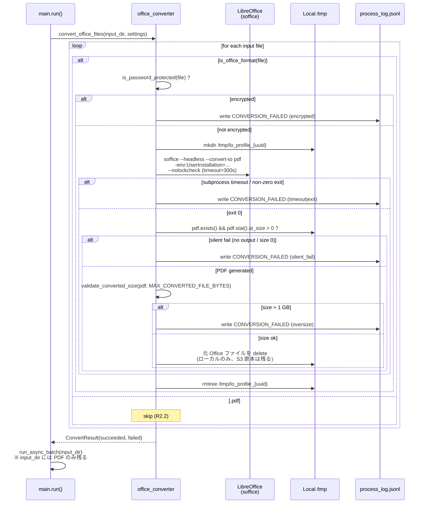
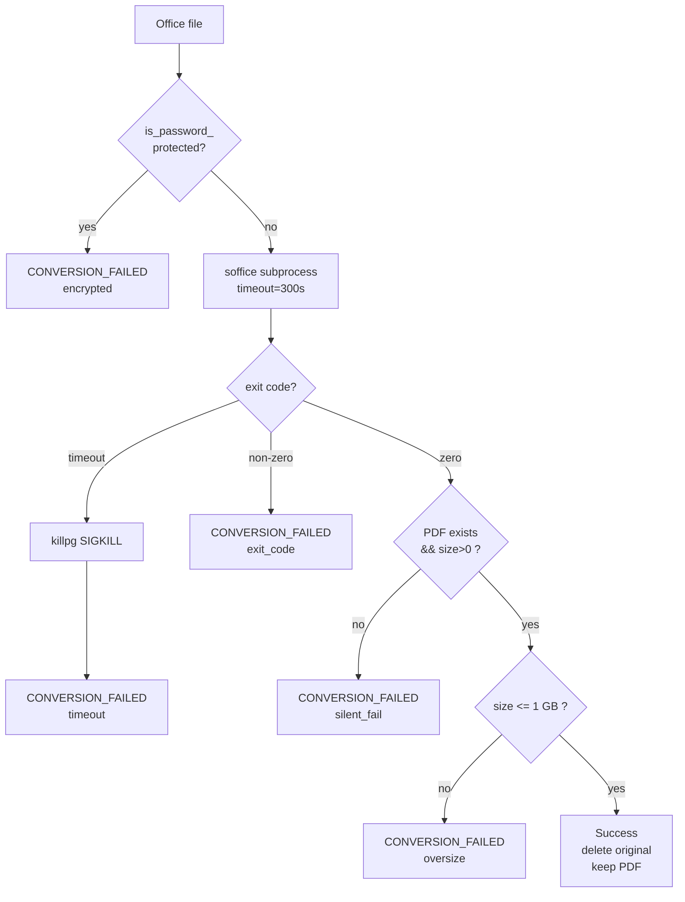
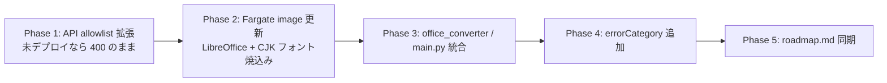

# Design Document — office-format-ingestion

## Overview

**Purpose**: 本機能は、利用者が PDF に加えて `.pptx` / `.docx` / `.xlsx` を直接アップロードできるようにし、Fargate batch-runner 内部で LibreOffice headless により PDF 化してから既存の SageMaker Async Inference パイプラインに投入する **入力 ingestion 拡張** である。

**Users**: OCR API を利用する SaaS / バッチ業務担当者は、外部での事前 PDF 化を撤廃して Office ドキュメントを直接投入できるようになる。

**Impact**: API の input contract に Office 形式 (3 種) を追加し、Fargate batch-runner に **Office → PDF 変換フェーズ** を `download_inputs` と `run_async_batch` の間に挿入する。SageMaker Async Endpoint (yomitoku-client) の入力契約 (PDF / payload ≤ 1 GB) は維持する。`process_log.jsonl` に `error_category` 列を追加して変換失敗 (`CONVERSION_FAILED`) と OCR 失敗 (`OCR_FAILED`) を区別する。

### Goals
- `.pdf` / `.pptx` / `.docx` / `.xlsx` の混在バッチを 1 リクエストで受理し、最終結果が形式によらず同一フォーマットで返る
- 変換失敗を per-file で分離し、バッチ全体の停止を起こさない (既存の部分失敗パターンを Office 形式にも適用)
- Office 文書中の日本語 (CJK) が変換後 PDF で正しくレンダリングされる
- 既存 PDF フローのレイテンシ / 成功率を悪化させない (PDF only バッチでは変換層を起動しない)

### Non-Goals
- `.odp` / `.ods` / `.odt` / レガシー `.doc` / `.ppt` / `.xls` への対応 (将来別 spec)
- 画像 (`.png` / `.jpg`) を直接 OCR 入力にする対応
- パスワード保護ファイルの自動解除 (検知 → `CONVERSION_FAILED` で扱う)
- 1 バッチあたりファイル数を 100 件超へ拡張する対応 (`batch-scale-out` spec の責務)
- Yomitoku-client / SageMaker エンドポイント側の入力契約変更
- PPTX スライド番号を可視化ファイル名に反映する UI 改善

## Boundary Commitments

### This Spec Owns
- **API 入力契約**: `lambda/api/schemas.ts` の `ALLOWED_EXTENSIONS` / `contentType` enum / OpenAPI description で Office 形式 3 種を許可する責務
- **`sanitizeFilename` の Office 対応 + silent fallback 廃止**: `lambda/api/lib/sanitize.ts` の PDF ハードコード (`"document.pdf"` への fallback / `cleaned === ".pdf"` 特例 / `endsWith(".pdf")` のみ許可) を廃止し、`ALLOWED_EXTENSIONS` ベースの一般化 + 空文字 / 拡張子のみ入力を **fail-fast で `ValidationError` throw** に統一する責務 (silent fallback による S3 キー衝突や stem 一意性 validation 迂回路の排除)
- **stem 一意性 validation**: `lambda/api/schemas.ts` の `CreateBatchBodySchema.files` レベルで、case-insensitive な stem 重複を 400 で拒否する責務 (Office 形式追加によって同名異拡張子の組合せが現実的になったため)
- **OpenAPI トップレベル description (`info`) の Office 形式反映**: `lambda/api/index.ts` の `info.description` に書かれた PDF 専用の使い方説明 (`PUT` 例 / curl サンプル / 「拡張子は `.pdf` のみ」記述等) を Office 形式対応に書き換える責務
- **`FileItem.errorCategory`**: API 側 (TS) と DDB FILE アイテムに `errorCategory: "CONVERSION_FAILED" | "OCR_FAILED" | null` を追加する責務 (TS と Python の双方が書ける契約)
- **`process_log.jsonl` の `error_category`**: 既存スキーマに 1 フィールド追加。変換失敗時に Python 変換層が直接書く責務
- **Office → PDF 変換**: `lambda/batch-runner/office_converter.py` (新規) が SageMaker invoke 前の正規化を担う責務
- **変換失敗判定**: silent fail / timeout / 暗号化 / 変換後サイズ超過の 4 ケースを `CONVERSION_FAILED` として記録する責務
- **Fargate Docker image の Office 変換実行環境**: LibreOffice + CJK フォントのインストールを Dockerfile で担う責務
- **OCR_FAILED 解釈**: `apply_process_log` で `success=False && error_category is None` を `OCR_FAILED` として書き戻す責務 (yomitoku-client が `error_category` を吐かないため Python 側で導出)

### Out of Boundary
- **SageMaker / yomitoku-client の入力契約**: PDF / payload ≤ 1 GB を本 spec は変えない。変換後 PDF を staging する側がこの契約を満たすことを保証
- **DynamoDB `BatchTable` の PK/SK / GSI 構造**: 既存スキーマに `errorCategory` 属性を 1 つ追加するのみで、キー設計や GSI は変更しない
- **`MAX_FILES_PER_BATCH` (99) / `MAX_TOTAL_BYTES` (10 GB) / `MAX_FILE_BYTES` (1 GB) / Fargate `ephemeralStorageGiB` (50)**: いずれも `feat: P1/P1b/P2` 系コミットで既に main にマージ済 (research.md 参照)。本 spec は OpenAPI description に Office 形式の文言を追加するのみで、定数値の変更は行わない
- **Step Functions ステートマシン構造 / バッチ status 遷移ロジック**: 変換失敗を per-file `FAILED` に落とすため、META.status の遷移 (`PROCESSING → COMPLETED/PARTIAL/FAILED`) は既存 `finalize_batch_status` がそのまま機能する
- **`unoserver` daemon モデル / Lambda + EventBridge 非同期 (Option C/D)**: 現フェーズ不採用 (research.md Options 節)
- **可視化ファイル名規約の変更**: 既存 `{basename}_{mode}_page_{idx}.jpg` を維持
- **Office 原本の S3 lifecycle / retention 変更**: 既存の input prefix / lifecycle policy をそのまま流用 (R9 充足)
- **メイン OCR JSON のファイル名規約変更 (`{stem}.json` → `{full_filename}.json`)**: 原本の拡張子を保持した出力ファイル名 (`report.pdf.json` / `report.pptx.json` 等) は **別 spec `result-filename-extension-preservation`** で扱う。本 spec では `async_invoker.py:492` の `{file_stem}.json` 命名規約を維持し、Office 形式由来の出力も既存と同じ `{stem}.json` 命名で出力する。理由: ① 命名変更は PDF ユーザにも影響する破壊的変更で本 spec の R7.3 (API 後方互換) と矛盾する、② 影響範囲が `async_invoker` / `runner.py` の可視化 lookup / 既存テスト群 / API consumer 互換に及び、Office 形式追加とは別の境界
- **追加フォーマット (`.md` / `.csv` / `.html` / `extra_formats`) のファイル名規約変更**: yomitoku-client (SageMaker コンテナ内) が命名するため batch-runner からは制御不可。本 spec の境界外

### Allowed Dependencies
- **Upstream システム**:
  - SageMaker Async Endpoint (PDF / ≤ 1 GB の入力契約を消費)
  - DynamoDB `BatchTable` / `ControlTable` (META / FILE / heartbeat)
  - S3 Bucket (`batches/{id}/input/`, `batches/_async/{inputs,outputs,errors}/`)
  - 既存 Step Functions ステートマシン
- **新規 OS / OCI 依存**:
  - `libreoffice-core` / `libreoffice-impress` / `libreoffice-writer` / `libreoffice-calc` (APT)
  - `fonts-noto-cjk` / `fonts-ipaexfont` (APT)
- **新規 Python 依存**:
  - `msoffcrypto-tool` (PyPI、暗号化検知)
- **既存 Python 依存** (本 spec で変更なし):
  - `boto3` / `yomitoku-client` / `opencv-python-headless`
- **依存制約**:
  - Python 3.12 を維持 (yomitoku-client / opencv 互換性のため `python:3.12-slim` 継続)
  - Fargate `Platform.LINUX_AMD64` を維持
  - `lib/api/lib/batch-store.ts` (TS) と `lambda/batch-runner/batch_store.py` (Py) の DDB FILE スキーマは bit 互換を維持

### Revalidation Triggers
以下の変更が起きた場合、下流 / 隣接 spec は本 spec との統合を再検証すること:

- **`process_log.jsonl` のスキーマ変更** (新フィールド追加 / 既存名変更) → yomitoku-client 側 ログ吐き出し仕様との整合性、`process_log_reader.py` の test fixture 全件
- **`FileItem.errorCategory` の取りうる値の追加 / 変更** → API consumer のステータスダッシュボード / 集計
- **`ALLOWED_EXTENSIONS` のさらなる拡張 (例: `.odp`)** → 本 spec の `office_converter.is_office_format()` が単純な拡張子マッチで済む保証が崩れる可能性
- **`OFFICE_CONVERT_TIMEOUT_SEC` / `OFFICE_CONVERT_MAX_CONCURRENT` のデフォルト変更** → SLO (バッチ完了レイテンシ) との整合
- **`MAX_FILE_BYTES` (1 GB) / `MAX_CONVERTED_FILE_BYTES` の引き上げ** → SageMaker payload 上限との整合
- **Docker base image の変更** (例: `shelf/lambda-libreoffice-base` への切替) → CJK フォント有無 / Python バージョン / opencv 互換性の再検証
- **`batch-scale-out` spec での 1000 ファイル対応** → 変換層の並列度 / ephemeralStorage 配分の再検討
- **`result-filename-extension-preservation` spec の進行** → メイン OCR JSON のファイル名規約変更時、`async_invoker.py:492` の `{file_stem}.json` 命名と `runner.py:170-171` の可視化 lookup ロジックが本 spec とぶつかるため、両 spec の merge 順序と test fixture の調整が必要

## Architecture

### Existing Architecture Analysis

本機能は **既存 Fargate batch-runner pipeline への 1 ステップ挿入** に位置付けられる。既存のステージは:

1. ControlTable heartbeat 登録
2. `download_inputs` (S3 → local `input/`)
3. `run_async_batch` (AsyncInvoker → SageMaker Async)
4. `generate_all_visualizations` (cv2 + load_pdf)
5. `upload_outputs` (local → S3)
6. `apply_process_log` + `finalize_batch_status` (DDB)

新ステージ **2.5 `convert_office_files`** を `download_inputs` 直後・`run_async_batch` 直前に追加する。これにより:

- Office ファイルは `input_dir/{stem}.pdf` として変換後 PDF が並置され、後段はすべて PDF として扱える
- `run_async_batch` 内部の `input_files = [p for p in sorted(input_path.iterdir()) if p.is_file()]` ロジック (`runner.py:57`) を変更せずに済む方法として、変換後は **Office 原本を local input_dir から削除** し PDF のみを残す (S3 上の原本は削除しない、R9 充足)
- 可視化フェーズの `pdf_path = in_path / f"{basename}.pdf"` (`runner.py:171`) は変換後 PDF を自動的に拾う

### Architecture Pattern & Boundary Map

```mermaid
flowchart LR
    Client([API Client]) -->|POST /batches with .pptx| API[API Lambda<br/>schemas.ts]
    API -->|presigned PUT URL<br/>contentType per ext| S3In[(S3 batches/id/input/)]
    Client -->|PUT .pptx| S3In
    Client -->|POST :id/start| API
    API --> SFN[Step Functions]
    SFN --> Fargate[Fargate batch-runner]

    Fargate --> Download[download_inputs]
    Download --> Convert{convert_office_files<br/>NEW}
    Convert -->|Office only| OC[office_converter<br/>NEW]
    OC -->|soffice headless<br/>per-invocation profile| LO[LibreOffice]
    OC -->|silent fail / timeout /<br/>encrypted / size > 1 GB| ProcLog[process_log.jsonl<br/>error_category=CONVERSION_FAILED]
    Convert --> RunAsync[run_async_batch]
    RunAsync --> Sage[SageMaker Async<br/>PDF only]
    Sage --> Viz[generate_all_visualizations]
    Viz --> Upload[upload_outputs]
    Upload --> ApplyLog[apply_process_log<br/>OCR_FAILED 導出]
    ApplyLog --> DDB[(DynamoDB FILE<br/>+ errorCategory)]

    style Convert fill:#ffe4b5
    style OC fill:#ffe4b5
    style ProcLog fill:#ffe4b5
```



**Architecture Integration**:
- **選択パターン**: 既存の `lambda/batch-runner/*.py` の「1 関心事 = 1 モジュール」を踏襲し、新規 `office_converter.py` を独立モジュールとして追加 (research Option B)
- **境界**: API 層は契約拡張のみ / Fargate 層は新変換ステージ追加 / SageMaker 層は無変更 / DDB 層は属性 1 追加のみ
- **既存パターン保持**: `main.py` のオーケストレーション順序 / `boto3 client を引数で注入する` 構造 / `BatchRunnerSettings.from_env()` の env 集約 / TS↔Py の DDB スキーマ対称性
- **新コンポーネント根拠**:
  - `office_converter.py`: 変換ロジック単独責務 (subprocess / profile 分離 / silent fail 検知 / size 検証 / 暗号化検知) を `main.py` から分離
- **Steering compliance**: `structure.md` の "main.py 以外のモジュールは副作用を持たない純粋関数か `boto3` client を引数で注入するクラスで構成する" を満たす (subprocess は外部側面、関数引数で injectable)

### Technology Stack

| Layer | Choice / Version | Role in Feature | Notes |
|-------|------------------|-----------------|-------|
| Frontend / CLI | (該当なし) | — | API client が presigned URL に PUT |
| Backend / Services | TypeScript 5.9.x + Hono 4.x + @hono/zod-openapi 1.x | API allowlist / contentType / OpenAPI description 拡張 | 既存 schema-first パターンに乗る |
| Backend / Services | Python 3.12 + boto3 + 新規 `msoffcrypto-tool>=5,<6` | Office → PDF 変換 / 暗号化検知 / size 検証 | `python:3.12-slim` 維持、`shelf base` への切替は本 spec では非採用 |
| Data / Storage | DynamoDB `BatchTable` (META + FILE) | `errorCategory` 属性 1 つ追加 | キー / GSI 構造変更なし |
| Data / Storage | S3 `batches/{id}/input/` | Office 原本保持 (R9) | retention / lifecycle 既存通り |
| Messaging / Events | (変更なし) | SageMaker SNS → SQS → runner | 本 spec で触らない |
| Infrastructure / Runtime | AWS Fargate (`x86_64`, 4 vCPU / 16 GiB / 50 GiB ephemeral) | LibreOffice subprocess 実行 | TaskDefinition 既存値、env のみ追加 |
| Infrastructure / Runtime | Docker `python:3.12-slim` + APT (`libreoffice-{core,impress,writer,calc}` + `fonts-noto-cjk` + `fonts-ipaexfont`) | OS-level Office 変換ツール | 推定 image size +700–900 MB |

## File Structure Plan

### Directory Structure
```
lambda/api/
├── schemas.ts                                  # MOD: ALLOWED_EXTENSIONS / contentType enum / description
├── index.ts                                    # MOD: OpenAPI info.description (PUT 例 / curl サンプル / 「拡張子は .pdf のみ」記述等) を Office 形式対応に更新
├── lib/
│   ├── batch-presign.ts                        # MOD: contentType per extension (default mapping)
│   ├── batch-store.ts                          # MOD: FileItem.errorCategory フィールド追加
│   └── sanitize.ts                             # MOD: ALLOWED_EXTENSIONS ベースの一般化 / "document.pdf" silent fallback 廃止 / 空名・拡張子のみは ValidationError throw に統一
└── __tests__/
    ├── schemas.test.ts                         # MOD: pptx/docx/xlsx 受理ケース + reject ケース + stem 重複 reject ケース
    ├── lib/
    │   ├── batch-presign.test.ts               # MOD: contentType per extension assertions
    │   ├── batch-store.test.ts                 # MOD: errorCategory read/write coverage
    │   └── sanitize.test.ts                    # MOD: pptx/docx/xlsx 受理ケース + 空名 / ".pptx" 単体 / 不正拡張子の throw assertion / 既存 throw メッセージ更新
    └── routes/                                 # (変更なし、表示確認のみ)

lambda/batch-runner/
├── office_converter.py                         # NEW: convert_office_to_pdf / is_office_format / is_password_protected / validate_converted_size
├── main.py                                     # MOD: convert_office_files フェーズ挿入 (download → convert → run_async)
├── settings.py                                 # MOD: OFFICE_CONVERT_TIMEOUT_SEC / OFFICE_CONVERT_MAX_CONCURRENT / MAX_CONVERTED_FILE_BYTES env 追加
├── process_log_reader.py                       # MOD: ProcessLogEntry に error_category フィールド追加
├── batch_store.py                              # MOD: apply_process_log で error_category を FILE に書き、success=False+null は OCR_FAILED に導出
├── runner.py                                   # NO CHANGE: pdf_path = in_path / f"{basename}.pdf" は変換後 PDF を自動で拾う
├── async_invoker.py                            # NO CHANGE: 変換後は PDF のみが input_dir に残るため _CONTENT_TYPE_OVERRIDES 拡張不要
├── requirements.txt                            # MOD: msoffcrypto-tool>=5,<6 追加
├── Dockerfile                                  # MOD: APT で libreoffice-* + fonts-noto-cjk + fonts-ipaexfont を追加 (USER 切替前)
└── tests/
    ├── test_office_converter.py                # NEW: convert / 暗号化 / timeout / silent fail / size 超過の単体テスト
    ├── test_main.py                            # MOD: 混在バッチ / 変換失敗継続 / PDF only バッチで変換層 no-op の coverage
    ├── test_runner.py                          # MOD: 変換後 PDF が可視化に流れる確認
    ├── test_run_async_batch_e2e.py             # MOD: pptx 混在の e2e 経路
    ├── test_process_log_reader.py              # MOD: error_category フィールド読み込み + 後方互換 (欠落時 None)
    └── test_batch_store.py                     # MOD: errorCategory 書き込み + OCR_FAILED 導出ロジック

lib/
└── batch-execution-stack.ts                    # MOD: TaskDefinition env に OFFICE_CONVERT_* を 3 つ追加

test/
├── batch-execution-stack.test.ts               # MOD: 新 env 変数 3 件の assert
└── app-synth.test.ts                           # NO CHANGE: 構造影響なし想定 (synth で確認)
```

### Modified Files (要点)
- `lambda/api/schemas.ts` — `ALLOWED_EXTENSIONS = [".pdf", ".pptx", ".docx", ".xlsx"]` / `contentType` enum に OOXML MIME 3 種追加 / `description` 文言更新 / `CreateBatchBodySchema.files` への stem 重複 `.refine()` 追加 (R1.1, R1.4, R1.5, R3.4, R3.5)
- `lambda/api/index.ts` — OpenAPI `info.description` 内の PDF 専用記述 (`PUT` 例 `:37` / curl サンプル `:48,52` / "拡張子は **`.pdf`** のみ" `:101` / smoke 計測の "PDF 2 ページ" 文言 `:82` 等) を Office 形式対応に更新。利用例には PDF + PPTX 混在の `files` body と Content-Type が拡張子別に決まる旨を 1 行追加 (R1.5)
- `lambda/api/lib/sanitize.ts` — PDF ハードコードの撤去と fail-fast 化:
  - `?.trim() || "document.pdf"` の silent fallback を廃止 → 空名は `ValidationError("Filename is empty after sanitization")` を throw
  - `cleaned === ".pdf"` 特例 (拡張子のみ → `document.pdf` 化) を廃止 → `ALLOWED_EXTENSIONS` 各々と完全一致する場合 (拡張子のみ) は `ValidationError("Filename has no basename (only extension)")` を throw
  - `endsWith(".pdf")` チェックを `ALLOWED_EXTENSIONS.some(ext => lower.endsWith(ext))` に一般化、throw メッセージは `Filename must end with one of: .pdf, .pptx, .docx, .xlsx`
  - `ALLOWED_EXTENSIONS` を `../schemas` から import して単一情報源化 (R1.1, R1.3, セキュリティ防御の対称性確保)
- `lambda/api/lib/batch-presign.ts` — 拡張子 → 既定 contentType の `Record<string, string>` を導入し、未指定時のフォールバックに使用 (R1.2)
- `lambda/api/lib/batch-store.ts` — `FileItem` に `errorCategory?: "CONVERSION_FAILED" | "OCR_FAILED"` を追加、書き込み (`updateFileResult`) と読み出し (`getFile`) の両方を扱う (R4.2, R4.3)
- `lambda/batch-runner/main.py` — `download_inputs` の後、`run_async_batch` の前に `convert_office_files()` を挟む。返り値の (成功 PDF パス) リストと (変換失敗エントリ) リストを集計 (R2.1, R2.2, R4.1)
- `lambda/batch-runner/office_converter.py` (新規) — public API 4 つ + private subprocess ヘルパ (詳細は Components & Interfaces 節)
- `lambda/batch-runner/Dockerfile` — `apt-get install -y --no-install-recommends libreoffice-core libreoffice-impress libreoffice-writer libreoffice-calc fonts-noto-cjk fonts-ipaexfont` を `useradd` の前に追加 (R2.5)。`msoffcrypto-tool` は **PyPI 経由** (`requirements.txt`) で入れるため APT 側には含めない

## System Flows

### Office 変換ステージのシーケンス



**フローレベル決定事項**:
- **並列実行**: ファイルあたりの soffice 呼び出しは独立。`asyncio.Semaphore(OFFICE_CONVERT_MAX_CONCURRENT)` または `concurrent.futures.ThreadPoolExecutor` で並列化。デフォルト = vCPU 数 (Fargate 4 vCPU = 4)
- **profile 分離**: 並列起動の lock 衝突を避けるため、`-env:UserInstallation=file:///tmp/lo_profile_{uuid}/` を呼び出しごとに切る
- **失敗ログの粒度**: 変換失敗の `error` メッセージには 4 区分 (`encrypted` / `timeout` / `silent_fail` / `oversize`) のいずれかを含めて運用が原因切り分けできるようにする
- **原本削除のスコープ**: ローカル `input_dir/{stem}.pptx` のみ削除。S3 `batches/{id}/input/{stem}.pptx` は残す (R9.1)

## Requirements Traceability

| Requirement | Summary | Components | Interfaces | Flows |
|-------------|---------|------------|------------|-------|
| 1.1 | Office 形式 4 種を受理 | `schemas.ts` / `sanitize.ts` | `ALLOWED_EXTENSIONS` (単一情報源) / `allowedExtensionRegex` / 一般化された endsWith チェック | API 受信 |
| 1.2 | contentType 既定値の導出 | `batch-presign.ts` | `EXTENSION_TO_CONTENT_TYPE` map | presign 発行 |
| 1.3 | 不正拡張子で 400 | `schemas.ts` / `sanitize.ts` | `.refine()` validation / sanitize 内 throw (二段防御) | API 受信 |
| 1.4 | contentType enum 制約 | `schemas.ts` | `z.enum([...])` | API 受信 |
| 1.5 | OpenAPI スキーマ更新 | `schemas.ts` / `index.ts` | `.openapi({ description })` / `info.description` 5 箇所更新 | OpenAPI 生成 |
| 2.1 | 送信前に PDF 変換 | `main.py` / `office_converter.py` | `convert_office_files()` | Office 変換シーケンス |
| 2.2 | PDF はスキップ | `office_converter.py` | `is_office_format()` | Office 変換シーケンス |
| 2.3 | 送信は全 PDF | `main.py` / `office_converter.py` | local 原本削除 → input_dir に PDF のみ | Office 変換シーケンス |
| 2.4 | 並列変換 | `office_converter.py` | `Semaphore(OFFICE_CONVERT_MAX_CONCURRENT)` | Office 変換シーケンス |
| 2.5 | CJK 描画 | `Dockerfile` | `fonts-noto-cjk` + `fonts-ipaexfont` APT | (構成のみ) |
| 3.1 | 混在バッチ受理 | `schemas.ts` | 既存 `files` 配列 (拡張子は file 単位) | API 受信 |
| 3.2 | 同一階層に成果物配置 | (既存) `runner.py` / `s3_sync.upload_outputs` | 既存規約維持 | 既存フロー |
| 3.3 | バッチ status 判定の形式非依存 | (既存) `batch_store.finalize_batch_status` | 既存ロジック流用 | 既存フロー |
| 3.4 | stem 重複で 400 | `schemas.ts` | `CreateBatchBodySchema.files.refine()` で case-insensitive stem 集合の duplicates を検出 | API 受信 |
| 3.5 | 重複 stem をエラー本文に列挙 | `schemas.ts` | `.refine({ message: ... })` で重複 stem 値と該当ファイル名を message に含める | API 受信 |
| 4.1 | per-file FAILED 分離 | `office_converter.py` / `batch_store.apply_process_log` | `ConvertResult.failed` → `ProcessLogEntry` | Office 変換シーケンス |
| 4.2 | `CONVERSION_FAILED` 記録 | `office_converter.py` / `process_log_reader.py` | `ProcessLogEntry.error_category` | 失敗書き込み |
| 4.3 | `OCR_FAILED` 区別 | `batch_store.apply_process_log` | derive 規則 (`success=False && error_category is None → OCR_FAILED`) | apply_process_log |
| 4.4 | 後方互換 (欠落時 null) | `process_log_reader.py` | `data.get("error_category")` で None | log 読込 |
| 4.5 | 暗号化検知 | `office_converter.is_password_protected()` | `msoffcrypto-tool` API | Office 変換シーケンス |
| 4.6 | timeout 強制終了 | `office_converter.py` | `subprocess.run(..., timeout=N)` + kill | Office 変換シーケンス |
| 4.7 | silent fail 検知 | `office_converter.py` | `pdf.exists() && pdf.stat().st_size > 0` | Office 変換シーケンス |
| 4.8 | PARTIAL 判定 | (既存) `batch_store.finalize_batch_status` | 既存ロジック流用 | 既存フロー |
| 5.1 | 変換後サイズ計測 | `office_converter.validate_converted_size()` | `pdf.stat().st_size` | Office 変換シーケンス |
| 5.2 | 1 GB 超で FAILED | `office_converter.validate_converted_size()` | `MAX_CONVERTED_FILE_BYTES = 1 GB` | Office 変換シーケンス |
| 5.3 | upload 上限内でも変換後再検証 | `office_converter.py` | 変換後に常に validate | Office 変換シーケンス |
| 6.1–6.5 | 10 GB / 50 GiB ephemeral | (既存実装済) `schemas.ts` / `batch-execution-stack.ts` | 既存定数値 / OpenAPI description のみ更新 | 非退行 |
| 7.1 | PDF only バッチで変換層 no-op | `main.py` | `if not any(is_office_format(f) for f in files)` 早期 return | Office 変換シーケンス |
| 7.2 | SageMaker 入力契約維持 | `office_converter.py` | 全変換後 PDF を `MAX_CONVERTED_FILE_BYTES` で gating | Office 変換シーケンス |
| 7.3 | API 後方互換 | `schemas.ts` / `sanitize.ts` | enum / allowlist は追加のみ / 正常 `.pdf` リクエストは無影響 (空名・拡張子のみ等の壊れた入力のみ silent rename → 400 に変化) | API 受信 |
| 8.1–8.3 | 可視化互換 | (既存) `runner.py` | 変換後 PDF が `input_dir/{stem}.pdf` に並置されるため既存ロジック流用 | 既存フロー |
| 9.1 | 原本保持 | (既存) `s3_sync` / S3 lifecycle | input prefix 不変 | 既存フロー |
| 9.2 | 処理中の原本不変 | `office_converter.py` | ローカルファイル削除のみ、S3 への delete 呼び出しなし | Office 変換シーケンス |
| 9.3 | 中間成果物の保持判断は独立 | `office_converter.py` | converted PDF はローカル `/tmp` のみ、S3 upload 不要 | Office 変換シーケンス |

## Components and Interfaces

| Component | Domain/Layer | Intent | Req Coverage | Key Dependencies (P0/P1) | Contracts |
|-----------|--------------|--------|--------------|--------------------------|-----------|
| `schemas.ts` (MOD) | API / TS | 入力契約に Office 4 種を許可 + stem 一意性 validation | 1.1, 1.3, 1.4, 1.5, 3.4, 3.5, 7.3 | Hono / @hono/zod-openapi (P0) | API |
| `index.ts` (MOD) | API / TS | OpenAPI `info.description` を Office 形式対応に更新 | 1.5 | @hono/zod-openapi (P0) | API |
| `sanitize.ts` (MOD) | API / TS | PDF ハードコード撤去 + fail-fast 化 + ALLOWED_EXTENSIONS 一般化 | 1.1, 1.3, 7.3 | schemas (`ALLOWED_EXTENSIONS`) (P0) | API |
| `batch-presign.ts` (MOD) | API / TS | 拡張子別 contentType 既定値導出 | 1.2 | @aws-sdk/s3-request-presigner (P0) | API |
| `batch-store.ts` (MOD) | API / TS | `FileItem.errorCategory` の TS 側型 + R/W | 4.2, 4.3 | @aws-sdk/client-dynamodb (P0) | State, API |
| `office_converter.py` (NEW) | Batch Runner / Py | Office → PDF 変換 / 失敗検知 / size 検証 | 2.1, 2.2, 2.3, 2.4, 4.5, 4.6, 4.7, 5.1, 5.2, 5.3, 9.2, 9.3 | LibreOffice (P0) / msoffcrypto-tool (P0) | Service, Batch |
| `main.py` (MOD) | Batch Runner / Py | 変換フェーズの orchestration | 2.1, 4.1, 7.1 | office_converter (P0) | Batch |
| `process_log_reader.py` (MOD) | Batch Runner / Py | `error_category` 読み出し + 後方互換 | 4.2, 4.4 | (なし) | Event |
| `batch_store.py` (MOD) | Batch Runner / Py | `errorCategory` を FILE に書き込み + `OCR_FAILED` 導出 | 4.2, 4.3 | boto3 DynamoDB (P0) | State |
| `settings.py` (MOD) | Batch Runner / Py | OFFICE_CONVERT_* env 集約 | 2.4, 4.6, 5.2 | (なし) | State |
| `Dockerfile` (MOD) | Infrastructure | LibreOffice + CJK フォントの provisioning | 2.5 | Debian APT (P0) | (該当なし) |
| `batch-execution-stack.ts` (MOD) | Infrastructure / TS CDK | TaskDef container env に OFFICE_CONVERT_* を配線 | 2.4, 4.6, 5.2 | aws-cdk-lib/aws-ecs (P0) | (該当なし) |

### API / TypeScript

#### `schemas.ts`

| Field | Detail |
|-------|--------|
| Intent | API 入力契約に Office 形式 4 種を追加 + stem 一意性 validation |
| Requirements | 1.1, 1.3, 1.4, 1.5, 3.4, 3.5, 7.3 |

**Responsibilities & Constraints**
- `ALLOWED_EXTENSIONS` を `[".pdf", ".pptx", ".docx", ".xlsx"]` に拡張
- `contentType` enum に OOXML MIME 3 種 + 既存 2 種を維持
- 既存クライアント (`.pdf` のみ送信) は影響なし (追加のみで削除なし)
- `CreateBatchBodySchema.files` 配列レベルで stem (拡張子を除いたベース名、サニタイズ後、case-insensitive) の重複を `.refine()` で reject (R3.4)
- stem 重複時のエラーメッセージに重複した stem 値と関連ファイル名 (例: `["report.pdf", "report.pptx"]`) を含める (R3.5)

**Dependencies**
- Outbound: `batch-presign.ts` がこの定数を indirectly 参照しない (presign は独自 contentType マッピングを持つ)
- Outbound: `sanitize.ts::sanitizeFilename` を stem 一意性 `.refine()` 内で **`try/catch` ラップして呼ぶ** — 想定外 throw が起きても refine は `false` を返して validation 失敗扱いに落ち、500 にしない (拡張子 / 空名 / 制御文字 only などは前段の `allowedExtensionRegex` refine と Zod `.min(1)` が大半を弾くため、ここで throw が飛ぶケースは攻撃入力の境界条件に限定される)

**Contracts**: API [x]

##### Service Interface (TypeScript)
```typescript
export const ALLOWED_EXTENSIONS = [
  ".pdf",
  ".pptx",
  ".docx",
  ".xlsx",
] as const;

export const ALLOWED_CONTENT_TYPES = [
  "application/pdf",
  "application/vnd.openxmlformats-officedocument.presentationml.presentation",
  "application/vnd.openxmlformats-officedocument.wordprocessingml.document",
  "application/vnd.openxmlformats-officedocument.spreadsheetml.sheet",
  "application/octet-stream",
] as const;

// CreateBatchBodySchema.files に追加する stem 一意性 refine の概念形:
//
// .refine(
//   (files) => {
//     try {
//       const stems = files.map((f) =>
//         stemOf(sanitizeFilename(f.filename)).toLowerCase()
//       );
//       return new Set(stems).size === stems.length;
//     } catch {
//       // sanitize 由来の throw (拡張子 / 空名 / 制御文字 only) はこの refine の
//       // 手前にある allowedExtensionRegex refine が拾う想定。万が一すり抜け
//       // ても 500 にせず validation 失敗として false を返す。
//       return false;
//     }
//   },
//   (files) => ({
//     message: `Duplicate stem detected. Conflicting files: ${formatDuplicates(files)}`,
//   }),
// )
//
// stemOf(name) は path.parse(name).name 相当 (拡張子を除いたベース名)。
```
- Preconditions: 既存の `ALLOWED_EXTENSIONS` 1 件のみ参照箇所 (`allowedExtensionRegex`) が automatic に拡張対応
- Postconditions: `.pptx` を含むリクエストは 400 とならない / 同一 stem を含むリクエスト (`report.pdf` + `report.pptx` 等) は 400 で reject される
- Invariants: `ALLOWED_EXTENSIONS` と `EXTENSION_TO_CONTENT_TYPE` のキー集合は一致する (test で assert) / stem 比較は case-insensitive (例: `Report.pdf` と `report.pptx` も衝突扱い)

#### `sanitize.ts`

| Field | Detail |
|-------|--------|
| Intent | サニタイズロジックの PDF ハードコード撤去と silent fallback 廃止、`ALLOWED_EXTENSIONS` ベースの一般化 |
| Requirements | 1.1, 1.3, 7.3 |

**Responsibilities & Constraints**
- 既存の **silent fallback (`?.trim() || "document.pdf"` と `cleaned === ".pdf"` 特例) を廃止** し、空名 / 拡張子のみ入力は `ValidationError` を throw する fail-fast 動作に統一
  - 廃止理由: ① 複数の悪性入力が同一 `document.pdf` に化けて S3 キー衝突 (silent overwrite) を起こし得る、② 本 spec の R3.4 (stem 一意性) と整合させるため silent な stem 化け道を塞ぐ必要がある、③ Office 形式追加で `.pptx` → `document.pdf` 化けが意味的に破綻する
- `endsWith(".pdf")` を `ALLOWED_EXTENSIONS.some(ext => lower.endsWith(ext))` に一般化、throw メッセージを `"Filename must end with one of: .pdf, .pptx, .docx, .xlsx"` に更新
- `ALLOWED_EXTENSIONS` を `../schemas` から import して **単一情報源化** (拡張子定義を schemas.ts と二重管理しない)
- 制御文字除去 (`/[\x00-\x1f<>:"|?*]/g`)、Unicode スラッシュ正規化、`MAX_FILENAME_BYTES = 255` チェック等の既存セキュリティ対策はすべて維持

**Dependencies**
- Outbound: `schemas.ts::ALLOWED_EXTENSIONS` を import (循環依存にならないことを確認 — `schemas.ts` 側は `sanitize.ts` を import しないため一方向)
- Inbound: `batch-presign.ts:56` `createUploadUrls()`、`batch-store.ts:172`、`schemas.ts` の stem 一意性 `.refine()` (try/catch ラップ済)

**Contracts**: API [x] (throw による 400 への変換は呼び出し側 handler の `ValidationError` ハンドラに委譲)

##### Service Interface (TypeScript)
```typescript
import { ALLOWED_EXTENSIONS } from "../schemas";
import { ValidationError } from "./errors";

const MAX_FILENAME_BYTES = 255;

export function sanitizeFilename(raw: string): string {
  const basename = raw
    .replace(/[∕／]/g, "/")
    .replace(/＼/g, "\\")
    .split("/").pop()
    ?.split("\\").pop()
    ?.trim() ?? "";

  // biome-ignore lint/suspicious/noControlCharactersInRegex
  const cleaned = basename.replace(/[\x00-\x1f<>:"|?*]/g, "");

  if (!cleaned) {
    throw new ValidationError("Filename is empty after sanitization");
  }

  const lower = cleaned.toLowerCase();

  // 拡張子のみ (".pdf" / ".pptx" 等) — basename が空に等しい
  if (ALLOWED_EXTENSIONS.some((ext) => lower === ext)) {
    throw new ValidationError("Filename has no basename (only extension)");
  }

  if (!ALLOWED_EXTENSIONS.some((ext) => lower.endsWith(ext))) {
    throw new ValidationError(
      `Filename must end with one of: ${ALLOWED_EXTENSIONS.join(", ")}`,
    );
  }

  if (Buffer.byteLength(cleaned, "utf8") > MAX_FILENAME_BYTES) {
    throw new ValidationError("Filename too long");
  }

  return cleaned;
}
```

- Preconditions: 呼び出し元は throw を `ValidationError` として handler 側で 400 に変換する想定 (既存の error handler 流用)
- Postconditions: 戻り値は必ず `ALLOWED_EXTENSIONS` の何れかで終わる、空でない、255 bytes 以下
- Invariants: 同じ input に対して常に同じ throw / 同じ戻り値 (副作用なし、stem 一意性 refine から `try/catch` で安全に呼べる)

##### Implementation Notes
- **既存テスト (`sanitize.test.ts`) の更新点**:
  - `expect(sanitizeFilename("")).toBe("document.pdf")` → `expect(() => sanitizeFilename("")).toThrow(ValidationError)`
  - `expect(sanitizeFilename(".pdf")).toBe("document.pdf")` → `.toThrow(ValidationError)`
  - `expect(() => sanitizeFilename("test.txt")).toThrow("Filename must end with .pdf")` → throw メッセージを `Filename must end with one of: .pdf, .pptx, .docx, .xlsx` に更新
  - 新規ケース: `.pptx` / `.docx` / `.xlsx` の正常通過、`.pptx` 単体名の throw、各種拡張子混在の cleanup pass-through
- **後方互換のスタンス**: 既存の `.pdf` 利用者から見ると、空名や拡張子のみを送るような壊れたクライアントは挙動が変わる (silent rename → 400) が、正常な `.pdf` リクエストは無影響。R7.3 (API 後方互換) は「正常系」のみ保証

#### `index.ts`

| Field | Detail |
|-------|--------|
| Intent | OpenAPI ドキュメント (`info.description`) の PDF 専用記述を Office 形式対応に更新 |
| Requirements | 1.5 |

**Responsibilities & Constraints**
- OpenAPI ハブとなる `info.description` 内の PDF 限定記述を全件刷新 (5 箇所程度)
- API consumer が `/openapi.json` / Swagger UI から Office 形式の使い方を発見できる状態にする

**Implementation Notes**
- 改修対象行 (現状の参照位置):
  - `:37` "返却された `uploads[].uploadUrl` に **PDF** を `PUT` (Content-Type は `application/pdf` 必須、有効 15 分)" → "PDF / PPTX / DOCX / XLSX を `PUT` (Content-Type は拡張子別の MIME を schema 仕様で確認、`application/pdf` / `application/vnd.openxmlformats-officedocument.*`、有効 15 分)"
  - `:48` 利用例 body — `{"files":[{"filename":"a.pdf"}]}` を `{"files":[{"filename":"a.pdf"},{"filename":"slides.pptx"}]}` に拡張
  - `:52` curl サンプル — PDF 例の直後に PPTX 例 (`-H 'content-type: application/vnd.openxmlformats-officedocument.presentationml.presentation' --data-binary @slides.pptx "$URL"`) を 1 行追加
  - `:82` 「PDF 2 ページの smoke では約 4 秒」 → 文言は維持しつつ「Office 形式 (PPTX / DOCX / XLSX) は内部 PDF 変換で +1–3 秒/ファイル程度のオーバーヘッドが追加」と 1 行併記
  - `:101` 「拡張子は **`.pdf`** のみ (日本語ファイル名可)」 → 「拡張子は **`.pdf` / `.pptx` / `.docx` / `.xlsx`** (日本語ファイル名可)。Office 形式は内部で LibreOffice により PDF 化されてから OCR にかかる」
- 既存の文言スタイル / Markdown 表組み / 用語選択 (Step Functions / SageMaker Async 等) は維持

#### `batch-presign.ts`

| Field | Detail |
|-------|--------|
| Intent | 拡張子から既定 Content-Type を導出し、presigned PUT URL に署名する |
| Requirements | 1.2 |

**Responsibilities & Constraints**
- `f.contentType` が指定された場合はそれを使用 (既存挙動)
- 未指定時、ファイル名拡張子から `EXTENSION_TO_CONTENT_TYPE` で MIME を引く
- マップに無い拡張子は `application/octet-stream` (フォールバック)

##### Service Interface
```typescript
const EXTENSION_TO_CONTENT_TYPE: Record<string, string> = {
  ".pdf":  "application/pdf",
  ".pptx": "application/vnd.openxmlformats-officedocument.presentationml.presentation",
  ".docx": "application/vnd.openxmlformats-officedocument.wordprocessingml.document",
  ".xlsx": "application/vnd.openxmlformats-officedocument.spreadsheetml.sheet",
};

function defaultContentType(filename: string): string {
  const ext = path.extname(filename).toLowerCase();
  return EXTENSION_TO_CONTENT_TYPE[ext] ?? "application/octet-stream";
}
```

#### `batch-store.ts`

| Field | Detail |
|-------|--------|
| Intent | `FileItem` に `errorCategory` を追加し、TS / Py 両方から R/W できる契約を維持 |
| Requirements | 4.2, 4.3 |

**Responsibilities & Constraints**
- `FileItem.errorCategory?: "CONVERSION_FAILED" | "OCR_FAILED"` を optional で追加 (旧データは欠落 = undefined)
- `BatchFileSchema` (Zod) にも対応する optional フィールドを追加
- API レスポンス `BatchFileSchema` で expose

##### State Management
- 状態モデル: `errorCategory` は `status === "FAILED"` の場合のみ意味を持つ。`status !== "FAILED"` での値は未定義扱い (validate しない)
- 永続化: DynamoDB FILE アイテムの string 属性 (top-level)
- 並行性: 既存 `update_file_result` の条件付き UpdateItem に embed (TS: `UpdateExpression` / Py: 既存パターン踏襲)

### Batch Runner / Python

#### `office_converter.py` (NEW)

| Field | Detail |
|-------|--------|
| Intent | Office → PDF 変換 + 失敗検知 + size 検証 |
| Requirements | 2.1, 2.2, 2.3, 2.4, 4.5, 4.6, 4.7, 5.1, 5.2, 5.3, 9.2, 9.3 |

**Responsibilities & Constraints**
- LibreOffice subprocess の起動・出力検証・cleanup を 1 モジュールに閉じる
- `boto3` には依存しない (純粋ローカル処理、structure.md の純粋関数原則)
- 副作用: `/tmp/lo_profile_{uuid}/` の生成・削除、`input_dir` 内のファイル削除 (Office 原本)、PDF 生成

**Dependencies**
- Outbound: 標準ライブラリ `subprocess` / `pathlib` / `uuid` / `shutil` (P0)
- External: `msoffcrypto-tool>=5,<6` (P0、暗号化検知のみ)
- External: `soffice` バイナリ (Docker image 内 LibreOffice、P0)

**Contracts**: Service [x], Batch [x]

##### Service Interface (Python)
```python
from dataclasses import dataclass
from pathlib import Path

OFFICE_EXTENSIONS: frozenset[str] = frozenset({".pptx", ".docx", ".xlsx"})

@dataclass(frozen=True)
class ConvertedFile:
    """変換成功 1 件の結果。"""
    original_path: Path   # 変換前の Office ファイル (削除前)
    pdf_path: Path        # 変換後 PDF

@dataclass(frozen=True)
class ConvertFailure:
    """変換失敗 1 件の結果。process_log.jsonl 書き込み素材。"""
    original_path: Path
    reason: str           # "encrypted" | "timeout" | "exit_code" | "silent_fail" | "oversize"
    detail: str           # 人間可読な追加情報

@dataclass(frozen=True)
class ConvertResult:
    succeeded: list[ConvertedFile]
    failed: list[ConvertFailure]


def is_office_format(filename: str) -> bool: ...

def is_password_protected(path: Path) -> bool: ...
    # msoffcrypto-tool で OOXML 暗号化判定。検知不可エラーは raise しない (False を返す)。

def validate_converted_size(pdf_path: Path, max_bytes: int) -> None: ...
    # 上限超過なら ConversionOversizeError (新規) を raise。

def convert_office_to_pdf(
    input_path: Path,
    work_dir: Path,
    timeout_sec: int,
) -> Path: ...
    # 成功時に PDF パスを返す。タイムアウト / silent fail / 暗号化 / 非ゼロ exit は専用例外を raise。

def convert_office_files(
    input_dir: Path,
    *,
    timeout_sec: int,
    max_concurrent: int,
    max_converted_bytes: int,
) -> ConvertResult: ...
    # 上記単位関数を semaphore で並列実行する高レベル API。
    # 成功・失敗いずれの場合も Office 原本を input_dir からローカル削除し、PDF のみ残す
    # (R7.2 維持。S3 上は不変 = R9.1 / R9.2)。
```

- Preconditions: `input_dir` が存在し、`soffice` コマンドが PATH に存在する
- Postconditions: 変換成功ファイルは `input_dir/{stem}.pdf` として配置済、Office 原本は成功・失敗を問わずローカル削除済 (R7.2 維持。S3 不変 = R9.1 / R9.2)
- Invariants: `ConvertResult.succeeded` と `ConvertResult.failed` の和が input_dir 内の Office ファイル総数に一致

##### Batch / Job Contract
- Trigger: `main.py::run` から `download_inputs` 完了後に同期呼び出し
- Input: `input_dir` (download_inputs の出力ディレクトリ)
- Validation: 各ファイルに対して 4 段階チェック (`is_office_format` → `is_password_protected` → `subprocess.run(...timeout)` → `pdf.exists() && size > 0` → `validate_converted_size`)
- Output: `ConvertResult` を返す。成功は input_dir 内に PDF として配置、失敗は呼び出し側で `process_log.jsonl` に追記
- Idempotency: 同じファイルを 2 回呼ぶと 2 回変換が走る (idempotency 不要、main.py から 1 回しか呼ばない)
- Recovery: 例外は呼び出し側に伝播。subprocess の zombie や `/tmp/lo_profile_{uuid}` の cleanup は本モジュール内で `try/finally` で完結

**Implementation Notes**
- soffice コマンド構築: `["soffice", "--headless", "--invisible", "--nodefault", "--nofirststartwizard", "--norestore", "--nolockcheck", f"-env:UserInstallation=file://{profile_dir}", "--convert-to", "pdf", "--outdir", str(work_dir), str(input_path)]`
- profile dir 命名: `Path(tempfile.gettempdir()) / f"lo_profile_{uuid.uuid4().hex}"`、`shutil.rmtree(..., ignore_errors=True)` で cleanup
- 並列実行: `concurrent.futures.ThreadPoolExecutor(max_workers=max_concurrent)` を採用 (asyncio は既存 `run_async_batch` の event loop と被らないように main 同期側で実行)
- silent fail パターン (`pptx_to_pdf_sample.py` 参考):
  ```python
  pdf = work_dir / f"{input_path.stem}.pdf"
  if not pdf.exists() or pdf.stat().st_size == 0:
      raise ConversionSilentFailError(f"soffice exited 0 but no PDF: {pdf}")
  ```
- 例外型: `ConversionEncryptedError` / `ConversionTimeoutError` / `ConversionExitCodeError` / `ConversionSilentFailError` / `ConversionOversizeError` を `office_converter` 内に定義 (caller がカテゴリ判定に使う)
- 暗号化検知: `msoffcrypto.OfficeFile(file).is_encrypted()` を try/except で wrap、ファイル open 不能なら False (corrupted は変換段で別途エラー化)

**Risks**:
- Risk: soffice の zombie 残留 → `subprocess.run()` の timeout で `TimeoutExpired` 後に process group を kill する flag は付かない。Mitigation: `subprocess.Popen(start_new_session=True)` + `os.killpg(os.getpgid(p.pid), signal.SIGKILL)` を timeout handler に組む
- Risk: `/tmp/lo_profile_*` の disk leak → `try/finally` で `shutil.rmtree(ignore_errors=True)`、ephemeralStorage 50 GiB なら 100 並列でも余裕
- Risk: opencv-python-headless との apt 依存衝突 → `python:3.12-slim` にすでに opencv 用 lib が無いので新規衝突なし

#### `main.py` (MOD)

| Field | Detail |
|-------|--------|
| Intent | 変換フェーズを既存 pipeline に挿入し、失敗を `process_log.jsonl` に追記 |
| Requirements | 2.1, 4.1, 7.1 |

**Responsibilities & Constraints**
- 既存 8 ステップ pipeline の **ステップ 3.5** に変換を挿入
- 変換失敗ファイルは `process_log.jsonl` に直接追記 (yomitoku-client が触る前のフェーズなので、yomitoku-client 出力と混ざらないよう先に書く)
- PDF only バッチでは `convert_office_files` の `succeeded` 全件 + `failed` 全件が空となる early return パスでロジック skip

##### Implementation Note
```python
# main.py::run() より抜粋 (擬似コード)
downloaded = download_inputs(...)
office_files_present = any(is_office_format(p.name) for p in downloaded)
if office_files_present:
    convert_result = convert_office_files(
        input_dir,
        timeout_sec=settings.office_convert_timeout_sec,
        max_concurrent=settings.office_convert_max_concurrent,
        max_converted_bytes=settings.max_converted_file_bytes,
    )
    _append_conversion_failures_to_log(log_path, convert_result.failed)
# 以降 run_async_batch は input_dir 内の PDF のみを処理
```

#### `process_log_reader.py` (MOD)

| Field | Detail |
|-------|--------|
| Intent | `error_category` を 1 フィールド追加し、欠落時は None で後方互換 |
| Requirements | 4.2, 4.4 |

**Implementation Note**
- `ProcessLogEntry` dataclass に `error_category: str | None = None` を追加
- `read_process_log()` の dict → dataclass 変換で `data.get("error_category")` を呼ぶだけ (既存パターン踏襲)
- 旧 fixture (フィールド無し) はそのまま `error_category=None` として読める

#### `batch_store.py` (MOD)

| Field | Detail |
|-------|--------|
| Intent | DDB FILE に `errorCategory` を書き、`success=False && error_category is None → "OCR_FAILED"` を導出 |
| Requirements | 4.2, 4.3 |

**Implementation Note**
- `update_file_result()` に `error_category: str | None = None` 引数を追加し、`UpdateExpression` に `errorCategory` を `SET` (None なら属性 set しない)
- `apply_process_log()` で `entry.success is False` のとき:
  - `entry.error_category` が `"CONVERSION_FAILED"` ならそのまま採用
  - `entry.error_category` が None なら `"OCR_FAILED"` に正規化して書き込み
- `OCR_FAILED` 導出ロジックは `apply_process_log` 内に閉じる (純粋関数で testable)

#### `settings.py` (MOD)

| Field | Detail |
|-------|--------|
| Intent | 新 env を `BatchRunnerSettings` frozen dataclass に追加 |
| Requirements | 2.4, 4.6, 5.2 |

**Implementation Note**
- 新 env (`BatchRunnerSettings.from_env()` で読む):
  - `OFFICE_CONVERT_TIMEOUT_SEC` (int, default=300) — R4.6
  - `OFFICE_CONVERT_MAX_CONCURRENT` (int, default=4 = Fargate vCPU) — R2.4
  - `MAX_CONVERTED_FILE_BYTES` (int, default=1073741824 = 1 GiB) — R5.2
- 欠落時は default 値を使う (既存 env と異なり ValueError raise しない)

### Infrastructure / CDK

#### `Dockerfile` (MOD)

| Field | Detail |
|-------|--------|
| Intent | LibreOffice + CJK フォントを image に焼き込む |
| Requirements | 2.5 |

**Implementation Note**
- レイヤ追加位置: `WORKDIR /app` の直後、`COPY requirements.txt .` の前
- 追加コマンド (APT 系のみ):
  ```dockerfile
  RUN apt-get update \
      && apt-get install -y --no-install-recommends \
         libreoffice-core libreoffice-impress libreoffice-writer libreoffice-calc \
         fonts-noto-cjk fonts-ipaexfont \
      && rm -rf /var/lib/apt/lists/*
  ```
- **`msoffcrypto-tool` は APT 側に含めない**。Debian の APT package 名は `python3-msoffcrypto` であり `msoffcrypto-tool` というパッケージは存在しないため、PyPI 名のまま APT に渡すと build が失敗する。本 spec では PyPI 版 (`msoffcrypto-tool>=5,<6`) を `requirements.txt` に追加して `pip install` 経由でインストールする (既存の `pip install --no-cache-dir -r requirements.txt` レイヤが拾う)
- USER 切替前に install (root 権限要)

#### `batch-execution-stack.ts` (MOD)

| Field | Detail |
|-------|--------|
| Intent | TaskDefinition container env に新 OFFICE_CONVERT_* 3 つを追加 |
| Requirements | 2.4, 4.6, 5.2 |

**Implementation Note**
- 既存 container env に追加:
  ```typescript
  environment: {
    // ... existing entries ...
    OFFICE_CONVERT_TIMEOUT_SEC: "300",
    OFFICE_CONVERT_MAX_CONCURRENT: "4",
    MAX_CONVERTED_FILE_BYTES: String(1024 * 1024 * 1024),
  },
  ```
- 値は static (CDK synth 時固定)、将来 SSM Parameter Store 化したくなれば別途 spec

## Data Models

### Domain Model

本 spec は新規 domain entity を導入しない。既存 `BatchJob` / `BatchFile` を拡張するのみ。

- `BatchFile` (既存): `errorCategory: "CONVERSION_FAILED" | "OCR_FAILED" | null` を 1 属性追加
- `ProcessLogEntry` (既存): `error_category: str | None` を 1 フィールド追加 (Python in-memory)

### Logical Data Model

- DynamoDB `BatchTable` の FILE アイテム (PK=`BATCH#{jobId}`, SK=`FILE#{fileKey}`) に `errorCategory` String 属性を追加
- 既存 FILE アイテム (errorCategory なし) は読み出し時 `null` 扱い (TS) / `None` 扱い (Py)

### Physical Data Model

#### DynamoDB FILE アイテム (差分のみ)

| 属性 | 型 | 必須 | 値 | 備考 |
|------|------|------|----|------|
| `errorCategory` | String | No | `"CONVERSION_FAILED"` \| `"OCR_FAILED"` | `status === "FAILED"` の場合のみ意味を持つ。それ以外では未設定 |

- インデックス: GSI1 / GSI2 への追加なし (検索キーには使わない)
- TTL: 既存 META TTL 経由で同期削除

#### `process_log.jsonl` (差分のみ)

```jsonl
{"timestamp":"2026-04-26T...","file_path":"/tmp/...","success":false,"error":"encrypted: ...","error_category":"CONVERSION_FAILED"}
```

### Data Contracts & Integration

#### TS↔Py の bit 互換 (R3.3 / 構造.md 契約)

- TS `FileItem.errorCategory` (camelCase) と Py `update_file_result(error_category=...)` (snake_case) はいずれも DDB 属性名 `errorCategory` (camelCase) で書く
- 既存パターン (`fileKey` / `errorMessage`) と一致

## Error Handling

### Error Strategy

本 spec の新エラーは 2 経路:
1. **API 入力検証エラー (400)**: `schemas.ts` の Zod refine が拡張子 / contentType / stem 重複を弾く (R1.3 / R1.4 / R3.4)
2. **変換失敗 (per-file FAILED)**: `office_converter.py` の 5 種類の例外 (`ConversionEncryptedError` / `ConversionTimeoutError` / `ConversionExitCodeError` / `ConversionSilentFailError` / `ConversionOversizeError`) を `main.py` で集約し、`process_log.jsonl` に追記 → `apply_process_log` 経由で DDB FILE に `status="FAILED"` + `errorCategory="CONVERSION_FAILED"` + `errorMessage=詳細`

### Error Categories and Responses

**User Errors (4xx)**:
- `400` (Schema Validation): `.txt` などの非対応拡張子、または `.pptx` に `application/pdf` という mismatched contentType → `error: "filename has unsupported extension"` / `error: "contentType does not match extension"`
- `400` (Stem Duplication): 同一 stem の組合せ (`report.pdf` + `report.pptx` 等) → `error: "Duplicate stem detected. Conflicting files: [\"report.pdf\", \"report.pptx\"]"` (R3.4 / R3.5)。利用者は重複 stem のいずれかをリネーム (例: `report-original.pdf` / `report-slides.pptx`) して再投入する
- `400` (Sanitize Validation, fail-fast 化に伴う新規エラー経路): handler 内 `sanitizeFilename` が以下のいずれかで `ValidationError` を throw → 既存 `ValidationError` ハンドラで 400 に変換:
  - 空名 / 制御文字 only / whitespace only → `error: "Filename is empty after sanitization"`
  - 拡張子のみ (例: `.pdf` / `.pptx` 単体) → `error: "Filename has no basename (only extension)"`
  - 許可外拡張子 (Schema validation を素通りした境界ケース) → `error: "Filename must end with one of: .pdf, .pptx, .docx, .xlsx"`
  - 旧挙動 (`document.pdf` への silent rename) との差分: 攻撃的 / 壊れたクライアントが silent に成功する状況がなくなる。正常 `.pdf` クライアントは影響なし

**System Errors / 部分失敗 (per-file FAILED)**:
- `CONVERSION_FAILED.encrypted`: `errorMessage="Encrypted office document is not supported"` (R4.5)
- `CONVERSION_FAILED.timeout`: `errorMessage="LibreOffice conversion exceeded {N}s timeout"` (R4.6)
- `CONVERSION_FAILED.exit_code`: `errorMessage="LibreOffice exited with non-zero status: {N}"`
- `CONVERSION_FAILED.silent_fail`: `errorMessage="LibreOffice exited successfully but PDF was not generated"` (R4.7、`pptx_to_pdf_sample.py` 既往実装パターン流用)
- `CONVERSION_FAILED.oversize`: `errorMessage="Converted PDF size {S} exceeds limit {MAX}"` (R5.2)
- `OCR_FAILED.*`: 既存の yomitoku-client 由来エラーが伝搬する経路。本 spec では `error_category` を `apply_process_log` で導出するのみ

**Business Logic Errors (422)**:
- 該当なし (本 spec 範囲では 422 を新規発行しない)



### Monitoring

- 既存 CloudWatch メトリクス (`FilesFailedTotal` / `BatchDurationSeconds`) は変換失敗も自動的にカウント (FAILED 数として加算)
- 新メトリクス追加なし (将来 `errorCategory` 別の breakdown が必要になれば別途 spec)
- ログレベル: `office_converter.py` は INFO で「対象ファイル名 + 結果カテゴリ」を出力、ERROR で例外を `logger.exception` で出す

## Testing Strategy

### Unit Tests
- `test_office_converter.py` (NEW):
  - `is_office_format()` が `.pptx` / `.docx` / `.xlsx` を True、`.pdf` / `.txt` を False (R2.2 / R1.1)
  - `is_password_protected()` が暗号化 fixture で True、平文 fixture で False、壊れ fixture で False (R4.5)
  - `convert_office_to_pdf()` が `subprocess.run` を mock で stub し、success / timeout / non-zero exit / silent fail / oversize の 5 経路を網羅 (R4.6 / R4.7 / R5.2)
  - `convert_office_files()` が semaphore で並列実行することを `subprocess.run` の call sequence で確認 (R2.4)
- `test_process_log_reader.py` (MOD): `error_category` 欠落 fixture が None で読める (R4.4)、新形式 fixture で値が読める (R4.2)
- `test_batch_store.py` (MOD): `apply_process_log` が `success=False && error_category=None → OCR_FAILED` に正規化 (R4.3)、`error_category="CONVERSION_FAILED"` はそのまま保持 (R4.2)
- `schemas.test.ts` (MOD): `.pptx` / `.docx` / `.xlsx` を含む CreateBatch リクエストが受理される (R1.1)、`.txt` で 400 (R1.3)、`.pptx` に `application/pdf` で 400 (R1.4)、contentType 未指定で拡張子別既定値が適用される (R1.2)、`report.pdf` + `report.pptx` の組合せで 400 + エラー本文に重複 stem (`report`) と該当ファイル名が含まれる (R3.4 / R3.5)、`Report.pdf` + `report.pptx` のような大文字小文字違いも reject される (R3.4 case-insensitive)、3 件以上の重複 (`a.pdf` + `a.pptx` + `a.docx`) でも reject される (R3.4 boundary)
- `batch-presign.test.ts` (MOD): `.pptx` ファイルに対する presigned PUT URL の signed `Content-Type` ヘッダが OOXML MIME であることを assert (R1.2)
- `sanitize.test.ts` (MOD): `.pptx` / `.docx` / `.xlsx` の正常 sanitize 通過 (R1.1)、空名 (`""`) / whitespace のみ / 制御文字 only で `ValidationError("Filename is empty after sanitization")` throw (silent rename 廃止の確認、R1.3 / R7.3)、`.pdf` / `.pptx` 等の拡張子のみ入力で `ValidationError("Filename has no basename (only extension)")` throw、`.txt` / `.zip` で `Filename must end with one of: .pdf, .pptx, .docx, .xlsx` throw (メッセージ形式の更新確認、R1.3)、255 byte 超過の throw 維持、Unicode スラッシュ正規化 / path-traversal 除去の既存挙動維持 (非退行)

### Integration Tests
- `test_main.py` (MOD): `download_inputs` mock + `office_converter.convert_office_files` mock で main pipeline を実行し、PDF only バッチで `convert_office_files` が呼ばれない (R7.1)、混在バッチで呼ばれて `process_log.jsonl` に CONVERSION_FAILED が追記される (R3.1 / R4.1)
- `test_runner.py` (MOD): 変換後 `input_dir/{stem}.pdf` が存在する場合に `generate_all_visualizations` が PDF を読みに行くこと (R8.1 / R8.3)

### E2E Tests
- `test_run_async_batch_e2e.py` (MOD): moto + Stubber で SNS / SQS / S3 / SageMaker を立て、`.pdf` + `.pptx` 混在バッチを `subprocess.run` mock 込みで一気通貫検証 (R3.1 / R3.2 / R7.2)
- `test/batch-execution-stack.test.ts` (MOD): TaskDef container environment に `OFFICE_CONVERT_TIMEOUT_SEC` / `OFFICE_CONVERT_MAX_CONCURRENT` / `MAX_CONVERTED_FILE_BYTES` が含まれることを Template assertion で確認 (R2.4 / R4.6 / R5.2)

### Manual / Visual Verification
- 日本語 PPTX (1 サンプル ≥ 50 ページ) を実 LibreOffice で変換し、変換後 PDF を OCR にかけて結果 JSON 内の文字列に元の日本語が文字化けせず含まれることを `sample-pdf/` (gitignore) で目視確認 (R2.5)
- ローカル Docker build → image size 計測 (現行値 + Δ を README / commit message で記録)

## Performance & Scalability

- **変換レイテンシ目安**: 1 ファイル ~ 1–3 秒 (10 MB PPTX 想定)。Fargate 4 vCPU 並列 = 4 ファイル並行で **100 ファイル混在バッチ ≈ 25–75 秒** の追加レイテンシ
- **ephemeralStorage 消費**: 100 ファイル × (元 100 MB + 変換後 100 MB) + LibreOffice profile 100 個 (~10 MB) = 約 21 GB → 50 GiB 内に収まる
- **CPU 使用**: soffice は CPU bound、SageMaker invoke 待ちは I/O bound。並列数 = vCPU 数で CPU を飽和させ、SageMaker 並列 (`ASYNC_MAX_CONCURRENT`) は別軸で制御 (両者衝突しない設計)

## Security Considerations

- **LibreOffice の脆弱性面**: 変換対象は API 経由でアップロードされた信頼できないバイナリ。CVE 履歴は多めだが、現行 `python:3.12-slim` 上の APT 提供版を使う限り Debian Security Team の patch 経路に乗る
- **隔離**: subprocess は per-invocation user installation profile を持つが、Fargate task 自体が他テナントから隔離されているため追加サンドボックスは不要
- **暗号化ファイル**: 解除は試みない (Out of Boundary)。検知して `CONVERSION_FAILED` で返す
- **path traversal**: 既存 `lambda/api/lib/sanitize.ts` + `lambda/batch-runner/s3_sync.download_inputs` の二段ガードを使用、`office_converter.py` 側では追加検査しない
- **cdk-nag**: 新 env / Dockerfile への apt-get install は AwsSolutionsChecks の対象外。新規 NagSuppressions 不要

## Migration Strategy

無視できる規模の rollout (新機能のみ、既存 API へ破壊的変更なし)。



- **Rollback**: Phase 3 / 4 の rollback は単純な image revert + CDK redeploy。DDB の `errorCategory` 属性は読み出し側が optional 扱いなので past data の互換は崩れない
- **Validation checkpoint**:
  - Phase 2 完了時に Fargate task が起動 / `soffice --version` が exit 0 を返すこと
  - Phase 3 完了時に sample PDF only バッチが既存と同 latency で完了 (R7.1 非退行)
  - Phase 5 完了時に `.pkiro/steering/roadmap.md` の `office-format-ingestion` 項を completed マークに更新

## Supporting References

- `research.md`: gap analysis、過去 Lambda 実装 (`pptx_to_pdf_sample.py`) からの再利用ポイント、4 オプションの trade-off
- `pptx_to_pdf_sample.py`: silent fail 検知パターン / LibreOffice CLI 基本フラグ / subprocess timeout の運用実績値
