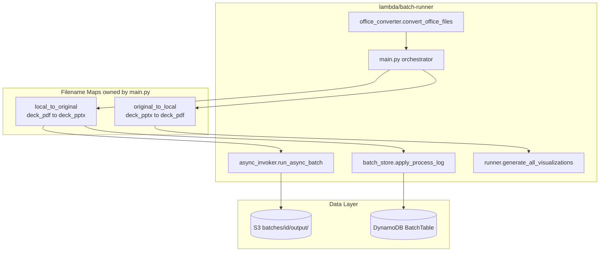
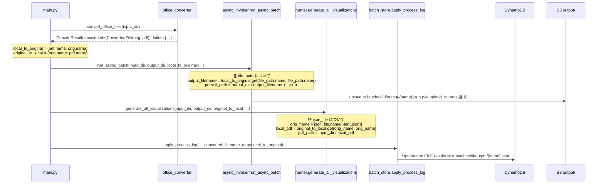

# Technical Design

## Overview

**Purpose**: 本機能はメイン OCR JSON の S3 オブジェクトキーから原本ドキュメントの形式を機械的に判別できるようにし、複数フォーマット (PDF / PPTX / DOCX / XLSX) を扱う API consumer に対して `BatchFile.resultKey` の自己記述性を確保する。

**Users**: バッチ API consumer (監査用途で原本と OCR 結果を機械的に突合する後段処理) と、複数フォーマット混在バッチを投入するユーザーが対象。

**Impact**: 既存の `BatchFile.resultKey` 値フォーマット (`batches/{id}/output/{stem}.json`) を `batches/{id}/output/{原本ファイル名}.json` (例: `report.pdf.json` / `deck.pptx.json`) に変更する破壊的変更。後方互換は OpenAPI description で migration ノートを明示することで担保する。既存バッチ (実行中 / 過去分) の遡及リネームは行わない。

### Goals

- メイン OCR JSON の S3 命名規約を `{原本ファイル名}.json` に統一し、`BatchFile.resultKey` 値だけで原本拡張子を判別可能にする
- Office 形式 (`deck.pptx`) は Fargate 内で変換後 PDF (`deck.pdf`) を経由するが、JSON 命名は変換前の原本 Office 名 (`deck.pptx`) を使用する
- 可視化処理 (`generate_all_visualizations`) を新命名規約に追従させ、PDF / Office 形式の双方で正しく PDF を解決する
- OpenAPI description で `BatchFile.resultKey` の値フォーマット変更と移行ノートを明示する

### Non-Goals

- 追加フォーマット (`.md` / `.csv` / `.html`) の命名統一 (yomitoku-client 側責務、将来 spec)
- 可視化 JPEG (`{basename}_{mode}_page_{idx}.jpg`) の命名変更 (現状維持)
- 既存バッチ (実行中 / 過去分) の S3 オブジェクト遡及リネーム / DynamoDB `resultKey` 値の遡及更新
- DynamoDB FILE アイテムの `resultKey` 属性名変更 (値フォーマットのみ変更)
- 新 API バージョン番号の発行 / `/v2/batches` などのパス分離
- Feature flag / dual-write 等の段階的移行機構の導入 (hard cutover を採用)

## Boundary Commitments

### This Spec Owns

- メイン OCR JSON の S3 オブジェクト命名規約 (`{原本ファイル名}.json`)
- `lambda/batch-runner/async_invoker.py` の JSON persist パスの組み立てロジック
- `lambda/batch-runner/runner.py` の可視化 lookup における JSON → ローカル PDF 解決ロジック
- `lambda/batch-runner/main.py` から下流モジュールへの「ローカル basename → 原本ファイル名」マッピングの伝播
- `lambda/api/schemas.ts` の `BatchFile.resultKey` の OpenAPI description (フォーマット仕様 + 移行ノート + 追加フォーマットとの非対称メモ)

### Out of Boundary

- API レイヤの入力ファイル名サニタイズ規則 (本 spec ではサニタイズ済の filename をそのまま使う前提)
- yomitoku-client が SageMaker コンテナ内で生成する追加フォーマット (`.md` / `.csv` / `.html`) の命名
- `s3_sync.py` の `_EXT_TO_CATEGORY` 分類ロジック (拡張子末尾分類なので `.pdf.json` → `output` カテゴリへ正しく振られる)
- `apply_process_log` の `converted_filename_map` 経由の DDB FILE PK lookup ロジック (`office-format-ingestion` で完結)
- 可視化 JPEG ファイルの命名 (現行 `{stem}_{mode}_page_{idx}.jpg` を維持)
- 既存バッチの S3 オブジェクト / DDB レコードの遡及移行 (運用判断で `R5.3` の通り将来 spec として独立)

### Allowed Dependencies

- **Upstream**: `office-format-ingestion` で導入された以下の機構を再利用する
  - `office_converter.ConvertResult` および `ConvertedFile(original_path, pdf_path)` 型 (immutable dataclass)
  - `main.py:201-221` の `pdf_to_original: dict[str, str]` 構築ロジック (本 spec で逆向き map も併設)
  - `apply_process_log(..., converted_filename_map=...)` (DDB PK lookup 用、本 spec で挙動変更なし)
- **Stack-internal**: `lambda/batch-runner/{async_invoker,runner,main}.py` 間の関数引数追加に閉じる。新規モジュール導入なし
- **依存方向**: `office_converter` → `{async_invoker, runner.py}` ← `main.py` ← (Step Functions invoke)。`main.py` のみがマッピングを所有し、他モジュールは引数で受け取る (純粋関数原則 / 副作用なし)

### Revalidation Triggers

以下の変更が発生した場合、依存仕様および consumer は再検証が必要:

- `BatchFile.resultKey` の値フォーマットの再変更 (OpenAPI description の改訂が伴う)
- `office_converter.ConvertResult` または `ConvertedFile` 構造の変更 (本 spec が直接消費)
- `apply_process_log` の `converted_filename_map` 引数仕様の変更 (本 spec の前提が崩れる)
- API レイヤのファイル名サニタイズ規則の変更 (`BatchFile.filename` と `resultKey` のファイル名部分の一致が崩れる)
- 追加フォーマット (`.md` / `.csv` / `.html`) の命名統一を行う将来 spec が走った場合 (本 spec の OpenAPI 非対称メモを更新する必要)

## Architecture

### Existing Architecture Analysis

**現行フロー** (Office 形式混在の場合):

1. `main.py` が `s3_sync.download_inputs` で S3 → ローカル `input_dir` にダウンロード
2. Office 形式が含まれていれば `office_converter.convert_office_files` で `.pptx/.docx/.xlsx → .pdf` 変換 (原本 Office はローカル削除、変換後 PDF が `input_dir` に残る)
3. `main.py:201-221` で `pdf_to_original = {converted_pdf.name: original_office.name}` を構築
4. `run_async_batch(input_dir, output_dir, ...)` が `input_dir` の PDF を SageMaker Async に投げる
5. `async_invoker._drain_queue` が成功通知を受け、`output_dir / f"{file_stem}.json"` に保存 (**本 spec の改修対象**)
6. `runner.generate_all_visualizations(input_dir, output_dir)` が `output_dir/*.json` を `json_file.stem → input_dir/{basename}.pdf` で逆引き (**本 spec の改修対象**)
7. `main.py` が `apply_process_log(..., converted_filename_map=pdf_to_original)` を実行し、DDB FILE PK は原本 Office 名で書き戻し (現行で正しく動作)
8. `s3_sync.upload_outputs` が `output_dir/*` を拡張子末尾で分類してアップロード (`*.json → output/`)

**現状の制約**:

- `pdf_to_original` は `apply_process_log` にしか渡されておらず、`async_invoker` および `runner` は「ローカル basename = 原本ファイル名」前提で動作している
- `async_invoker.py:362, 492` は `file_path.stem` (拡張子なし) を JSON 命名に使用しているため、PDF 入力でも `report.pdf → report.json` となり、原本拡張子が失われる
- `runner.py:170-171` は `json_file.stem` から `.pdf` を 1 段だけ剥がす前提で逆引きしている (新仕様 `deck.pptx.json` では `stem = deck.pptx` となり破綻)

### Architecture Pattern & Boundary Map

**Selected pattern**: 既存の純粋関数 + データフロー注入 (steering 規約)。新規モジュールは追加せず、既存関数のシグネチャに `dict[str, str]` 型のマッピング引数を追加する。`main.py` がオーケストレータとしてマッピングを所有し、下流モジュールは引数で受け取る。



**Architecture Integration**:

- **Domain/feature boundaries**: `main.py` がフィルナムマッピングを所有。`async_invoker` / `runner` は引数で受け取って動作する純粋関数 (steering 規約「main.py 以外のモジュールは副作用を持たない純粋関数」を維持)
- **Existing patterns preserved**: `office-format-ingestion` で導入した `pdf_to_original` の片方向マップを `local_to_original` として継承。本 spec で逆向き `original_to_local` を併設するのみ
- **New components rationale**: 新規 component は導入しない。既存 4 モジュール (`main`, `async_invoker`, `runner`, `schemas.ts`) のシグネチャ拡張に閉じる
- **Steering compliance**:
  - `tech.md`: Python yomitoku-client / Async Invoker パターンを維持。`@dataclass(frozen=True)` 不採用は変更データが単純な `dict[str, str]` 1 つで済むため (YAGNI)
  - `structure.md`: `main.py` 以外のモジュールに副作用を持たせない原則に従い、マッピングは引数で渡す。新ファイル追加なし

### Technology Stack

| Layer | Choice / Version | Role in Feature | Notes |
|-------|------------------|-----------------|-------|
| Backend / Services | Python 3.12 | `async_invoker.py` / `runner.py` / `main.py` の引数追加と命名ロジック改修 | 新規依存追加なし |
| Backend / Services | TypeScript 5.9.x + Hono 4.x + @hono/zod-openapi 1.x | `schemas.ts` の `BatchFile.resultKey` description 改修 | 新規依存追加なし |
| Data / Storage | DynamoDB BatchTable (既存) | `resultKey` 属性値フォーマット変更のみ (属性名 / GSI / TTL は変更なし) | スキーマ変更なし |
| Data / Storage | S3 BatchBucket (既存) | メイン JSON のキー命名規約変更 | 既存オブジェクトは遡及リネームしない |
| Testing | pytest + moto + Stubber / Vitest | 既存 fixture 約 22 箇所の書換 + Office 形式の新規 test case 追加 | 新規依存追加なし |

## File Structure Plan

### Modified Files

#### Python (Batch Runner)

- `lambda/batch-runner/async_invoker.py` — `run_async_batch` 関数および `AsyncInvoker` クラスに `local_to_original: dict[str, str]` 引数を追加。`_drain_queue` 内の `persisted_path = output_dir / f"{file_stem}.json"` (L492) を `output_dir / f"{output_filename}.json"` に変更。`output_filename = local_to_original.get(file_path.name, file_path.name)` で解決 (Office case のみ map に entry あり、PDF case は identity)
- `lambda/batch-runner/runner.py` — `generate_all_visualizations` に `original_to_local: dict[str, str] | None` 引数を追加。L169-173 の lookup ロジックを以下に書き換え:
  - `original_input_name = json_file.name[:-len(".json")]` で `.json` を 1 段剥がす
  - `local_pdf_basename = original_to_local.get(original_input_name, original_input_name)` (Office case 以外は identity → ファイル名そのまま)
  - `pdf_path = in_path / local_pdf_basename`
  - lookup 失敗時は `errors_per_file` に `"local PDF not found: {local_pdf_basename}"` を記録 (既存と同等の silent skip + warning)
- `lambda/batch-runner/main.py` — L201-221 の既存 `pdf_to_original` を `local_to_original` にリネーム (役割と一致)。新規に `original_to_local: dict[str, str]` を併設して構築。`run_async_batch(...)` 呼び出し L230-238 と `generate_all_visualizations(...)` 呼び出し L251-254 にそれぞれ map 引数を追加。既存の `apply_process_log(..., converted_filename_map=local_to_original)` への引数渡しは継続 (引数名 `converted_filename_map` はそのまま、value は `local_to_original` を流用)

#### TypeScript (API)

- `lambda/api/schemas.ts` — `BatchFile.resultKey` (L367-371) の OpenAPI description を以下に書き換え:
  - 値フォーマット: `batches/{batchJobId}/output/{原本ファイル名}.json` (`{原本ファイル名}` は `BatchFile.filename` と一致、原本拡張子を含む)
  - 例: `report.pdf.json` / `deck.pptx.json` / `report.docx.json` / `report.xlsx.json`
  - 移行ノート: 旧フォーマットは `{stem}.json` であったこと、`.json` 直前のファイル名部分に拡張子が含まれるよう変更されたこと、既存 consumer の basename 抽出処理 (`.json` 1 段剥がし前提) に影響すること
  - 追加フォーマット非対称メモ: yomitoku-client が出力する `.md` / `.csv` / `.html` は本 spec の対象外で、命名は `{stem}_{ext}.json` (yomitoku-client 規約) のまま。将来 spec で統一の可能性あり
  - `example` 値も `batches/abc-123/output/document.pdf.json` に更新

#### Tests

- `lambda/batch-runner/tests/test_async_invoker.py` — L955 等で persist 後のファイル名 assert を `{name}.json` 形式に書き換え。Office 形式 (`deck.pptx.json` 期待) の test case を追加
- `lambda/batch-runner/tests/test_runner.py` — `generate_all_visualizations` の lookup test に `original_to_local` 経由 / 経由なしの両ケースを追加
- `lambda/batch-runner/tests/test_run_async_batch_e2e.py` — L252, L784 等の assert を新フォーマットに書換 (`/ok.json` → `/ok.pdf.json`、`/deck.json` → `/deck.pptx.json`)
- `lambda/batch-runner/tests/test_main.py` — L758, L830, L960 等の fixture と assert を新フォーマットに書換
- `lambda/batch-runner/tests/test_batch_store.py` — `output_path` / `resultKey` 関連の fixture を新フォーマットに書換 (L116, L313, L322, L335, L373, L435, L483, L515, L557, L564)
- `lambda/api/__tests__/lib/batch-presign.test.ts`, `batch-store.test.ts`, `routes/batches.test.ts` — `resultKey` 値の fixture を新フォーマットに書換 (L220, L175, L243, L116)
- `lambda/api/__tests__/openapi-description.test.ts` — `BatchFile.resultKey` description に新フォーマット明示と移行ノートが含まれることを assert する新規テストケース追加

> 既存テスト規約 (`structure.md` の 1:1 対応原則) を維持。新規テストファイルは作成しない (既存ファイルへの追加で完結)。

## System Flows

### Filename Mapping Construction & Propagation



**Key Decisions**:

- **PDF identity case**: native PDF 入力では `local_to_original` および `original_to_local` に entry が無く、`dict.get(key, key)` で identity が返る。実装簡素化のため。
- **Office case**: `convert_office_files` の戻り値から両方向 map を組み立てる。逆引きが必要なのは `runner.py` のみだが、実装明示性のため両方向を `main.py` で構築する。
- **Failure path**: 変換失敗 / OCR 失敗時は `output_path` が `None` のまま `_append_log_entry` され、`apply_process_log` 経由でも `result_key` は書き込まれない (既存挙動を維持)。

## Requirements Traceability

| Requirement | Summary | Components | Interfaces / Files | Flows |
|-------------|---------|------------|--------------------|-------|
| 1.1 | PDF `report.pdf` → `report.pdf.json` | `async_invoker.AsyncInvoker._drain_queue` | `async_invoker.py` L492, `run_async_batch` 引数追加 | Mapping Propagation |
| 1.2 | PPTX `deck.pptx` → `deck.pptx.json` (変換後 PDF 名でなく原本 Office 名) | `main.py` (map 構築) + `async_invoker._drain_queue` | `main.py` L201-238, `async_invoker.py` L492 | Mapping Propagation |
| 1.3 | DOCX/XLSX 同様 | 同 1.2 | 同 1.2 | Mapping Propagation |
| 1.4 | 非 ASCII / サニタイズ済 filename を JSON 命名に使用 | `async_invoker._drain_queue` (依存: API sanitize → DDB filename → local file 名の同一性) | `async_invoker.py` L492 | Mapping Propagation |
| 1.5 | API レスポンス `BatchFile.resultKey` 値が `{原本ファイル名}.json` 終端 | `apply_process_log` (entry.output_path 自動追従) + API 経路 | `batch_store.py` L297-299 (変更なし), `batch-query.ts` L81 (変更なし) | Mapping Propagation |
| 2.1 | PDF 可視化 `report_{mode}_page_{idx}.jpg` | `runner._generate_for_single_file` | `runner.py` L136-148 (変更なし) | — |
| 2.2 | PPTX 可視化 `deck_{mode}_page_{idx}.jpg` | `runner.generate_all_visualizations` (lookup logic) | `runner.py` L154-187 (lookup 改修) | Mapping Propagation |
| 2.3 | PDF / Office 双方で PDF 解決成功 | `runner.generate_all_visualizations` | `runner.py` L169-173 | Mapping Propagation |
| 2.4 | 可視化 JPEG 命名据え置き (`{basename}_{mode}_page_{idx}.jpg`) | `runner._generate_for_single_file` | `runner.py` L136-148 (変更なし) | — |
| 3.1 | 変換失敗 → `errorCategory=CONVERSION_FAILED` + no resultKey | `_append_conversion_failures_to_log` + `apply_process_log` (既存) | `main.py` L227, `batch_store.py` (変更なし) | — |
| 3.2 | OCR 失敗 → `errorCategory=OCR_FAILED` + no resultKey | `apply_process_log` (既存) | `batch_store.py` (変更なし) | — |
| 3.3 | PENDING/PROCESSING 中は `resultKey` 未返却 | API consumer は条件付き取得 (既存) | `batch-query.ts` (変更なし) | — |
| 4.1 | OpenAPI で新フォーマット仕様明示 | `BatchFile.resultKey` schema | `schemas.ts` L367-371 | — |
| 4.2 | 移行ノートを description に含める | 同 4.1 | 同 4.1 | — |
| 4.3 | `resultKey` 属性名 / `.json` 終端不変 | `BatchFile.resultKey` schema | `schemas.ts` L367-371 | — |
| 4.4 | 追加フォーマットとの非対称メモ | 同 4.1 | 同 4.1 | — |
| 5.1 | S3 既存オブジェクト遡及リネームなし | (実装なし — migration script を追加しない方針) | — | — |
| 5.2 | DDB `resultKey` 既存値遡及更新なし | 同 5.1 | — | — |
| 5.3 | デプロイ後の新規バッチのみ新仕様 | Fargate task 単位でのコンテナ画像更新 (in-flight 影響なし) | (デプロイ手順) | — |

## Components and Interfaces

| Component | Domain/Layer | Intent | Req Coverage | Key Dependencies | Contracts |
|-----------|--------------|--------|--------------|------------------|-----------|
| `main.py` orchestrator | Batch Runner / Orchestrator | フィルナムマッピングを所有し、下流モジュールに pipe through | 1.2, 1.3, 2.2, 2.3 | `office_converter` (P0), `async_invoker` (P0), `runner` (P0), `batch_store` (P1) | Service |
| `async_invoker.AsyncInvoker` | Batch Runner / Service | SageMaker Async invoke と JSON persist 命名 | 1.1, 1.2, 1.3, 1.4 | SageMaker SDK (P0), S3 SDK (P0) | Service, Batch |
| `runner.generate_all_visualizations` | Batch Runner / Service | OCR 成功 JSON ごとに可視化 JPEG 生成 | 2.1, 2.2, 2.3 | `cv2` (P0), `pdf2image` (P0) | Service |
| `lambda/api/schemas.ts BatchFile.resultKey` | API / Schema | OpenAPI description で新フォーマット仕様と移行ノートを明示 | 4.1, 4.2, 4.3, 4.4 | `@hono/zod-openapi` (P0) | API |

### Batch Runner

#### main.py orchestrator

| Field | Detail |
|-------|--------|
| Intent | フィルナムマッピングを構築し、下流モジュール (`async_invoker` / `runner` / `apply_process_log`) に pipe through する |
| Requirements | 1.2, 1.3, 2.2, 2.3 |

**Responsibilities & Constraints**:

- `office_converter.convert_office_files` の戻り値から `local_to_original: dict[str, str]` および `original_to_local: dict[str, str]` を構築 (両方向 map)
- 既存の `pdf_to_original` 変数を `local_to_original` にリネーム (役割の明示化)。`apply_process_log(..., converted_filename_map=local_to_original)` への渡しは継続 (引数名は `converted_filename_map` のまま、value は `local_to_original` を流用)
- `run_async_batch(...)` および `generate_all_visualizations(...)` 呼び出しに新引数を追加
- ネイティブ PDF のみのバッチでは両 map は空 dict (`{}`) になる (`is_office_format` チェックで条件分岐済)

**Dependencies**:

- Inbound: Step Functions invoke (P0)
- Outbound: `office_converter.convert_office_files` (P0), `async_invoker.run_async_batch` (P0), `runner.generate_all_visualizations` (P0), `batch_store.apply_process_log` (P1)
- External: なし (Python stdlib のみ)

**Contracts**: Service ✅

##### Service Interface

```python
# main.py 内のローカル変数として保持される (公開関数なし)
local_to_original: dict[str, str]   # {converted_pdf_basename: original_office_filename}
original_to_local: dict[str, str]   # {original_office_filename: converted_pdf_basename}
```

- **Preconditions**: `convert_office_files` 実行後 (Office 形式が存在する場合のみ非空)
- **Postconditions**: 両 map は互いに逆引き関係。entry 数は `convert_result.succeeded` の長さと同一
- **Invariants**: `local_to_original` の value は API レイヤでサニタイズ済の DDB filename と一致 (`BatchFile.filename` と同値)

**Implementation Notes**:

- ネイティブ PDF のみのバッチ: 両 map が空 dict のまま下流に渡される。`dict.get(key, key)` 経由で identity 解決され、`{name}.json` 命名が PDF にも自動適用される
- 変換失敗 (`ConvertFailure`): 該当ファイルは `process_log.jsonl` に `errorCategory=CONVERSION_FAILED` で書き込まれ、後段の async_invoker は呼ばれない。本 spec の命名規約変更には影響しない
- **Drift 防止 (Single Source of Truth)**: 双方向 map を `main.py` で個別構築すると将来の保守者が片方だけ更新するリスク (`office-format-ingestion` Bug 001 と同種) があるため、以下のいずれかをタスク化して採用する:
  - 案 A (推奨): `office_converter.py` に `build_filename_maps(convert_result: ConvertResult) -> tuple[dict[str, str], dict[str, str]]` ヘルパ関数を追加し、両 map を一箇所で原子的に構築する。`main.py` はこのヘルパを呼ぶだけ
  - 案 B: `local_to_original` のみ `main.py` で構築し、`runner.py` 内部で `dict((v, k) for k, v in local_to_original.items())` により逆引き map を都度生成する (single source of truth、ただし `runner.py` のシグネチャ引数は `local_to_original` に統一)

#### async_invoker.AsyncInvoker

| Field | Detail |
|-------|--------|
| Intent | SageMaker Async Inference 呼び出しと、成功通知から S3 経由でダウンロードした JSON をローカルに persist する |
| Requirements | 1.1, 1.2, 1.3, 1.4 |

**Responsibilities & Constraints**:

- 既存の SageMaker invoke / SQS poll / 成功失敗判定ロジックは変更なし
- JSON persist 時のファイル名解決のみ改修: `output_filename = local_to_original.get(file_path.name, file_path.name)` で原本ファイル名を解決し、`persisted_path = output_dir / f"{output_filename}.json"` で保存
- `local_to_original` は `run_async_batch` 関数引数として注入され、`AsyncInvoker.run_batch` 経由で `_drain_queue` に到達する
- `_safe_ident` (SHA-1) は SageMaker `InferenceId` および S3 input key 用途のみ。ローカル JSON persist には使用しない (R1.4 担保)

**Dependencies**:

- Inbound: `main.py` (`run_async_batch`) (P0)
- Outbound: SageMaker Runtime SDK (P0), S3 SDK (download) (P0)
- External: AWS SQS Notification (Success/Failure Queue) (P0)

**Contracts**: Service ✅, Batch ✅

##### Service Interface

```python
async def run_async_batch(
    *,
    settings: BatchRunnerSettings,
    input_dir: str,
    output_dir: str,
    log_path: str,
    deadline_seconds: float,
    local_to_original: dict[str, str] | None = None,  # 新規引数 (デフォルト空 dict 相当で None 可)
) -> BatchResult: ...

class AsyncInvoker:
    def __init__(
        self,
        ...,  # 既存引数
        local_to_original: dict[str, str] | None = None,  # 新規引数
    ) -> None: ...

    def run_batch(
        self,
        *,
        input_files: list[Path],
        output_dir: Path,
        log_path: Path,
        batch_job_id: str,
        deadline_seconds: float,
    ) -> BatchResult: ...
    # 内部で self._local_to_original を _drain_queue に渡す
```

- **Preconditions**: `local_to_original` の key は `input_files` の各 `Path.name` と一致するものが entry として存在する (Office 形式の場合のみ)。PDF のみの場合は `None` または空 dict
- **Postconditions**: 成功通知を受けた各ファイルは `output_dir / f"{output_filename}.json"` に保存され、`process_log.jsonl` に `output_path` 値として記録される
- **Invariants**: `local_to_original` が `None` の場合は identity (`file_path.name → file_path.name`) と等価

##### Batch Contract

- **Trigger**: Step Functions → Fargate task → `main.py:main()` → `run_async_batch(...)`
- **Input / validation**: `input_dir/*.pdf` (Office 変換後の PDF + ネイティブ PDF) と `local_to_original` map
- **Output / destination**: `output_dir/*.json` (原本ファイル名終端) → `s3_sync.upload_outputs` 経由で `s3://bucket/batches/{id}/output/` へ
- **Idempotency & recovery**: SageMaker InferenceId / SQS at-least-once 対応は既存ロジックを維持。本 spec の命名変更は冪等性に影響しない

**Implementation Notes**:

- **Integration**: `local_to_original` は `AsyncInvoker.__init__` で受け取り `self._local_to_original` に保持。`_drain_queue` 内で `local_to_original.get(file_path.name, file_path.name)` を呼ぶ。`run_async_batch` 関数経由で `AsyncInvoker` を構築する際に引数を渡す
- **Validation**: `local_to_original` は型ヒント `dict[str, str] | None` で受ける。`None` は `{}` と同値扱い (空 dict)
- **Risks**: `_drain_queue` 内で `file_path.name` を参照する箇所は L492 のみ (現行 `file_stem` 参照)。test_async_invoker.py で persist 後パスを assert している箇所 (L955) を新フォーマットに書換

#### runner.generate_all_visualizations

| Field | Detail |
|-------|--------|
| Intent | OCR 成功した各 JSON に対して、対応するローカル PDF を逆引きしてページ単位の可視化 JPEG を生成する |
| Requirements | 2.1, 2.2, 2.3 |

**Responsibilities & Constraints**:

- 既存の `_generate_for_single_file` (`{basename}_{mode}_page_{idx}.jpg` の JPEG 出力) は変更なし (R2.4)
- `generate_all_visualizations` の lookup ロジックを以下に書換:
  - `original_input_name = json_file.name[:-len(".json")]` (`.json` を 1 段だけ剥がす)
  - `local_pdf_basename = original_to_local.get(original_input_name, original_input_name)`
  - `pdf_path = in_path / local_pdf_basename`
- lookup 失敗時 (`pdf_path.exists()` が False) は既存と同等の `errors_per_file[basename] = [...]` 警告ログ。エラーメッセージのみ「local PDF not found: {local_pdf_basename}」に更新

**Dependencies**:

- Inbound: `main.py` (P0)
- Outbound: なし (cv2 / pdf2image はファイル単位処理関数内)
- External: `cv2` / `pdf2image` (yomitoku-client transitive 経由) (P0)

**Contracts**: Service ✅

##### Service Interface

```python
def generate_all_visualizations(
    *,
    input_dir: str,
    output_dir: str,
    original_to_local: dict[str, str] | None = None,  # 新規引数
) -> dict[str, list[str]]: ...
```

- **Preconditions**: `output_dir/*.json` が存在 (`async_invoker` の persist 後)
- **Postconditions**: 各 JSON について対応する PDF が解決できれば JPEG が生成される。解決失敗は warning ログ + 戻り値の dict に記録されるが致命ではない
- **Invariants**: `original_to_local` が `None` の場合は identity (`json_file.name[:-5] → json_file.name[:-5]`) と等価。これは旧仕様 `{stem}.json` でも動作するが、新仕様では `report.pdf.json → report.pdf` がそのまま PDF basename に一致する

**Implementation Notes**:

- **Integration**: `original_to_local` は関数引数として `main.py` から注入。Default `None` で空 dict と同値
- **Validation**: lookup 失敗は致命ではないため `errors_per_file` に記録のみ。pipeline は継続
- **Risks**: 既存テスト `test_runner.py` の lookup test fixture を新フォーマットに更新する必要あり

### API

#### lambda/api/schemas.ts BatchFile.resultKey

| Field | Detail |
|-------|--------|
| Intent | OpenAPI description で新フォーマット仕様と移行ノートを consumer に明示する |
| Requirements | 4.1, 4.2, 4.3, 4.4 |

**Responsibilities & Constraints**:

- `BatchFile.resultKey` schema (`schemas.ts` L367-371) の `description` 文字列を更新
- 値フォーマット仕様: `batches/{batchJobId}/output/{原本ファイル名}.json`
- 移行ノート: 旧フォーマット (`{stem}.json`) からの変更点と consumer への影響
- 追加フォーマット (`.md` / `.csv` / `.html`) との一時的非対称メモ
- `example` プロパティを `batches/abc-123/output/document.pdf.json` に更新
- 属性名 `resultKey` および `.json` 終端は維持 (R4.3)

**Dependencies**:

- Inbound: API consumer (CloudFront 経由 UI / 自動化スクリプト) (P0)
- Outbound: なし (description は静的文字列)
- External: `@hono/zod-openapi` (P0)

**Contracts**: API ✅

##### API Contract

| Method | Endpoint | Request | Response | Errors |
|--------|----------|---------|----------|--------|
| GET | `/batches/{batchJobId}` | path: batchJobId | `BatchSummary` (含む `files[].resultKey`) | 404 (batch not found) |

**Implementation Notes**:

- **Integration**: `lambda/api/__tests__/openapi-description.test.ts` に `BatchFile.resultKey` description が新フォーマットと移行ノートを含むことを検証する test case を追加
- **Validation**: `pnpm cdk synth` で OpenAPI スキーマ生成が破綻しないことを確認 (description は単なる文字列なので機械検証は不要)
- **Risks**: description 更新のみで実装変更なし。consumer 側の migration window は本 description 更新のみで通知

## Data Models

### Logical Data Model

本 spec で変更されるデータ要素:

| 項目 | 旧 | 新 | 影響範囲 |
|------|-----|-----|----------|
| S3 メイン JSON キー | `batches/{id}/output/{stem}.json` | `batches/{id}/output/{原本ファイル名}.json` | S3 バケット内オブジェクト命名 |
| DDB `FILE.resultKey` 値 | `batches/{id}/output/{stem}.json` | `batches/{id}/output/{原本ファイル名}.json` | DynamoDB BatchTable の各 FILE アイテム |
| API レスポンス `BatchFile.resultKey` | `{stem}.json` 終端 | `{原本ファイル名}.json` 終端 | API consumer への返却値 |

**Consistency**:

- DDB `resultKey` の値変更と S3 オブジェクトキーは同時に新仕様化される (`apply_process_log` が両者を一括して更新する。原子性は既存ロジックで担保)
- 既存バッチの DDB / S3 は遡及リネームしない (R5.1, R5.2)
- 属性名 `resultKey` は不変 (R4.3)。GSI / TTL / 楽観ロックロジックも変更なし

## Error Handling

### Error Strategy

本 spec で導入される新たな失敗モードは存在しない。既存の失敗ハンドリングを維持する:

- **変換失敗 (`CONVERSION_FAILED`)**: `office_converter` で発生 → `_append_conversion_failures_to_log` でログ → `apply_process_log` で `errorCategory` 設定。`resultKey` は書き込まれない (R3.1)
- **OCR 失敗 (`OCR_FAILED`)**: `async_invoker` で SageMaker 失敗通知を受信 → `_append_log_entry(success=False)` でログ → `apply_process_log` で `errorCategory` 設定。`resultKey` は書き込まれない (R3.2)
- **可視化 lookup 失敗**: `runner.generate_all_visualizations` で `pdf_path.exists() == False` の場合、warning ログ + `errors_per_file` に記録のみ。バッチ全体は継続 (既存挙動を維持、R2 の妨げにはならない)

### Monitoring

本 spec で新規メトリクスは導入しない。既存の CloudWatch メトリクス (`FilesFailedTotal` / `BatchDurationSeconds` 等) で観測可能。

## Testing Strategy

### Unit Tests

1. **async_invoker JSON 命名 (R1.1)**: PDF 入力 (`report.pdf`) に対して `output_dir / "report.pdf.json"` で保存されることを assert (`test_async_invoker.py`)
2. **async_invoker Office 命名 (R1.2, R1.3)**: `local_to_original={"deck.pdf": "deck.pptx"}` を渡した場合、`output_dir / "deck.pptx.json"` で保存されることを assert (`test_async_invoker.py` 新規ケース)
3. **async_invoker 非 ASCII / サニタイズ済 filename (R1.4)**: API レイヤでサニタイズ済の非 ASCII filename (例: `Path("報告書.pdf")` または `_____.pdf`) を `run_async_batch` に渡した場合、persist 先パスがサニタイズ済 filename + `.json` (例: `output_dir / "報告書.pdf.json"`) と完全一致し、`_safe_ident` 由来の SHA-1 16 文字列が persist パスに **含まれない** ことを assert (`test_async_invoker.py` 新規ケース)
4. **runner lookup 二段拡張子 (R2.2, R2.3)**: `output_dir/deck.pptx.json` と `original_to_local={"deck.pptx": "deck.pdf"}` を与えた場合、`input_dir/deck.pdf` を解決できることを assert (`test_runner.py` 新規ケース)
5. **runner lookup ネイティブ PDF (R2.1)**: `output_dir/report.pdf.json` と空 `original_to_local` の場合、`input_dir/report.pdf` を解決できることを assert (`test_runner.py`)
6. **schemas.ts description (R4.1, R4.2, R4.4)**: `BatchFile.resultKey` description が「`{原本ファイル名}.json`」「移行ノート」「追加フォーマット非対称」を含むことを assert (`openapi-description.test.ts` 新規ケース)
7. **filename map drift 防止 (R1.2, R1.3, R2.2, R2.3)**: `build_filename_maps(convert_result)` ヘルパ (案 A 採用時) が同一 `convert_result` から構築した両 map が完全な逆引き関係 (`local_to_original[v] == k for k, v in original_to_local.items()`) であることを assert (`test_office_converter.py` 新規ケース)。案 B 採用時は `runner.py` 内部の逆引き構築ロジックを単体テストでカバー

### Integration Tests

1. **batch_store apply_process_log (R1.5, R3.1, R3.2)**: `entry.output_path = "/tmp/output/deck.pptx.json"` および `converted_filename_map={"deck.pdf": "deck.pptx"}` で実行した場合、DDB FILE PK が `deck.pptx` でルックアップされ、`resultKey = batches/{id}/output/deck.pptx.json` で UpdateItem されることを assert (`test_batch_store.py` 既存ケース更新)
2. **process_log_reader (既存非リグレッション)**: `output_path` フィールドが新フォーマット文字列でも `ProcessLogEntry` に正しくパースされることを assert
3. **API GET /batches (R1.5, R3.3)**: DDB から `resultKey = "batches/abc/output/deck.pptx.json"` を read し、API レスポンスにそのまま返ることを assert (`batches.test.ts` 既存ケース更新)

### E2E Tests

1. **混在バッチ E2E (R1.1, R1.2, R2, R3.1)**: PDF 2 ファイル + PPTX 1 ファイル + (DOCX 1 ファイル + 変換失敗 PPTX 1 ファイル) の混在で `run_async_batch` → `generate_all_visualizations` → `apply_process_log` を通貫実行し、各 FILE の `resultKey` および可視化 JPEG が新規約で生成されることを assert (`test_run_async_batch_e2e.py` 既存ケース更新)
2. **PDF のみバッチ E2E (R1.1, R5.3)**: ネイティブ PDF のみ 3 ファイル (空 `local_to_original`) で実行し、`resultKey` が `{name}.pdf.json` 形式になることを assert
3. **OpenAPI 整合性 E2E**: `pnpm cdk synth` で OpenAPI ドキュメントが破綻なく生成され、`BatchFile.resultKey` description が新仕様文言を含むことを assert (`openapi-description.test.ts`)

### Performance Tests

本 spec は新規 hot path を導入しない (`dict.get` 1 回追加のみ)。Phase 5 の既存ベンチマーク非リグレッションのみ確認 (1000 ファイル混在バッチで通常範囲)。

### Contract Test (Legacy Reference Guard)

**Purpose**: ~22 箇所の test fixture 移行 (Modified Files > Tests 参照) が完了した後、旧フォーマット (`{stem}.json`) のリテラルや構築パターンが test コードに残存しないことを CI で機械的に保証する。`tech.md` の「契約テスト」原則 (`scripts/check-legacy-refs.sh` / `test/check-legacy-refs.test.ts`) と同パターン。

**実装案**:

- `scripts/check-legacy-refs.sh` を拡張、または `scripts/check-result-key-format.sh` を新設し、以下の正規表現で違反検出 → `exit 1`:
  - `output_dir\s*/\s*f"\{(?:file_)?stem\}\.json"` — Python `f"{stem}.json"` 系の構築パターン (現在 `lambda/batch-runner/tests/test_main.py:758,960` 等に存在)
  - `output/[a-zA-Z0-9_-]+\.json["']` — 拡張子なし basename + `.json` のリテラル (現在 `test_batch_store.py` 等に多数)
  - 例外として `process_log.jsonl` / `_async/outputs/{uuid}.out` / `extra_formats` ({stem}_{ext}.json yomitoku-client 規約) は除外リストで弾く
- `pnpm lint` または pytest 契約テストの一部として実行

**Coverage**: R1.1, R1.2, R1.3, R1.5, R4.1 — 旧フォーマット fixture の取り残しを検出

## Migration Strategy

```mermaid
flowchart TB
    Start([Start]) --> Pre[Pre-deploy: OpenAPI doc 更新済]
    Pre --> Build[CDK + Docker image build]
    Build --> Deploy[CDK deploy: BatchExecutionStack]
    Deploy --> NewBatchOnly{デプロイ後の<br/>新規バッチか?}
    NewBatchOnly -->|Yes| NewFmt[新フォーマット {name}.json で生成]
    NewBatchOnly -->|No, In-flight| InFlight[既存 Fargate task は旧コード継続<br/>= 旧フォーマット {stem}.json で生成]
    InFlight --> Drain[既存 task が完了したら<br/>新規 task は新コード]
    NewFmt --> Done([Done])
    Drain --> Done
```

### Phase Breakdown

1. **Pre-deploy**: 本 spec の全コード変更 + テスト更新を merge。OpenAPI description は merge 時点で新仕様反映 (deploy 前でも doc は最新)
2. **Deploy**: `pnpm cdk deploy BatchExecutionStack` で Fargate TaskDefinition の Docker image を新版に更新。API Lambda は同時 deploy
3. **Cutover**: 新 deploy 後に開始される batch (Step Functions Execution) は新 image を pull → 新仕様で動作
4. **In-flight handling**: deploy 瞬間に `RUNNING` 状態の Fargate task は **旧 image で走り続ける** (Fargate task は image を起動時に pull してメモリ常駐するため、deploy 中 task の動作は影響を受けない)。In-flight task が完了するまでは旧フォーマットで JSON が生成され、その後の新規 batch のみ新フォーマット
5. **Validation**: deploy 後の新規バッチで `BatchFile.resultKey` 値が `.pdf.json` / `.pptx.json` 終端であることを sample-pdf / sample-pptx で実機確認

### Rollback Triggers

- E2E テストでメイン JSON が S3 に保存されない / 可視化が全件失敗する
- API 経由で取得した `resultKey` が新フォーマットと一致しない
- consumer 側 (CloudFront UI 等) が新フォーマットの `resultKey` をパースできず 5xx を返す

### Rollback Strategy

- **Hard rollback**: 直前の Docker image (旧 commit) を `pnpm cdk deploy` で再 push。新 image による Fargate task が起動できる前に旧 image に戻す。新フォーマットで生成された S3 オブジェクト / DDB レコードは残存するが、機械的判別可能性が落ちるだけで API consumer のパース処理が `.json` で 1 段剥がす実装なら互換 (旧 stem ベース) として扱える
- **No data migration**: rollback 時に S3 / DDB の遡及書換は行わない (forward-only migration)
- **Boundary**: rollback 後の整合性 (新旧フォーマット混在期間) は API consumer 側で `.json` 終端チェック + 拡張子部位の有無で判別可能

### Validation Checkpoints

- ✅ Deploy 直後: sample-pdf 1 ファイルで `resultKey = batches/{id}/output/{name}.pdf.json` を確認
- ✅ Deploy 後 30 分: sample-pdf + sample-pptx 混在バッチで両形式の resultKey を確認
- ✅ Deploy 後 24 時間: 本番バッチの `resultKey` 値を Spot check し、新フォーマット定着を確認
