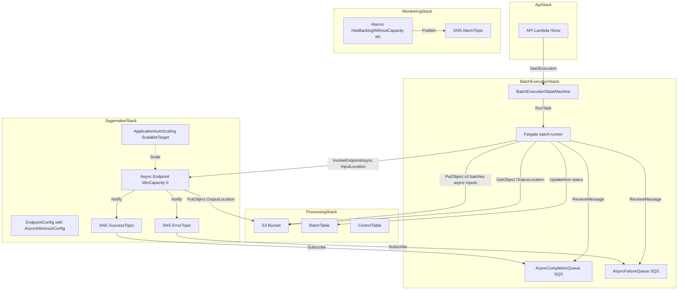
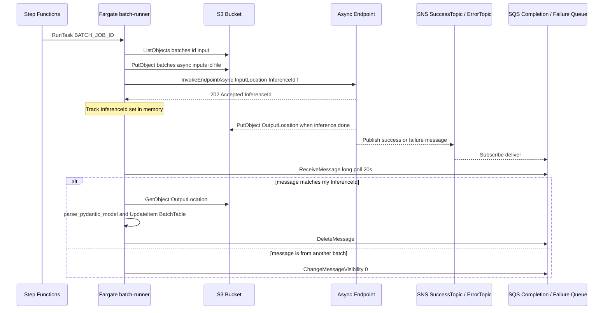
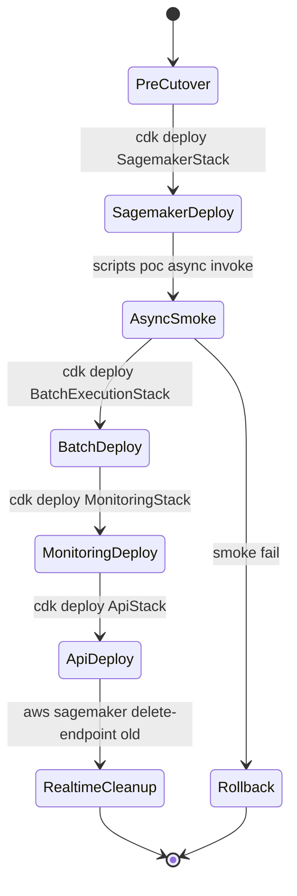
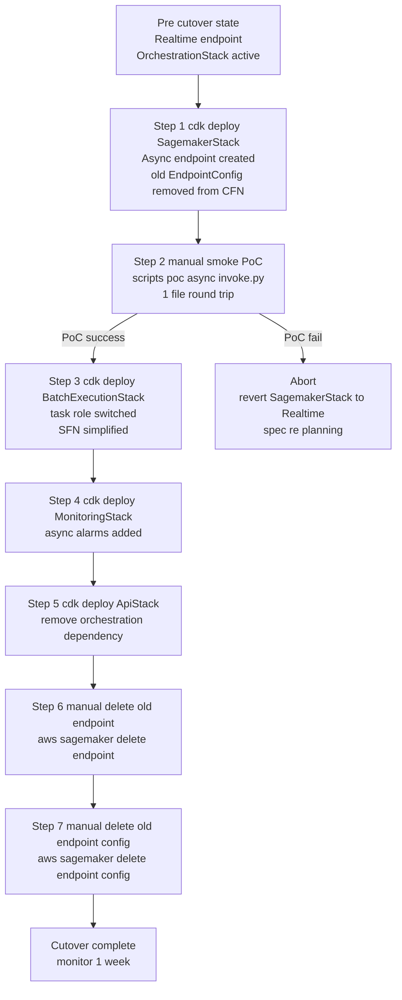

# Design Document — `sagemaker-async-inference-migration`

## Overview

**Purpose**: 現行の SageMaker **Realtime** Endpoint (`ml.g5.xlarge`,
`InitialInstanceCount=1`, 常時稼働) を、**Asynchronous Inference** Endpoint
(`MinCapacity=0`, Auto Scaling `0 ↔ N`, S3 InputLocation + SNS 通知) へ
全面置換する。アイドル時 GPU 課金ゼロと、`InvokeEndpointAsync` の
1 時間実行上限による大容量 PDF 対応を同時に満たす。

**Users**: (a) 運用者 (コスト削減とキャパシティ事故の回避), (b) 開発者
(batch-runner の呼び出し契約差し替え), (c) セキュリティ担当 (IAM 最小権限の
維持)。公開 API (バッチ API `/batches`) は一切変更せず、エンドユーザーへの
影響はゼロ。

**Impact**: 4 スタック (`SagemakerStack` / `BatchExecutionStack` /
`MonitoringStack` / `OrchestrationStack`) と `lambda/batch-runner` が破壊的に
変更される。`OrchestrationStack` は撤去され、`endpoint-control` Lambda も
削除される。旧 Realtime Endpoint / EndpointConfig は AWS アカウントから
明示削除する (CFN + CLI)。

### Goals

- Realtime Endpoint を廃止し、Async Endpoint のみを唯一の推論経路にする
- `MinCapacity=0` の Auto Scaling で、バックログ無しの時間帯は GPU ゼロ課金
- batch-runner を `InvokeEndpointAsync` + SNS→SQS pull で Async 対応
- `ApproximateBacklogSizePerInstance` ベースの ターゲット追跡 Auto Scaling
- 4 スタック横断の破壊的変更を、CDK スタック単位の段階デプロイで吸収
- ap-northeast-1 をデフォルトリージョンとし、us-east-1 は退避用オプション

### Non-Goals

- Realtime Endpoint との **併存運用** (本仕様デプロイ後は Async のみ)
- SageMaker インスタンスタイプの変更 (`ml.g5.xlarge` を維持)
- バッチ API `/batches` の公開契約変更
- `BatchTable` / `ControlTable` / `ProcessLog` のスキーマ変更
- yomitoku-pro Marketplace モデル本体の差し替え・バージョンアップ
- `yomitoku-client` (MLism-Inc/yomitoku-client) への PR / fork 継続維持

## Boundary Commitments

### This Spec Owns

- `SagemakerStack` の EndpointConfig を `AsyncInferenceConfig` 付きで再定義
  し、Application Auto Scaling (`0 ↔ MaxCapacity`) を Endpoint に配線する
- 専用 SNS `SuccessTopic` / `ErrorTopic` の新規作成と、それぞれに紐づく
  SQS Queue (`AsyncCompletionQueue` / `AsyncFailureQueue`) の作成・購読
- `lambda/batch-runner/async_invoker.py` (新設) — S3 PUT → `invoke_endpoint_async`
  → SQS poll → `OutputLocation` GetObject → `parse_pydantic_model` のフロー
- `BatchExecutionStack` の `RunBatchTask` Task Role を `InvokeEndpointAsync`
  + SNS/SQS/S3 `_async` prefix 権限へ差し替え
- `MonitoringStack` へ Async 用 CloudWatch Alarm (`HasBacklogWithoutCapacity`
  / `ApproximateAgeOfOldestRequest`) を追加
- カットオーバー Runbook (`docs/runbooks/sagemaker-async-cutover.md`) の新設

### Out of Boundary

- 公開バッチ API (`/batches` CRUD) の仕様変更 — 既存 `yomitoku-client-batch-migration`
  仕様が owner
- `BatchTable` / `ControlTable` / `ProcessLog` の属性・PK/SK・GSI — 同上
- 画像ラスター化 / PDF 分割 / OCR 結果のパース・可視化ロジック — batch-runner
  側のユーティリティ (`runner.py` の `_generate_for_single_file` など) をそのまま
  流用。Async 移行後も変更しない
- yomitoku-pro コンテナの推論ロジック — Marketplace モデル本体は不変
- API Lambda (`lambda/api/`) のコード — SageMaker Endpoint を直接呼ばない
  ため、本仕様の影響は endpointName context 値のみ

### Allowed Dependencies

- 既存 `ProcessingStack` の S3 Bucket / DynamoDB Tables を Async の I/O 先
  として利用してよい (ただし IAM は `_async` prefix に絞る)
- `yomitoku_client` の **parser/visualizer** (`parse_pydantic_model`,
  `correct_rotation_image`, `page_result.visualize`, `load_pdf_to_bytes`,
  `load_pdf`) を `async_invoker.py` から import 可能
- `cdk-nag` / `AwsSolutionsChecks` の既存 suppressions パターンを踏襲可能

### Revalidation Triggers

- **Contract shape changes**: SNS メッセージ JSON スキーマが AWS 側で変更
  された場合 (SNS→SQS 購読メッセージ構造を前提とした実装に波及)
- **Data ownership changes**: `BatchTable` の `ProcessLog` 書式変更は
  `yomitoku-client-batch-migration` 仕様が owner のため、本仕様で再定義しない
- **Dependency direction changes**: yomitoku-pro モデル応答 JSON スキーマの
  変更 (Realtime/Async 共通で用いる `parse_pydantic_model` が破綻する可能性)
- **Startup/runtime prerequisite changes**: AWS サービスクォータ
  (`Maximum instances per endpoint` が 1 未満になる変更など) が発生した場合

## Architecture

### Existing Architecture Analysis

現行の **Realtime 前提** アーキテクチャ (該当 Req 1, 3, 5, 7):

- `SagemakerStack` が `CfnEndpointConfig` で Realtime variant
  (`ml.g5.xlarge` × 1) を固定し、`CfnEndpoint` は `OrchestrationStack` の
  `endpoint-control` Lambda が create/delete で動的制御
- `BatchExecutionStack` の SFN `EnsureEndpointInService` が
  `DescribeEndpoint` → `EndpointStatus=InService` を 60 秒間隔でポーリング
- Fargate batch-runner は `YomitokuClient.analyze_batch_async` (`invoke_endpoint`
  同期呼び出し) で 1 ページずつ Realtime に投げる
- `MonitoringStack` は Realtime を前提としない汎用アラーム
  (`FilesFailedTotal`, `BatchDurationSeconds`) のみを持ち、Invocations /
  ModelLatency などの Realtime 専用メトリクスは未導入

### Architecture Pattern & Boundary Map



**Architecture Integration**:

- **Selected pattern**: Event-driven async inference with client-side pull.
  SageMaker が OutputLocation に書き込んだ時点で SNS 通知、SQS をバッファに
  挟んで Fargate batch-runner が pull する。
- **Domain / feature boundaries**: SageMaker レイヤー (Endpoint / SNS / Auto
  Scaling) は `SagemakerStack` が owner、invoke / SQS 購読 / S3 I/O は
  `BatchExecutionStack` + `lambda/batch-runner` が owner。
- **Existing patterns preserved**: Step Functions による Fargate 起動
  (`RunBatchTask`)、ControlTable の `BATCH_EXEC_LOCK`、BatchTable の
  `PK=BATCH#id / SK=META` / `PK=BATCH#id / SK=FILE#...` 契約。
- **New components rationale**:
  - `AsyncCompletionQueue` / `AsyncFailureQueue`: SNS → batch-runner 間の
    バッファ (SNS は HTTPS 以外では直接 pull 不可)
  - `ScalableTarget` + `ScalingPolicy`: `MinCapacity=0` 運用を CDK で宣言
- **Steering compliance**: CDK v2, cdk-nag, context 駆動、IAM 最小権限、
  SNS 暗号化 (AWS 管理 KMS) の既存原則を踏襲。

### Technology Stack

| Layer | Choice / Version | Role in Feature | Notes |
|-------|------------------|-----------------|-------|
| Infrastructure / Runtime | AWS CDK v2 (TypeScript) | SagemakerStack 再定義、4 スタック変更 | `aws-cdk-lib/aws-sagemaker`, `aws-applicationautoscaling`, `aws-sns`, `aws-sqs` |
| Infrastructure / Runtime | SageMaker Asynchronous Inference | 推論 Endpoint | `ml.g5.xlarge`, `MaxConcurrentInvocationsPerInstance` 既定 4 (実測 PoC で確定) |
| Backend / Services | Python 3.12 (Fargate) | `lambda/batch-runner/async_invoker.py` (新設) | `boto3 sagemaker-runtime.invoke_endpoint_async` / `boto3 sqs.receive_message` |
| Messaging / Events | SNS + SQS | 完了 / 失敗通知 | Topic 新規 (Req 4.2, 再利用不可)。 AWS 管理 KMS で暗号化 |
| Data / Storage | S3 (既存 processing bucket) | `batches/_async/inputs/` / `outputs/` / `errors/` | IAM を `batches/_async/*` prefix に絞る |
| Observability | CloudWatch Alarms | `HasBacklogWithoutCapacity`, `ApproximateAgeOfOldestRequest` | 既存 `AlarmTopic` (MonitoringStack) に配線 |

## File Structure Plan

### Directory Structure

```
lib/
├── sagemaker-stack.ts             # 大規模改修: AsyncInferenceConfig / ScalableTarget / SNS Topic
├── batch-execution-stack.ts       # 中規模改修: Task Role / SFN 簡素化 / SQS 参照
├── monitoring-stack.ts            # 小規模追加: Async アラーム
├── orchestration-stack.ts         # 撤去 (ファイル削除)
├── api-stack.ts                   # 小改修: orchestration stateMachine 依存を剥がす
└── processing-stack.ts            # 変更なし (S3/DDB オーナー)

lambda/batch-runner/
├── main.py                        # 改修: async_invoker 経路へ切替
├── runner.py                      # 大改修: create_client/run_analyze_batch 撤去、run_async_batch 新設
├── async_invoker.py               # 新設: invoke_endpoint_async + SQS pull
├── settings.py                    # 追加設定: SUCCESS_QUEUE_URL, FAILURE_QUEUE_URL, ASYNC_INPUT_PREFIX
└── tests/                         # pytest で async_invoker / run_async_batch をカバー

lambda/endpoint-control/           # 撤去 (ディレクトリ削除)

bin/
└── app.ts                         # 改修: orchestrationStack 削除、asyncMaxCapacity context 解決

docs/runbooks/
└── sagemaker-async-cutover.md     # 新設: デプロイ順序・旧 Endpoint 削除手順・ロールバック不能性

scripts/
└── check-legacy-refs.sh           # 追記: 禁止語に InvokeEndpoint (Realtime), endpoint-control など
```

### Modified Files

- `lib/sagemaker-stack.ts` — Endpoint を CDK リソースとして持つようにし、
  `AsyncInferenceConfig` (NotificationConfig 含む) / `ScalableTarget` /
  `ScalingPolicy` / SNS `SuccessTopic` / `ErrorTopic` を配線
- `lib/batch-execution-stack.ts` — Task Role を Async 用に置換、SFN から
  `EnsureEndpointInService` / `WaitEndpoint` を撤去、SQS 環境変数追加
- `lib/monitoring-stack.ts` — `HasBacklogWithoutCapacity` /
  `ApproximateAgeOfOldestRequest` アラーム追加
- `lib/api-stack.ts` — `orchestrationStack.stateMachine` 依存を削除。
  `stateMachine` prop を撤去し、`batchExecutionStateMachine` のみに絞る
- `bin/app.ts` — `orchestrationStack` インスタンス化を削除、
  `asyncMaxCapacity` context を解決して `SagemakerStack` に渡す
- `lambda/batch-runner/main.py` — `create_client` / `run_analyze_batch` 参照を
  `run_async_batch` 呼び出しに差し替え
- `lambda/batch-runner/runner.py` — `create_client` / `run_analyze_batch`
  関数を削除、新 `run_async_batch(settings)` を定義 (内部で `async_invoker` を
  呼ぶ)
- `lambda/batch-runner/settings.py` — `success_queue_url` / `failure_queue_url`
  / `async_input_prefix` / `endpoint_name` を追加 (`endpoint_name` は既存だが
  用途変更)
- `scripts/check-legacy-refs.sh` — 禁止語に `sagemaker:InvokeEndpoint`
  (Realtime 版の IAM 文字列)、`OrchestrationStack`, `endpoint-control`,
  `EnsureEndpointInService` を追加

## System Flows

### Async Invocation Sequence



**Flow-level decisions**:

- **バックログ制御**: batch-runner は同時に保持する `InferenceId` 集合の
  サイズを `max_concurrent_async` (既定 16、context 可変) で制限し、上限に
  達したら新規投入を停止して SQS pull に専念する (Req 3.3 の背圧制御)。
- **タイムアウト**: batch-runner タスク全体は 7200 秒 (`BATCH_TASK_TIMEOUT_SECONDS`
  既存値を維持)。Async 個別推論の `InvocationTimeoutSeconds` は 3600 秒
  (Req 4.3)。未完了のまま Fargate 側タイムアウトした場合は `failed` で確定。
- **重複配信**: SQS standard queue で at-least-once。batch-runner は
  `InferenceId` の処理済みセットで重複実行を防止 (`DeleteMessage` 後に
  再配送があっても no-op)。

### Cutover State Flow



- **Rollback 不能性**: 旧 Realtime Endpoint / EndpointConfig を
  `RealtimeCleanup` で削除した後は、CDK ツリーから定義が除かれているため、
  再展開には spec 再実装が必要。要件 Req 7 / Req 11.2 でこの不可逆性を
  Runbook に明記する。

## Requirements Traceability

| Req # | Summary | Components | Interfaces | Flows |
|-------|---------|------------|------------|-------|
| 1.1, 1.2, 1.3, 1.4, 1.5 | Realtime 廃止・Async 一本化 | `SagemakerStack` | `CfnEndpointConfig` with `AsyncInferenceConfig`, `CfnEndpoint` | Cutover |
| 2.1, 2.2, 2.3, 2.4, 2.5 | Auto Scaling `0 ↔ N` | `SagemakerStack` | `CfnScalableTarget`, `CfnScalingPolicy` | Async Invocation |
| 3.1, 3.2, 3.3, 3.4, 3.5, 3.6 | `InvokeEndpointAsync` + SNS | `async_invoker.py`, `runner.py`, SQS Queues | `AsyncInvoker`, SQS `ReceiveMessage` | Async Invocation |
| 4.1, 4.2, 4.3, 4.4, 4.5 | AsyncInferenceConfig パラメータ | `SagemakerStack` | `CfnEndpointConfig.AsyncInferenceConfig`, SNS Topics | — |
| 5.1, 5.2, 5.3, 5.4, 5.5 | IAM 最小権限 | `SagemakerStack`, `BatchExecutionStack` | IAM Policies (role / topic policy) | — |
| 6.1, 6.2, 6.3, 6.4, 6.5 | Async 監視・アラーム | `MonitoringStack` | CloudWatch Alarms | — |
| 7.1, 7.2, 7.3, 7.4, 7.5 | カットオーバー・旧削除 | `SagemakerStack`, Runbook | Runbook manual step | Cutover |
| 8.1, 8.2, 8.3, 8.4 | ap-northeast-1 デフォルト | `bin/app.ts`, Runbook | context `region` | — |
| 9.1, 9.2, 9.3, 9.4 | コスト見積り・タグ | design.md appendix, `MonitoringStack`, Runbook | Cost Explorer tags | — |
| 10.1, 10.2, 10.3, 10.4, 10.5 | 既存契約維持 | `ApiStack`, `lambda/api/`, `scripts/check-legacy-refs.sh` | 既存 API 契約 | — |
| 11.1, 11.2, 11.3, 11.4, 11.5 | 監査可能性 | `docs/runbooks/sagemaker-async-cutover.md`, design.md | Runbook, PR template | Cutover |

## Components and Interfaces

| Component | Domain/Layer | Intent | Req Coverage | Key Dependencies (P0/P1) | Contracts |
|-----------|--------------|--------|--------------|--------------------------|-----------|
| `SagemakerStack` | Infra / IaC | Async Endpoint と関連 AWS リソースの宣言 | 1, 2, 4, 5 | `CfnModel`, SageMaker execution role (P0) | Service, State |
| `AsyncInvoker` | Runtime | `invoke_endpoint_async` + SQS poll のファサード | 3, 5 | `boto3 sagemaker-runtime` / `sqs` (P0), `parse_pydantic_model` (P1) | Service, Event |
| `BatchExecutionStack` | Infra / IaC | Fargate / SFN / Task Role 配線 | 3, 5, 7 | `Cluster`, `TaskDefinition`, `StateMachine` (P0), SQS Queues (P0) | Service |
| `MonitoringStack` | Infra / IaC | Async 用 CloudWatch Alarms | 6 | `AlarmTopic` (P0) | State |
| `CutoverRunbook` | Ops / Docs | 手動手順書 | 7, 8, 9, 11 | 運用者 (P0) | — |

### SageMaker / Infrastructure

#### SagemakerStack

| Field | Detail |
|-------|--------|
| Intent | Async Endpoint (MinCapacity 0) と AsyncInferenceConfig / AutoScaling / SNS を 1 スタックで所有する |
| Requirements | 1.1, 1.2, 1.3, 1.4, 1.5, 2.1, 2.2, 2.3, 2.4, 2.5, 4.1, 4.2, 4.3, 4.4, 4.5, 5.1, 5.3 |

**Responsibilities & Constraints**

- `CfnModel` は従来通り Marketplace Model Package を参照する (不変)
- `CfnEndpointConfig` に `AsyncInferenceConfig` を付与し、
  `ProductionVariant.InitialInstanceCount=0`, `InstanceType=ml.g5.xlarge` を
  宣言する
- `CfnEndpoint` を同スタックが所有する (OrchestrationStack で動的に create
  していた従来方式から変更)
- SNS `SuccessTopic` / `ErrorTopic` を**新規**作成し、KMS 暗号化 (AWS 管理
  `alias/aws/sns`)。`Publish` 権限を SageMaker service principal
  (`sagemaker.amazonaws.com`) に限定
- `CfnScalableTarget` と `CfnScalingPolicy` (TargetTracking) を Endpoint 作成
  完了後に登録 (`CfnScalableTarget.addDependsOn(endpoint)`)
- 旧 Realtime `ProductionVariant` / 旧 `EndpointConfig` 定義は完全削除
- `cdk-nag` の suppression は既存ルール (ECR / CW Logs) を踏襲、新規 SNS /
  SQS / ScalableTarget 関連 suppression は最小化

**Dependencies**

- Inbound: `bin/app.ts` が `asyncMaxCapacity` / `endpointName` /
  `endpointConfigName` / `modelPackageArn` を context から渡す (P0)
- Outbound: `BatchExecutionStack` が `successQueueUrl` / `failureQueueUrl` /
  `endpointName` を props で受け取る (P0)
- External: AWS SageMaker (`sagemaker:*` service-linked role), AWS Application
  Auto Scaling (`AWSServiceRoleForApplicationAutoScaling_SageMakerEndpoint`) (P0)

**Contracts**: Service [x] / API [ ] / Event [ ] / Batch [ ] / State [x]

##### Service Interface

```typescript
export interface SagemakerStackProps extends StackProps {
  /** Application Auto Scaling の上限値 (既定 1)。context `asyncMaxCapacity` で上書き可能。 */
  readonly asyncMaxCapacity?: number;
  /**
   * AsyncInferenceConfig.ClientConfig.MaxConcurrentInvocationsPerInstance
   * yomitoku-pro の PoC 実測値に基づく既定値 (初期値 4)。
   */
  readonly maxConcurrentInvocationsPerInstance?: number;
  /** 推論 1 件あたりの最大実行時間 (秒、既定 3600)。 */
  readonly invocationTimeoutSeconds?: number;
  /** scale-in 確定までの待機 (秒、既定 900 = 15 分)。 */
  readonly scaleInCooldownSeconds?: number;
}

export class SagemakerStack extends Stack {
  public readonly endpointConfigName: string;
  public readonly endpointName: string;
  public readonly modelName: string;
  public readonly successTopic: ITopic;
  public readonly errorTopic: ITopic;
  public readonly successQueue: IQueue;
  public readonly failureQueue: IQueue;
}
```

- Preconditions: `modelPackageArn` / `endpointName` / `endpointConfigName` が
  context から解決済であること
- Postconditions: `CfnOutput` で `EndpointConfigName` / `EndpointName` /
  `SuccessTopicArn` / `ErrorTopicArn` / `SuccessQueueUrl` / `FailureQueueUrl`
  を公開する
- Invariants: `InitialInstanceCount=0`、`MaxCapacity>=1`、`MinCapacity=0` は固定

##### State Management

- **State model**: AWS リソース状態 (Endpoint status, ScalableTarget capacity)
  は AWS 側が保持。CDK は宣言のみ。
- **Persistence & consistency**: CloudFormation による順次更新
  (Endpoint → ScalableTarget → ScalingPolicy → Alarm)
- **Concurrency strategy**: なし (シングル writer である CloudFormation)

**Implementation Notes**

- Integration: `bin/app.ts` で context を解決し、`SagemakerStack` を最初に
  deploy。Queue/Topic の URL は CfnOutput で伝搬、`BatchExecutionStack` が
  import するか props で受け取る
- Validation: ユニットテスト `test/sagemaker-stack.test.ts` で
  (a) `AsyncInferenceConfig.OutputConfig.S3OutputPath` が `batches/_async/outputs/`
  prefix、(b) `NotificationConfig.SuccessTopic` / `ErrorTopic` が CFN 参照で
  配線済、(c) `CfnScalableTarget.MinCapacity=0`、(d) `TargetTrackingScalingPolicy`
  の `CustomizedMetricSpecification` が `ApproximateBacklogSizePerInstance` を
  宣言、(e) 旧 `InitialInstanceCount=1` 定義が残存しない、(f) Task/Execution
  Role に `sagemaker:InvokeEndpoint` (Realtime) が残存しない、を検証
- Risks: `ApproximateBacklogSizePerInstance` はアカウント有効化済でないと
  メトリクスが publish されない (最初の invoke で初期化される仕様)。初回
  scale-out が遅れる可能性があるため PoC で実測する (R2)

### Runtime / Invocation

#### AsyncInvoker

| Field | Detail |
|-------|--------|
| Intent | 1 バッチジョブ分の入力ファイル群を S3 PUT し、非同期推論を発行し、SQS で完了通知を回収する |
| Requirements | 3.1, 3.2, 3.3, 3.4, 3.5, 3.6, 5.2 |

**Responsibilities & Constraints**

- `yomitoku_client` の呼び出し層は一切使用しない (Realtime 前提の invoke)。
  ただし `parse_pydantic_model` / `correct_rotation_image` / `page_result.visualize`
  / `load_pdf_to_bytes` は `runner.py` 経由で引き続き利用可能
- 1 ファイル = 1 InvokeEndpointAsync (PDF はラスター化せず、yomitoku-pro
  コンテナ側に多ページ処理を委任する前提。Realtime 時の「クライアント側
  ページ分割」は廃止)
- `InferenceId` を UUID (`f"{batch_job_id}:{file_stem}"` 形式) で生成し、
  batch-runner タスク内メモリで保持する (in-flight set)
- SQS は共通 Queue を long poll。自身の InferenceId 以外は
  `ChangeMessageVisibility=0` で即座に返却
- 4xx エラー (`ValidationException`) は即時失敗扱い、リトライなしで
  `process_log.jsonl` へ記録 (Req 3.4)
- ErrorTopic 経由で受信した失敗通知は `S3FailurePath` から `failureReason` を
  取得し `error` フィールドへ記録 (Req 3.5)
- タスク全体のタイムアウト (`BATCH_TASK_TIMEOUT_SECONDS=7200`) を超えた場合、
  未完了の InferenceId を `FAILED` として確定し Fargate タスクは成功終了
  させない (SFN 側で `MarkFailedForced` 経由)

**Dependencies**

- Inbound: `runner.run_async_batch(settings)` から呼び出される (P0)
- Outbound: `boto3 sagemaker-runtime.invoke_endpoint_async`, `boto3 sqs`,
  `boto3 s3` (P0)。`parse_pydantic_model` (P1, 流用のみ)
- External: SageMaker Async Endpoint (P0), AWS S3 / SNS / SQS (P0)

**Contracts**: Service [x] / API [ ] / Event [x] / Batch [x] / State [ ]

##### Service Interface

```python
class AsyncInvoker:
    def __init__(
        self,
        *,
        endpoint_name: str,
        input_bucket: str,
        input_prefix: str,          # "batches/_async/inputs/{batch_job_id}/"
        output_bucket: str,         # same as input_bucket
        success_queue_url: str,
        failure_queue_url: str,
        max_concurrent: int,        # in-flight InferenceId 上限 (既定 16)
        poll_wait_seconds: int = 20,  # SQS long poll
        sagemaker_client=None,
        sqs_client=None,
        s3_client=None,
    ) -> None: ...

    async def run_batch(
        self,
        *,
        batch_job_id: str,
        input_files: list[Path],
        output_dir: Path,
        log_path: Path,
    ) -> BatchResult: ...


@dataclass
class BatchResult:
    succeeded_files: list[str]
    failed_files: list[tuple[str, str]]  # (file_stem, error_message)
    in_flight_timeout: list[str]         # タイムアウトで未完了のファイル
```

- Preconditions:
  - SageMaker Async Endpoint が `InService` (instance 0 でも可)
  - SuccessQueue / FailureQueue が存在し、batch-runner Task Role に
    `sqs:ReceiveMessage`, `sqs:DeleteMessage`, `sqs:ChangeMessageVisibility`,
    `sqs:GetQueueAttributes` が付与済
  - `input_bucket` に `input_prefix` で PUT 可能な S3 権限あり
- Postconditions:
  - 成功ファイルごとに `output_dir/{file_stem}_{ext}.json` が作成される
  - `process_log.jsonl` に全ファイル分のレコードが書き込まれる
  - `BatchResult` が呼び出し元に返却される
- Invariants:
  - `max_concurrent` を超える in-flight は発生しない
  - 他バッチの SQS メッセージは消費しない

##### Event Contract

- **Subscribed events**: SNS → SQS 配送メッセージ
  - SuccessQueue 本文 (AWS 側の正式形式に準拠):
    ```json
    {
      "inferenceId": "batch_id:file_stem",
      "requestParameters": {"inputLocation": "s3://.../batches/_async/inputs/.../file.pdf"},
      "responseParameters": {"outputLocation": "s3://.../batches/_async/outputs/.../uuid.out"},
      "invocationStatus": "Completed"
    }
    ```
  - FailureQueue 本文:
    ```json
    {
      "inferenceId": "batch_id:file_stem",
      "failureLocation": "s3://.../batches/_async/errors/.../uuid.out",
      "failureReason": "...",
      "invocationStatus": "Failed"
    }
    ```
- **Ordering / delivery guarantees**: SQS standard の at-least-once、順序保証
  なし。batch-runner は `InferenceId` 集合で idempotent に処理
- **Note**: 実メッセージスキーマは R3 で PoC 時に検証し、差異があれば
  `async_invoker.py` のパースを調整する (design.md の記述は概念レベル)

##### Batch / Job Contract

- **Trigger**: `SFN.RunBatchTask` が Fargate タスクを起動 → `runner.run_async_batch`
  → `AsyncInvoker.run_batch`
- **Input / validation**: `input_files` は `batches/{batchJobId}/input/*` を
  走査し、対応拡張子 (`.pdf`, `.png`, `.jpg`, `.tiff`) のみを対象。
  それ以外は即時 skip + process_log に記録
- **Output / destination**: `batches/{batchJobId}/output/*.json` (既存契約
  維持)、加えて `batches/_async/outputs/` に Async 内部用 .out が残存
  (後日 S3 Lifecycle で削除するが本仕様では扱わない)
- **Idempotency & recovery**: 同一 `batch_job_id` で再実行した場合、
  既に `output/{file_stem}_{ext}.json` が存在するファイルは skip
  (既存 `analyze_batch_async` の `overwrite=False` 挙動を踏襲)。
  途中失敗の再開は Step Functions 再実行で対応。

**Implementation Notes**

- Integration: `runner.py` が `AsyncInvoker(settings).run_batch(...)` を
  `await` で呼ぶ。その後 `generate_all_visualizations(...)` を呼ぶ (既存)
- Validation: pytest で (a) 成功/失敗/タイムアウトの 3 パスを moto + motoserver
  で smoke test、(b) 他バッチメッセージのスキップ挙動、(c) `max_concurrent`
  背圧、(d) 4xx 即時失敗を検証
- Risks: SQS 共通 Queue の他バッチメッセージ誤消費が起きた場合、VisibilityTimeout
  が短いため速やかに返却されるが、3+ 並行バッチで発生頻度が上昇する。
  モニタリングで並行数を観測し、必要なら InferenceId ベースの per-batch Queue
  に切替 (本仕様 Out of Scope)

### Orchestration / Flow

#### BatchExecutionStack

| Field | Detail |
|-------|--------|
| Intent | Fargate クラスタ・TaskDefinition・BatchExecutionStateMachine を配線し、Async invoke に必要な環境変数 / IAM を供給する |
| Requirements | 3.1, 3.6, 5.2, 5.5, 7.1 |

**Responsibilities & Constraints**

- 既存 Cluster / TaskDefinition / Public subnet 構成は維持
- Task Role の SageMaker 権限を `sagemaker:InvokeEndpoint` (Realtime) から
  `sagemaker:InvokeEndpointAsync` へ差し替え。`sagemaker:DescribeEndpoint` は
  削除 (Req 5.2, D4)
- Task Role に SQS `ReceiveMessage` / `DeleteMessage` /
  `ChangeMessageVisibility` / `GetQueueAttributes` を `SuccessQueue` /
  `FailureQueue` ARN 限定で付与
- Task Role に S3 `batches/_async/inputs/*` / `batches/_async/outputs/*` /
  `batches/_async/errors/*` へのアクセス権を追加 (Req 5.5)
- Task 環境変数に `SUCCESS_QUEUE_URL` / `FAILURE_QUEUE_URL` /
  `ASYNC_INPUT_PREFIX` / `ASYNC_OUTPUT_PREFIX` / `ASYNC_ERROR_PREFIX` を追加
- SFN 定義から `EnsureEndpointInService` / `WaitEndpoint` / `EndpointReady?` /
  `DescribeEndpoint` CallAwsService を削除 (D4)
- `RunBatchTask` は `AcquireBatchLock` → `RunBatchTask` に直結

**Dependencies**

- Inbound: `bin/app.ts` が SagemakerStack の outputs (topic/queue ARN) を props
  で渡す (P0)
- Outbound: `ApiStack` が `batchExecutionStateMachine` のみを参照する (P0,
  既存と同じ)
- External: ECS Fargate (P0), Step Functions (P0), SQS (P0)

**Contracts**: Service [x] / API [ ] / Event [ ] / Batch [x] / State [ ]

**Implementation Notes**

- Integration: `BatchExecutionStackProps` に `successQueue: IQueue`,
  `failureQueue: IQueue` を追加
- Validation: `test/batch-execution-stack.test.ts` で
  (a) Task Role から `sagemaker:InvokeEndpoint` (Realtime) が消え
  `sagemaker:InvokeEndpointAsync` に置換済、(b) SQS 権限が対象 ARN 限定、
  (c) SFN 定義から `EnsureEndpointInService` 文字列が消滅、(d) 環境変数に
  `SUCCESS_QUEUE_URL` / `FAILURE_QUEUE_URL` が存在、(e) `RunBatchTask` が
  依然として Public subnet + assignPublicIp (既存仕様維持) を確認
- Risks: SFN 定義の変更で既存 in-flight 実行が破綻しないよう、デプロイ前に
  in-flight バッチ 0 を確認する手順を Runbook に記載

### Monitoring

#### MonitoringStack (追補)

| Field | Detail |
|-------|--------|
| Intent | Async 専用の CloudWatch Alarm を追加し、SNS AlarmTopic 経由で通知する |
| Requirements | 6.1, 6.2, 6.3, 6.4, 6.5 |

**Responsibilities & Constraints**

- 既存 `FilesFailedTotal` / `BatchDurationSeconds` アラームは維持
- 新規アラーム:
  - `HasBacklogWithoutCapacityAlarm`: `AWS/SageMaker`
    `HasBacklogWithoutCapacity` (dim: `EndpointName`) が `>= 1` で 5 分連続
    → AlarmTopic 通知
  - `ApproximateAgeOfOldestRequestAlarm`: `AWS/SageMaker`
    `ApproximateAgeOfOldestRequest` (dim: `EndpointName`) が `> 1800` 秒を
    1 回でも観測 → AlarmTopic 通知
- Realtime 専用メトリクス (`Invocations`, `ModelLatency`, `OverheadLatency`)
  をアラーム化しない (Req 6.4) — 既存 MonitoringStack にそもそも存在しない
  ため新規追加もしない、という現状維持で要件は自然に充足
- Req 6.5 「バッチ実行中の集計メトリクスと Async 特有メトリクスを同一
  ダッシュボードで参照可能に」— ダッシュボード (`CfnDashboard`) を本仕様で
  新設するか否かは **Out of scope** とし、既存 AlarmTopic への通知経路の
  一貫性のみを保証する (Runbook に手動ダッシュボード作成ガイドを記載)

**Dependencies**

- Inbound: `bin/app.ts` が `SagemakerStack.endpointName` を props 経由で渡す (P0)
- Outbound: なし
- External: CloudWatch Alarms, SNS AlarmTopic (既存)

**Contracts**: Service [ ] / API [ ] / Event [ ] / Batch [ ] / State [x]

**Implementation Notes**

- Integration: `MonitoringStackProps` に `endpointName?: string` を追加。
  未指定時はアラーム 2 本をスキップ (テスト容易性のため)
- Validation: `test/monitoring-stack.test.ts` で (a) 2 本のアラームが
  `AWS/SageMaker` namespace で `EndpointName` dimension 付きで作成される、
  (b) SNS `AlarmTopic` にアクションが接続されている、を検証

### Documentation

#### CutoverRunbook

| Field | Detail |
|-------|--------|
| Intent | Realtime → Async の段階的切替を手動手順として定義し、ロールバック不能性を明記する |
| Requirements | 7.3, 7.4, 7.5, 8.3, 9.3, 9.4, 11.2, 11.3 |

**Responsibilities & Constraints**

- 対象読者: 運用者 (`docs/runbooks/sagemaker-async-cutover.md`)
- 構成:
  1. Pre-flight checklist (in-flight バッチ 0 / smoke PoC の成功確認)
  2. Stack-by-stack デプロイ手順 (D7 の 5 ステップ)
  3. 旧 Endpoint / EndpointConfig 削除コマンド (`aws sagemaker delete-endpoint`
     / `delete-endpoint-config`) と verification (`aws sagemaker
     describe-endpoint` が `ResourceNotFound` を返すこと)
  4. `-c region=us-east-1` 退避判定基準 (Req 8.3)
  5. コスト実測記録テンプレート (Req 9.3)
  6. トラブルシュート 3 項目 (S3 出力が来ない / HasBacklogWithoutCapacity が
     解消しない / scale-out が遅延する)

## Data Models

### Domain Model

本仕様は新しい永続ドメインモデルを導入しない。既存 `BatchTable` 上の
`FileItem` (`PK=BATCH#id`, `SK=FILE#stem`) の `status` 更新経路のみが
Async 完了検知に合わせて変更される。

### Physical Data Model — S3 Layout

**For S3 (Object Store)**:

```
s3://{processing-bucket}/
├── batches/{batchJobId}/              # 既存 (API 契約で公開、変更なし)
│   ├── input/{file}.{ext}
│   ├── output/{stem}_{ext}.json
│   └── manifest.json
└── batches/_async/                    # 新設 (Async 内部専用、API 非公開)
    ├── inputs/{batchJobId}/{file}.{ext}
    ├── outputs/{batchJobId}/{inferenceId}.out
    └── errors/{batchJobId}/{inferenceId}.err
```

- 既存 `batches/{batchJobId}/output/*.json` は batch-runner が Async 応答を
  取得した後、`parse_pydantic_model` で整形した結果を書き込む (公開契約不変)
- `batches/_async/*` 配下は API からは参照不可 (IAM で `batches/_async/*` を
  `lambda/api/` Task Role から除外)

### Data Contracts & Integration

**Event Schemas** — SNS → SQS Message (JSON): 前述 `AsyncInvoker.Event Contract`
参照。実メッセージスキーマは R3 PoC で固定化し、`async_invoker.py` の
パース関数を unit test で保護する。

## Error Handling

### Error Strategy

- **4xx from InvokeEndpointAsync**: `ValidationException` 等は即時失敗。
  `process_log.jsonl` に `"error": "ValidationException: ..."` を記録し、
  リトライなし (Req 3.4)
- **Async timeout**: `InvocationTimeoutSeconds=3600` を超えた場合、SageMaker が
  FailureLocation に書き込み ErrorTopic に通知。batch-runner は
  `S3FailurePath` から `failureReason` を取得して `error` に記録 (Req 3.5)
- **SQS receive errors**: 一時的な API エラーは exponential backoff (最大
  5 回) でリトライ。連続失敗は batch タスク全体を失敗扱い
  (SFN `MarkFailedForced`)
- **Fargate timeout (7200s)**: `BATCH_TASK_TIMEOUT_SECONDS` 到達時、未完了
  InferenceId は `FAILED` として確定、SFN が `States.Timeout` をキャッチし
  `MarkFailedForced` → `ReleaseBatchLockOnError` → `Failed` 状態へ遷移
- **Endpoint capacity errors (InsufficientCapacity)**: scale-out 失敗が
  CloudWatch `HasBacklogWithoutCapacity` に反映、MonitoringStack のアラームが
  運用者に通知。Runbook の判定基準 (1 週間 3 回超) で `-c region=us-east-1`
  退避を検討

### Error Categories and Responses

- **User Errors (4xx)**: 公開 API (`/batches`) 側の入力検証は既存仕様の
  範囲で処理。本仕様での新規 user error はなし
- **System Errors (5xx)**: Endpoint の `InServiceOutOfCapacity` や
  SNS/SQS service outage に対しては、Fargate レベルでは retry せず SFN
  `MarkFailedForced` → Runbook 介入とする (fail fast)
- **Business Logic Errors**: 未使用 (バッチは全件 success/partial/failed で
  集約)

### Monitoring

- 本仕様で新設するログ: batch-runner タスクの `async_invoker` モジュール log
  (CloudWatch Logs, 既存 `BatchLogGroup`) に
  `invoke_endpoint_async`/`receive_message`/`get_object` 各時点の構造化 JSON
  を出力
- 既存 EMF メトリクス (`FilesFailedTotal`, `BatchDurationSeconds`) は
  batch-runner 側で引き続き発行 (契約変更なし)

## Testing Strategy

### Unit Tests

- `test/sagemaker-stack.test.ts` — AsyncInferenceConfig / ScalableTarget /
  ScalingPolicy / SNS Topic / SQS Queue の CFN 表現検証
- `test/batch-execution-stack.test.ts` — Task Role が `InvokeEndpointAsync` 付、
  `InvokeEndpoint` (Realtime) 不在、SFN から `EnsureEndpointInService` 消滅
- `test/monitoring-stack.test.ts` — 新規 2 アラームの存在確認、AlarmTopic 配線
- `lambda/batch-runner/tests/test_async_invoker.py` — moto + localstack で
  invoke → SQS → output GetObject のモックフロー、4xx / timeout / 他バッチ
  メッセージスキップ

### Integration Tests

- `test/app-synth.test.ts` (既存 or 新設) — `cdk synth --all` で
  OrchestrationStack が存在しない、SagemakerStack に Async リソースが
  含まれる、を確認
- `lambda/batch-runner/tests/test_run_async_batch_e2e.py` — localstack で
  S3 / SQS / SNS を立て、Endpoint は `invoke_endpoint_async` を moto で
  スタブした上で、1 ファイル成功 / 1 ファイル失敗の混在バッチを実行

### Performance / Load

- **Scale-out 実測**: scale-out `0 → 1` の cold-start 時間を計測 (PoC R2
  と同等、実測 3 回の平均を Runbook に記録)
- **同時 invocation**: `MaxConcurrentInvocationsPerInstance=4` で 8 ファイル
  投入時の backlog 解消時間を計測 (設計想定: 2 ラウンド = モデル応答時間 × 2)
- **SQS スループット**: 共通 Queue に並行バッチ 2 本を投入し、他バッチ
  メッセージのスキップが正常動作することを確認

## Security Considerations

- **SNS Topic Policy**: `Publish` を SageMaker service principal
  (`sagemaker.amazonaws.com`) からの `SourceArn=<endpoint-arn>` 限定で許可。
  `Subscribe` は同一アカウント内の SQS Queue のみに限定 (Req 5.3)
- **SQS Queue Policy**: `SendMessage` を SNS Topic ARN 限定で許可
- **S3 IAM**: SageMaker 実行ロールは `batches/_async/inputs/*` の GetObject、
  `batches/_async/outputs/*` / `batches/_async/errors/*` の PutObject のみ
  (Req 5.1)。Fargate Task Role は `batches/*` 配下 Get/Put + `_async/*`
  配下 Get/Put/Delete (Req 5.5)
- **Endpoint ARN 固定化**: Fargate Task Role の `InvokeEndpointAsync` 権限は
  `arn:aws:sagemaker:{region}:{account}:endpoint/{endpointName}` に限定
- **暗号化**: SNS Topic / SQS Queue は AWS 管理 KMS (`alias/aws/sns`,
  `alias/aws/sqs`) で SSE

## Performance & Scalability

- **Cold-start**: `MinCapacity=0` → `1` への scale-out は 5-10 分を想定
  (PoC で実測)。SLA が許容しない場合は運用者判断で `asyncMaxCapacity` を
  保ちつつ `MinCapacity` を `1` に変える context を検討 (本仕様では既定値
  `0` 固定)
- **Throughput**: `MaxCapacity=1` × `MaxConcurrentInvocationsPerInstance=4` で
  同時 4 invocation。大規模バッチ (100+ ファイル) では処理時間が比例して
  伸びるが、Fargate 7200 秒 / 推論 3600 秒の枠内で完結する前提
- **Backlog absorption**: `ApproximateBacklogSize` が積み上がっても
  `ApproximateAgeOfOldestRequest` 1800 秒アラーム (Req 6.3) で運用者に通知

## Migration Strategy



- **Phase breakdown**: 上記 7 ステップをランブックに 1 コマンド/ステップで記載
- **Rollback triggers**: Step 2 の PoC 失敗のみが rollback ポイント。Step 3
  以降は rollback 不能 (旧 EndpointConfig が CFN 管理から外れているため、
  戻すには spec 再作成が必要)
- **Validation checkpoints**:
  - Step 1 後: `aws sagemaker describe-endpoint --endpoint-name <new>`
    → `EndpointStatus: InService`
  - Step 2 後: S3 output にサンプル JSON が生成され `parse_pydantic_model` で
    正常にパース可能
  - Step 3 後: `RunBatchTask` が新 Task Definition revision で起動可能
  - Step 6 後: `describe-endpoint --endpoint-name <old>` が `ResourceNotFound`
  - Step 7 後: `describe-endpoint-config --endpoint-config-name <old>` が
    `ResourceNotFound`

## Supporting References

### コスト見積り (Req 9.1)

| 項目 | Realtime (現行) | Async (本仕様) | 削減額 |
|------|-----------------|----------------|--------|
| `ml.g5.xlarge` 単価 (ap-northeast-1, ap-useeast-1 同額) | $1.459/hr | $1.459/hr | — |
| 稼働前提 | 24h × 30 日 = 720h | ジョブ集中 4h/日 × 20 日 = 80h (`MaxCapacity=1`) | — |
| 月額 GPU 費 | $1,050 | $116 | **$934 (89%) 削減** |
| その他 (S3 / SQS / SNS / ECS / SFN) | 既存 | 既存 + $5 未満 (SNS/SQS 新設) | 誤差範囲 |

- 前提: バッチ集中時のみ scale-out し、それ以外は `0` 台。`MaxCapacity` を
  増やした場合は単純比例で上振れ
- 実測は移行後 1 ヶ月のコスト実測を `docs/runbooks/sagemaker-async-cutover.md`
  の実測記録欄に追記する (Req 9.3)

### Cost Explorer タグ戦略 (Req 9.2)

全 Async 関連 AWS リソースに以下タグを付与:

- `yomitoku:stack=sagemaker-async`
- `yomitoku:component=<endpoint|autoscaling|sns|sqs|runbook>`

`SagemakerStack` / `BatchExecutionStack` / `MonitoringStack` の `Tags.of(this)`
で一括タグ付けし、CDK 再帰的に伝搬させる。

### Open Questions / Future Work

- **Q1 (R3)**: SNS 通知の実メッセージスキーマが公式ドキュメントと差異がある
  場合は `async_invoker.py` のパースを修正。テストは実メッセージを JSON
  フィクスチャ化して固定化
- **Q2**: `MaxConcurrentInvocationsPerInstance` の最適値は yomitoku-pro
  モデルの GPU メモリと推論時間に依存。PoC 結果で確定し、design.md の
  "Technology Stack" の既定値を更新
- **Q3**: 将来的に `MaxCapacity > 1` 運用する際の Queue 分離 (per-batch
  Queue) 判断基準は本仕様 Out of Scope。必要時に別 spec で扱う
