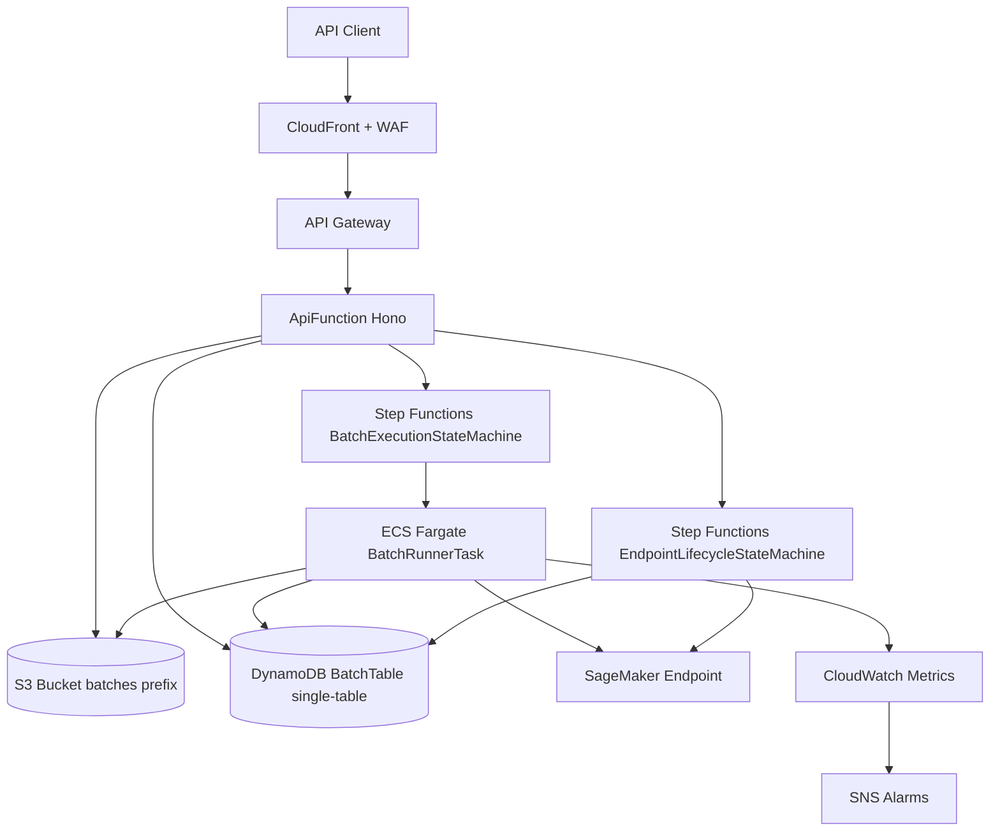
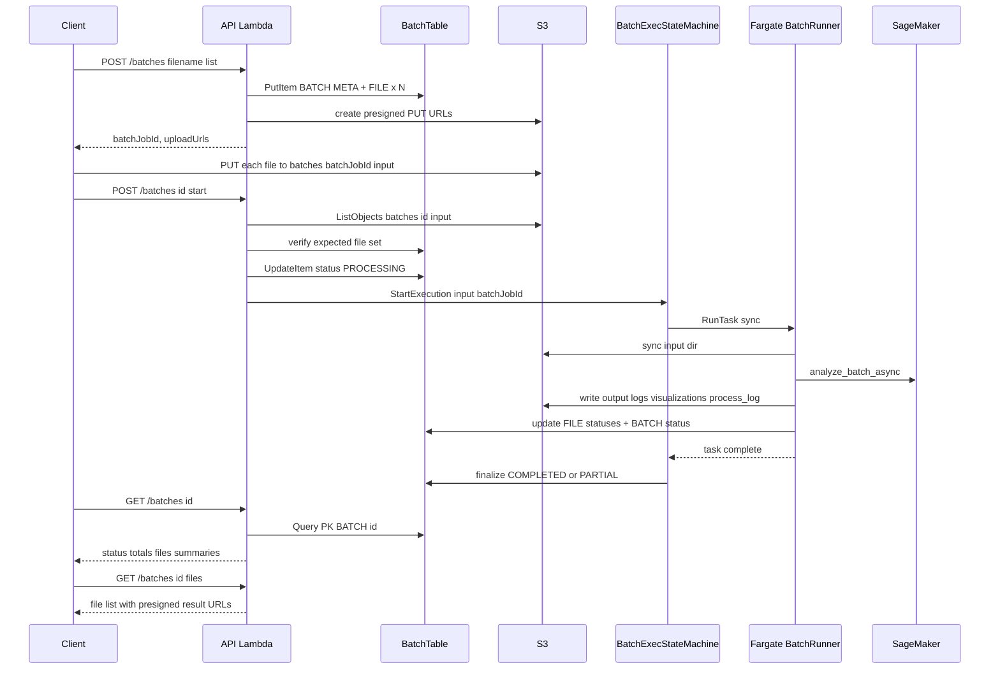
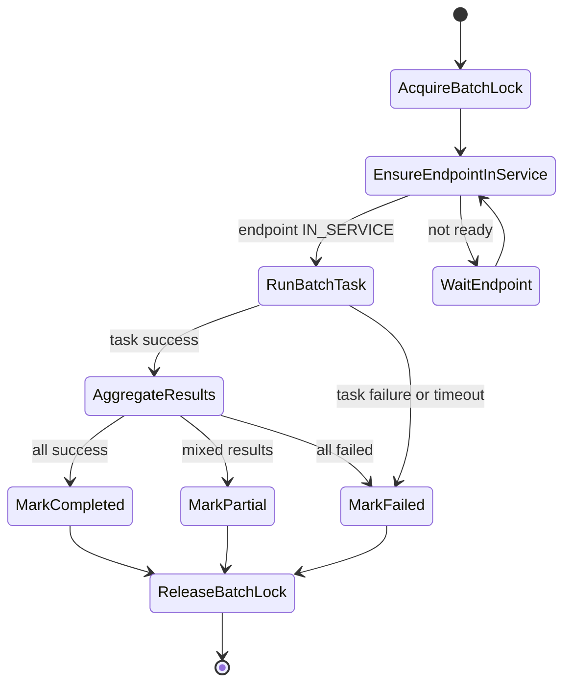
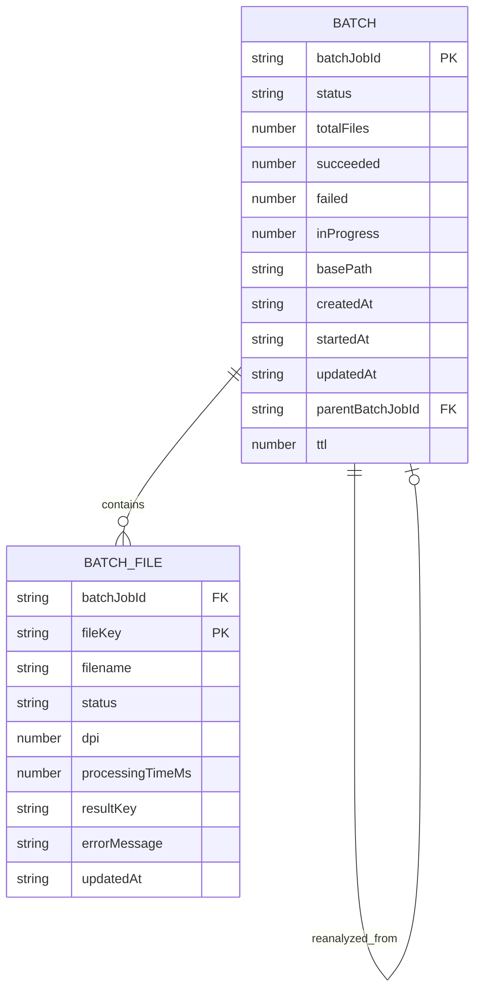

# Technical Design — yomitoku-client-batch-migration

## Overview

本設計は、現行「1 PDF 1 ジョブ」同期風 OCR ワーカーを、`yomitoku-client==0.2.0` のバッチ処理モード（`analyze_batch_async` によるファイル並列＋ページ並列推論）へ全面置換するアーキテクチャを定義する。API は `/batches` 系へ刷新され、DynamoDB は Single-table 設計に再構築、ワーカー実行基盤は Lambda（10 分）から ECS Fargate（最大 2 時間）へ移行する。旧 `/jobs` API・`StatusTable`・SQS 経路・旧 S3 キー・関連 IAM／メトリクスは一度のカットオーバーで削除する。

**Purpose**: 大量文書を 1 回のバッチ発注で投入し、`process_log.jsonl` を正本として成功／失敗を確認・再解析できる OCR パイプラインを提供する。
**Users**: OCR API を利用するバッチクライアント（文書取込パイプライン）と、エンドポイント稼働を監視する運用者。
**Impact**: 旧 `/jobs` と `StatusTable` の完全廃止により、利用者はバッチ API のみを通じて OCR を利用する。データ移行は行わない。

### Goals
- `POST /batches` による複数ファイル同時受付と署名付き URL 配布
- `analyze_batch_async` 相当の並列・サーキットブレーカ・リトライ挙動を活用したスループット／安定性の両立
- `process_log.jsonl` をファイル単位の正本ステータスとしてクライアント／運用者に配信
- バッチ状態遷移（`PENDING`/`PROCESSING`/`COMPLETED`/`PARTIAL`/`FAILED`/`CANCELLED`）を Single-table DynamoDB で一貫提供
- 旧単一ジョブ API・DDB・Lambda・SQS・IAM・メトリクス・OpenAPI・スクリプトの完全削除

### Non-Goals
- SageMaker エンドポイント自動起動／停止ライフサイクル本体の再設計（既存 `OrchestrationStack` 方針を継承）
- SageMaker インスタンスタイプ選定・モデルバージョン更新
- CloudFront / WAF / API Gateway の経路制御方針そのものの再設計
- 旧スキーマから新スキーマへのデータ移行（`StatusTable` 上の既存ジョブは廃棄）
- `yomitoku-client` 本体への機能追加

## Boundary Commitments

### This Spec Owns
- `POST /batches`、`POST /batches/:batchJobId/start`、`GET /batches`、`GET /batches/:batchJobId`、`GET /batches/:batchJobId/files`、`DELETE /batches/:batchJobId`、`GET /batches/:batchJobId/process-log`、`POST /batches/:batchJobId/reanalyze` の API 契約
- Single-table DynamoDB スキーマ（PK=`BATCH#{batchJobId}`, SK=`META` / `FILE#{fileKey}`）と GSI1 / GSI2 の設計
- ECS Fargate バッチランナーのコンテナ仕様、エントリポイント、I/O 契約（S3 入出力プレフィックスと `process_log.jsonl` 配置）
- S3 バッチレイアウト `batches/{batchJobId}/{input,output,results,visualizations,logs}/...` の定義・IAM 権限境界
- バッチ関連 CloudWatch メトリクス（in-flight/failure/pages/circuit-break）と SNS アラーム
- 旧リソース（`/jobs`、`StatusTable`、SQS main/DLQ、旧 Lambda `ProcessorFunction`、旧 OpenAPI／スクリプト／テスト）の削除
- OpenAPI / README / 設計資料の刷新と CI legacy-reference guard

### Out of Boundary
- SageMaker エンドポイント作成・削除の内部遷移（`OrchestrationStack` 現行実装を継承）
- SageMaker モデルアーティファクト、コンテナイメージ、推論プロトコル
- CloudFront / WAF / `x-origin-verify` の防御機構本体
- 利用者クライアント SDK（HTTP クライアントや aws CLI 呼び出しの実装責務）

### Allowed Dependencies
- `yomitoku-client==0.2.0`（バッチランナーが `YomitokuClient.analyze_batch_async` を同名のまま利用）
- AWS SageMaker Endpoint（既存）
- AWS Step Functions（既存 `OrchestrationStack` に `RunBatchTask` ステートを追加）
- AWS EventBridge（S3 ObjectCreated → Step Functions トリガ、本仕様ではバッチ開始検知には未使用）
- AWS DynamoDB（新 Single-table）、AWS ECS Fargate、AWS S3

### Revalidation Triggers
- `yomitoku-client` メジャーバージョンアップによる `analyze_batch_async` 契約変更
- SageMaker エンドポイントの起動／停止方式変更（`OrchestrationStack` 側の責務が再設計された場合）
- S3 バッチレイアウトやキー命名の変更
- 新 DynamoDB のキー設計・GSI 変更
- API 契約（`/batches` 系）の破壊的変更

## Architecture

### Existing Architecture Analysis
現行は 2 系統のパイプラインが同じ `input/` プレフィックスで発火する独立パスとして走る：
- **S3 → SQS → Lambda (`ProcessorFunction`)**: 1 オブジェクト 1 メッセージでファイル単位同期 OCR
- **S3 → EventBridge → Step Functions (`OrchestrationStack`)**: エンドポイント起動／停止ライフサイクル

本設計は前者（OCR 実行系）を置換し、後者（エンドポイント制御系）を継承しつつ「バッチ実行中シグナル源」を SQS 深度から DDB の `concurrentBatchCount` + `ttl` ベースの heartbeat に切り替える。

### Architecture Pattern & Boundary Map



**Architecture Integration**
- 選定パターン: Event-driven Orchestration + Single-table Ownership（Option C Hybrid phased）
- ドメイン境界: API ドメイン（Hono + Zod）／実行ドメイン（Step Functions + Fargate）／データドメイン（DynamoDB + S3）／エンドポイント制御ドメイン（既存 `OrchestrationStack`）
- 既存パターン維持: CloudFront → API Gateway → Lambda、CDK Nag 抑制、`x-origin-verify` ヘッダ、Step Functions 内ロック制御（`ControlTable`）
- 新コンポーネント理由: `BatchRunnerTask` は Lambda 15 分制約を回避し `analyze_batch_async` 完走を保証、`BatchTable` は 1 クエリでバッチ全体を取得する必要
- ステアリング整合: `.kiro/steering/` は未整備のため厳密な整合性チェックは行わない。CLAUDE.md の「Agentic SDLC / Kiro-style」方針に準拠

### Technology Stack

| Layer | Choice / Version | Role in Feature | Notes |
|-------|------------------|-----------------|-------|
| API / CLI | Hono 4 + Zod + `@hono/zod-openapi`（既存） | `/batches` 系 REST API の骨格、OpenAPI 自動生成 | 既存パターン踏襲、`/jobs` ルート削除 |
| Backend Service (API) | Node.js 20 Lambda（既存 `lambda/api`） | DDB 書き込み・S3 署名付き URL・Step Functions キック | 既存 `lib/*.ts` を再利用 |
| Backend Service (Worker) | Python 3.12 + `yomitoku-client==0.2.0` | `analyze_batch_async` 実行、S3 同期、`process_log.jsonl` の DDB 反映 | 新規 ECS Fargate タスクコンテナ |
| Data / Storage | DynamoDB（Single-table `BatchTable`、GSI1/GSI2）、S3（`batches/*` プレフィックス） | バッチ／ファイル状態、入出力・可視化・ログ格納 | 旧 `StatusTable` と旧 S3 キーは削除 |
| Messaging / Events | Step Functions（`BatchExecutionStateMachine` 新設、`EndpointLifecycleStateMachine` 継承） | バッチ実行オーケストレーション／エンドポイント起動制御 | 旧 SQS main/DLQ は廃止 |
| Infrastructure / Runtime | ECS Fargate（4 vCPU / 16 GB 初期）、CloudFront + WAF（継承）、API Gateway（継承） | バッチランナー実行、前段アクセス制御 | 旧 `ProcessorFunction` Lambda は削除 |

## File Structure Plan

### Directory Structure
```
lambda/
├── api/                       # 既存 Hono API。/jobs 系を削除、/batches 系を追加
│   ├── index.ts               # app.route 登録を /batches に差し替え
│   ├── schemas.ts             # Batch 系 Zod スキーマに全面置換
│   ├── routes/
│   │   ├── batches.ts         # NEW: /batches 系ルート本体（POST/GET/DELETE/start/reanalyze）
│   │   ├── batches.routes.ts  # NEW: OpenAPI ルート定義
│   │   ├── status.ts          # 継続（エンドポイント状態）
│   │   └── up.ts              # 継続
│   ├── lib/
│   │   ├── batch-store.ts     # NEW: BatchTable への単一テーブル CRUD
│   │   ├── batch-presign.ts   # NEW: 複数ファイル署名付き URL 生成
│   │   ├── batch-cancel.ts    # NEW: PENDING キャンセル条件付き更新
│   │   ├── dynamodb.ts        # 既存（新テーブル向けに薄く再利用）
│   │   ├── s3.ts              # 既存（署名付き URL 生成ロジック再利用）
│   │   ├── sfn.ts             # 既存（BatchExecutionStateMachine 起動）
│   │   └── sanitize.ts        # 既存
│   └── __tests__/             # jobs.test.ts 削除、batches.test.ts 追加
└── batch-runner/              # NEW: ECS Fargate タスクのコンテナ
    ├── Dockerfile             # lambda/processor/Dockerfile をベースに流用
    ├── main.py                # analyze_batch_async 実行とログ反映のエントリポイント
    ├── s3_sync.py             # S3 → ローカル同期、ローカル → S3 同期
    ├── process_log_reader.py  # process_log.jsonl → DDB 反映
    ├── ddb_client.py          # BatchTable 操作（META/FILE アイテム更新）
    └── settings.py            # 環境変数／CircuitConfig／RequestConfig 集約

lib/                           # CDK スタック群
├── processing-stack.ts        # 旧 StatusTable/SQS/ProcessorFunction を削除、BatchTable を追加
├── batch-execution-stack.ts   # NEW: Fargate クラスタ＋タスク定義＋Step Functions
├── orchestration-stack.ts     # check_queue_status を batch-concurrency 判定に差し替え
├── api-stack.ts               # 旧 /jobs grants 削除、/batches 系 grants 追加
├── monitoring-stack.ts        # 旧メトリクス削除、バッチメトリクス追加
└── sagemaker-stack.ts         # 変更なし

scripts/
└── check-legacy-refs.sh       # NEW: 禁止語 grep による CI legacy guard
```

> `domain-b follows same pattern as domain-a` 的な繰り返し構造はなし。各ファイルは単一責務（API ルート／コンテナ I/O／IaC）。

### Modified Files
- `lambda/api/index.ts` — `app.route("/jobs", jobsRoutes)` を削除し `app.route("/batches", batchesRoutes)` を登録。OpenAPI メタデータも刷新。
- `lambda/api/schemas.ts` — `JOB_STATUSES` を `BATCH_STATUSES` に置換し、旧 Job/Visualization スキーマを削除。`CreateBatchBodySchema` 等を追加。
- `lib/processing-stack.ts` — `StatusTable` / `MainQueue` / `DeadLetterQueue` / `ProcessorFunction` / S3→SQS 通知を削除し、`BatchTable` を追加（S3 バケットは継承）。
- `lib/orchestration-stack.ts` — `check_queue_status` を `BatchTable` の `concurrentBatchCount` 照会に差し替え。EventBridge Rule はエンドポイント起動のみを残す。
- `lib/api-stack.ts` — IAM grants を `batches/*` プレフィックスに限定、Step Functions 起動権限を追加。
- `lib/monitoring-stack.ts` — 旧メトリクス削除、`BatchInFlight`／`BatchFailuresTotal`／`CircuitBreakerOpened`／`PagesProcessedTotal` を追加。
- `lambda/endpoint-control/index.py` — SQS 深度チェック → `BatchTable` の実行中バッチ件数チェックへ。
- `README.md`、`API実装検討.md`、`cdk.json`、`package.json` — 旧 API 記述削除、CI lint 追加。

## System Flows

### バッチ作成 → アップロード → 実行 → 結果取得



キー決定:
- **Start イベントの正本化**: 欠損ファイルは `ListObjectsV2` と DDB 期待集合の差分で検出し、一致しなければ `400`。
- **PARTIAL 判定**: Fargate タスク完了時に FILE 集合を集計。1 件以上成功かつ 1 件以上失敗なら `PARTIAL`、全成功で `COMPLETED`、全失敗もしくはインフラ中断で `FAILED`。
- **キャンセル**: `PENDING` 限定。`PROCESSING` 中は `409`（Step Functions 実行中は中断しない）。

### バッチ実行ステートマシン



`RunBatchTask` は `ecs:runTask.sync`（`TimeoutSeconds=7200`）で起動。`Catch: States.Timeout` から `MarkFailed` へ遷移し、`ecs:stopTask` でタスクを停止する。

## Requirements Traceability

| Requirement | Summary | Components | Interfaces | Flows |
|-------------|---------|------------|------------|-------|
| 1.1 | 旧 `/jobs` ルート提供しない | ApiFunction, Routes | `app.route("/jobs", …)` を削除 | — |
| 1.2 | 旧 DDB 削除、互換読み取りなし | ProcessingStack, BatchStore | CDK 定義から `StatusTable` 削除 | — |
| 1.3 | 旧 Lambda/SQS/IAM/OpenAPI/Scripts 削除 | ProcessingStack, ApiStack, scripts | CDK + `scripts/` 削除 | — |
| 1.4 | 旧 S3 キー廃止、バッチレイアウトへ統一 | ProcessingStack, BatchRunner | S3 prefix `batches/*` | バッチ作成フロー |
| 1.5 | 旧 API 呼び出しは 404 | ApiFunction | 404 ハンドリング | — |
| 2.1 | `POST /batches` で署名付き URL 群返却 | ApiFunction, BatchPresign, BatchStore | API Contract `POST /batches` | バッチ作成フロー |
| 2.2 | 上限超過は 400 系 | ApiFunction (validate) | Zod 検証エラー | — |
| 2.3 | 非対応拡張子は拒否 | ApiFunction (validate) | Zod 検証エラー | — |
| 2.4 | エンドポイント未起動時 503 | ApiFunction, StatusRoute | `GET /status` 参照 + 503 | — |
| 2.5 | 署名付き URL 有効期限を応答に含める | BatchPresign | Response `expiresIn` | — |
| 3.1 | アップロード完了検知で `PROCESSING` 遷移 | ApiFunction (start), BatchStore | API Contract `POST /batches/:id/start` | バッチ作成フロー |
| 3.2 | 明示 start 要求で欠損検出 | ApiFunction (start) | 400 Error | — |
| 3.3 | 期限切れは `FAILED` 遷移 | BatchExecStateMachine | Catch → MarkFailed | ステートマシン |
| 3.4 | `startedAt` を永続化 | BatchStore | DDB `startedAt` 属性 | — |
| 4.1 | ファイル／ページ並列 | BatchRunnerTask | `analyze_batch_async` | バッチ作成フロー |
| 4.2 | リトライ・タイムアウト・サーキット閾値を設定化 | BatchRunnerTask (settings) | 環境変数 `MAX_RETRIES` 等 | — |
| 4.3 | サーキット発動中は呼び出し停止 | BatchRunnerTask | `CircuitConfig` による自動復帰 | — |
| 4.4 | ファイル失敗時も残りを継続 | BatchRunnerTask, process_log | `process_log.jsonl` | バッチ作成フロー |
| 4.5 | 並列上限運用設定 | BatchRunnerTask (settings) | 環境変数 `MAX_FILE_CONCURRENCY` 等 | — |
| 5.1 | `process_log.jsonl` 生成 | BatchRunnerTask | ライブラリ自動生成 | — |
| 5.2 | `GET /batches/:id` 集計 | ApiFunction (get), BatchStore | API Contract `GET /batches/:id` | — |
| 5.3 | `GET /batches/:id/files` 一覧 | ApiFunction (files), BatchStore | API Contract `GET /batches/:id/files` | — |
| 5.4 | `process_log.jsonl` 署名 URL | ApiFunction (process-log) | API Contract `GET /batches/:id/process-log` | — |
| 6.1 | 結果 JSON 生成 | BatchRunnerTask | S3 `batches/:id/output/*.json` | — |
| 6.2 | layout/ocr 可視化 | BatchRunnerTask | S3 `batches/:id/visualizations/*` | — |
| 6.3 | 追加フォーマット変換 | BatchRunnerTask | `analyze_batch_async(extra_formats=…)` | — |
| 6.4 | 可視化失敗は非致命 | BatchRunnerTask | FILE エラー属性へ付記 | — |
| 6.5 | 成果物署名 URL は明示要求時のみ | ApiFunction (files) | 409/404 ハンドリング | — |
| 7.1 | ステータス集合 | BatchStore | `BATCH_STATUSES` | — |
| 7.2 | 全成功 → `COMPLETED` | BatchExecStateMachine (AggregateResults) | — | ステートマシン |
| 7.3 | 混在 → `PARTIAL` | BatchExecStateMachine (AggregateResults) | — | ステートマシン |
| 7.4 | 全失敗 → `FAILED` | BatchExecStateMachine (AggregateResults) | — | ステートマシン |
| 7.5 | `PENDING` のみキャンセル可 | ApiFunction (cancel), BatchStore | 条件付き更新 | — |
| 8.1 | 失敗のみ再解析 | ApiFunction (reanalyze), BatchStore | API Contract `POST /batches/:id/reanalyze` | — |
| 8.2 | 親子関係保持 | BatchStore | `parentBatchJobId` 属性 | — |
| 8.3 | 最新成功結果参照経路 | ApiFunction (files) | Overlay クエリ | — |
| 8.4 | 元バッチ不在は 404/409 | ApiFunction (reanalyze) | エラー応答 | — |
| 9.1 | Single-table のみ提供 | BatchTable | PK=`BATCH#id` SK=`META` / `FILE#key` | — |
| 9.2 | アクセスパターン (a)(b)(c) を最小クエリ | BatchTable, BatchStore | GSI1 = `STATUS#...` | — |
| 9.3 | 旧スキーマ移行しない | ProcessingStack | CDK 削除 | — |
| 9.4 | ホットキー回避スケール設計 | BatchTable | `STATUS#{status}#{yyyymm}` シャーディング | — |
| 9.5 | IaC から旧テーブル削除 | ProcessingStack | CDK 差分削除 | — |
| 10.1 | 実行中 `IN_SERVICE` 維持シグナル | BatchRunnerTask, EndpointControl | DDB heartbeat | — |
| 10.2 | 完了時アイドル判定 | EndpointControl | `concurrentBatchCount=0` | — |
| 10.3 | メトリクス刷新 | MonitoringStack | CW Metrics | — |
| 10.4 | タイムアウト超過で `FAILED` 化 | BatchExecStateMachine | `States.Timeout` + `stopTask` | ステートマシン |
| 10.5 | CloudFront 経由必須 | ApiFunction | `x-origin-verify` 継承 | — |
| 11.1 | スループット目標を文書化 | MonitoringStack, README | CW Metrics + docs | — |
| 11.2 | 運用上限を公開 | ApiFunction (validate), README | Zod 上限値 + docs | — |
| 11.3 | タイムスタンプ／件数を CW Logs | BatchRunnerTask | 構造化ログ | — |
| 11.4 | SNS アラート | MonitoringStack | CW Alarm → SNS | — |
| 11.5 | リテンション方針 | ProcessingStack (S3 Lifecycle) | S3 lifecycle rules | — |
| 12.1 | `/doc` `/ui` から旧定義削除 | ApiFunction | OpenAPI meta 刷新 | — |
| 12.2 | 新 API を正準定義 | ApiFunction | OpenAPI 記述 | — |
| 12.3 | README / 設計資料刷新 | docs | — | — |
| 12.4 | CI guard 実装 | scripts/check-legacy-refs.sh | package.json `lint:legacy` | — |

## Components and Interfaces

| Component | Domain / Layer | Intent | Req Coverage | Key Dependencies | Contracts |
|-----------|----------------|--------|--------------|------------------|-----------|
| ApiFunction (`/batches`) | API / Service | バッチ API の窓口と入力検証 | 1.1, 1.5, 2.1–2.5, 3.1–3.2, 5.2–5.4, 6.5, 7.5, 8.1, 8.3–8.4, 10.5, 12.1–12.2 | BatchStore (P0), BatchPresign (P0), SFN client (P0) | API |
| BatchStore | Data / Repository | Single-table DDB への CRUD と集計 | 3.4, 5.2–5.3, 7.1, 8.2, 9.1–9.2 | BatchTable (P0) | Service |
| BatchPresign | Infrastructure / Adapter | 署名付き URL を一括発行 | 2.1, 2.5, 5.4, 6.5 | S3 (P0) | Service |
| BatchExecutionStateMachine | Orchestration | Fargate 起動・結果集計・ロック解放 | 3.3, 7.2–7.4, 10.4 | ECS (P0), BatchStore (P0), ControlTable (P1) | Batch, State |
| BatchRunnerTask | Worker / Container | `analyze_batch_async` 実行とログ／成果物同期 | 4.1–4.5, 5.1, 6.1–6.4, 10.1, 11.3 | yomitoku-client (P0), SageMaker Endpoint (P0), S3 (P0), BatchTable (P0) | Batch |
| BatchTable | Data / Storage | バッチとファイルの正本状態保持 | 9.1–9.5 | DynamoDB (P0) | State |
| EndpointControl (既存改修) | Control Plane | `BatchTable` を根拠にエンドポイント起動／停止 | 10.1–10.2 | BatchTable (P0), SageMaker (P0) | Service |
| MonitoringStack | Observability | バッチ運用メトリクスとアラーム | 10.3, 11.1, 11.4 | CloudWatch (P0), SNS (P0) | Event |
| LegacyRefGuard (`check-legacy-refs.sh`) | Tooling / CI | 旧 API 参照の残存禁止 | 12.4 | git (P1) | Service |

### API Domain

#### ApiFunction (/batches ルート)

| Field | Detail |
|-------|--------|
| Intent | Hono + Zod OpenAPI で `/batches` 系 API を提供し、DDB・S3・Step Functions を介して実行を駆動 |
| Requirements | 1.1, 1.5, 2.1–2.5, 3.1–3.2, 5.2–5.4, 6.5, 7.5, 8.1, 8.3–8.4, 10.5, 12.1–12.2 |

**Responsibilities & Constraints**
- ルート層は入力検証と権限確認のみを行い、永続化は BatchStore、URL 発行は BatchPresign、実行開始は Step Functions 起動に委譲
- `x-origin-verify` ヘッダ検証を継続（CloudFront 経由以外は 403）
- 旧 `/jobs` ルート削除は OpenAPI・ルーター両方で実施

**Dependencies**
- Inbound: API Gateway — HTTP エントリ（P0）
- Outbound: BatchStore — DDB 操作（P0）、BatchPresign — 署名付き URL 発行（P0）、sfn client — Step Functions 開始（P0）
- External: AWS SDK v3 (DynamoDBClient, S3Client, SFNClient, ECSClient)（P0）

**Contracts**: Service [x] / API [x] / Event [ ] / Batch [ ] / State [ ]

##### Service Interface
```typescript
export interface BatchApiHandler {
  createBatch(input: CreateBatchRequest): Promise<CreateBatchResponse>;
  startBatch(batchJobId: string): Promise<StartBatchResponse>;
  getBatch(batchJobId: string): Promise<BatchDetail>;
  listBatchFiles(batchJobId: string, cursor?: string): Promise<BatchFilesPage>;
  listBatches(filter: ListBatchesQuery): Promise<BatchListPage>;
  cancelBatch(batchJobId: string): Promise<CancelBatchResponse>;
  getProcessLog(batchJobId: string): Promise<ProcessLogLink>;
  reanalyzeFailures(batchJobId: string): Promise<CreateBatchResponse>;
}

export type CreateBatchRequest = {
  basePath: string;
  files: ReadonlyArray<{ filename: string; contentType?: string }>;
  extraFormats?: ReadonlyArray<"markdown" | "csv" | "html" | "pdf">;
};

export type CreateBatchResponse = {
  batchJobId: string;
  uploads: ReadonlyArray<{
    filename: string;
    fileKey: string;
    uploadUrl: string;
    expiresIn: number;
  }>;
};

export type BatchDetail = {
  batchJobId: string;
  status: BatchStatus;
  totals: { total: number; succeeded: number; failed: number; inProgress: number };
  createdAt: string;
  startedAt: string | null;
  updatedAt: string;
  parentBatchJobId: string | null;
};
```
- Preconditions: 入力 `files.length` ∈ [1, `MAX_FILES_PER_BATCH`]、合計サイズ ≤ `MAX_TOTAL_BYTES`
- Postconditions: `createBatch` は DDB に META + FILE×N を原子的に書き込み、`uploads` を返す
- Invariants: `status = PENDING` のとき `startedAt = null`、`status ∈ {PROCESSING, COMPLETED, PARTIAL, FAILED, CANCELLED}` では `startedAt != null`

##### API Contract
| Method | Endpoint | Request | Response | Errors |
|--------|----------|---------|----------|--------|
| POST | /batches | `CreateBatchBody` | `CreateBatchResponse` | 400, 503 |
| POST | /batches/:batchJobId/start | (empty) | `StartBatchResponse` | 400, 404, 409 |
| GET | /batches | `ListBatchesQuery` | `BatchListPage` | 400 |
| GET | /batches/:batchJobId | — | `BatchDetail` | 404 |
| GET | /batches/:batchJobId/files | `cursor?` | `BatchFilesPage` | 404 |
| GET | /batches/:batchJobId/process-log | — | `ProcessLogLink` | 404, 409 |
| DELETE | /batches/:batchJobId | — | `CancelBatchResponse` | 404, 409 |
| POST | /batches/:batchJobId/reanalyze | — | `CreateBatchResponse` | 404, 409 |

**Implementation Notes**
- Integration: 既存 `lambda/api/lib/dynamodb.ts` `sfn.ts` `s3.ts` を再利用。`routes/jobs*` は削除。
- Validation: Zod スキーマに上限（`MAX_FILES_PER_BATCH`, `MAX_TOTAL_BYTES`, `MAX_FILE_BYTES`）を定義。
- Risks: `/batches` 系とエンドポイント状態 API の同時呼び出し時の整合（`/up` 呼び出し中の `POST /batches` は 503）。

### Data Domain

#### BatchTable / BatchStore

| Field | Detail |
|-------|--------|
| Intent | バッチ／ファイル状態の正本を Single-table で保持し、API と Fargate の両方に対して整合性を提供 |
| Requirements | 9.1–9.5, 3.4, 5.2–5.3, 7.1–7.4, 8.2 |

**Responsibilities & Constraints**
- PK=`BATCH#{batchJobId}`、SK=`META` or `FILE#{fileKey}` の 1 バッチ = 1 パーティション。
- META アイテムはバッチ状態、FILE アイテムはファイル単位の処理結果を保持。
- META の `status` を変更する操作は条件付き更新で競合防止。
- GSI1（`STATUS#{status}#{yyyymm}` / `createdAt`）は一覧・検索用。
- GSI2（`PARENT#{parentBatchJobId}` / `createdAt`）は再解析親子関係用。

**Dependencies**
- Inbound: ApiFunction（P0）、BatchRunnerTask（P0）、EndpointControl（P0）
- Outbound: DynamoDB（P0）

**Contracts**: Service [x] / API [ ] / Event [ ] / Batch [ ] / State [x]

##### Service Interface
```typescript
export interface BatchStore {
  putBatchWithFiles(input: PutBatchWithFilesInput): Promise<void>;
  transitionBatchStatus(input: TransitionBatchStatusInput): Promise<void>;
  updateFileResult(input: UpdateFileResultInput): Promise<void>;
  getBatchWithFiles(batchJobId: string): Promise<BatchDetail | null>;
  listFailedFiles(batchJobId: string): Promise<ReadonlyArray<FileItem>>;
  listBatchesByStatus(
    status: BatchStatus,
    month: string,
    cursor?: string,
  ): Promise<BatchListPage>;
  listChildBatches(parentBatchJobId: string): Promise<ReadonlyArray<BatchMeta>>;
}

export type BatchStatus =
  | "PENDING"
  | "PROCESSING"
  | "COMPLETED"
  | "PARTIAL"
  | "FAILED"
  | "CANCELLED";
```
- Preconditions: `transitionBatchStatus` は `expectedCurrent` を渡して条件付き更新
- Postconditions: `putBatchWithFiles` は TransactWriteItems で META + FILE を原子的に追加
- Invariants: 同一 `batchJobId` の META は常に 1 件

##### State Management
- 状態モデル: `PENDING → PROCESSING → { COMPLETED, PARTIAL, FAILED }`、`PENDING → CANCELLED`
- 永続化・整合: DynamoDB（PAY_PER_REQUEST、PITR 有効）、TransactWriteItems でバッチ作成を原子化
- 同時実行戦略: META の `status` は `expectedCurrent` 条件付き更新、FILE の `status` も条件付き更新で二重反映を防止

**Implementation Notes**
- Integration: Single-table のため `entityType` 属性で META/FILE を識別する。
- Validation: FILE アイテム作成時に `fileKey` の `batches/{batchJobId}/input/` プレフィックスを強制。
- Risks: GSI1 のパーティションキーに `status` を直接使うとホットキー化するため、`yyyymm` サフィックスで月次シャーディング。

### Worker Domain

#### BatchRunnerTask

| Field | Detail |
|-------|--------|
| Intent | S3 から入力を取得し `analyze_batch_async` を実行、結果・可視化・`process_log.jsonl` を S3 と DDB に反映 |
| Requirements | 4.1–4.5, 5.1, 6.1–6.4, 10.1, 11.3 |

**Responsibilities & Constraints**
- 実行環境: ECS Fargate タスク（Python 3.12 + `yomitoku-client==0.2.0`）
- I/O 契約: S3 `batches/{batchJobId}/input/*` → ローカル `input_dir`、出力は `batches/{batchJobId}/{output,results,visualizations,logs}/*`
- DDB 反映は `process_log.jsonl` の各行を FILE アイテム更新に変換し、完了後に META を `PROCESSING → PARTIAL/COMPLETED/FAILED` に遷移
- 起動時に DDB `controlTable.batchHeartbeat` に自分の `batchJobId` を登録し、`EndpointControl` のアイドル判定と協調
- 生成可視化: `DocumentResult.visualize(img, mode)` を layout/ocr 双方で生成し `batches/{id}/visualizations/` に配置

**Dependencies**
- Inbound: BatchExecutionStateMachine（P0）
- Outbound: S3（P0）、BatchTable（P0）、SageMaker Endpoint（P0）、ControlTable heartbeat（P1）
- External: `yomitoku-client==0.2.0`（`YomitokuClient`, `analyze_batch_async`, `CircuitConfig`, `RequestConfig`, `parse_pydantic_model`）（P0）

**Contracts**: Service [ ] / API [ ] / Event [ ] / Batch [x] / State [ ]

##### Batch / Job Contract
- Trigger: Step Functions `ecs:runTask.sync`、`batchJobId` を環境変数で受領
- Input: `s3://{bucket}/batches/{batchJobId}/input/*.pdf`、期待集合は DDB FILE アイテム
- Output: `s3://{bucket}/batches/{batchJobId}/output/*.json`、`.../results/*.{md,csv,html,pdf}`、`.../visualizations/*.jpg`、`.../logs/process_log.jsonl`
- Idempotency & Recovery: タスク再実行時は `output/` と `process_log.jsonl` を再作成して上書き。DDB FILE 更新は条件付き（`status != COMPLETED` のとき）で、完了済みファイルは再処理スキップ
- Config: `MAX_FILE_CONCURRENCY`（既定 2）、`MAX_PAGE_CONCURRENCY`（既定 2）、`MAX_RETRIES`（既定 3）、`READ_TIMEOUT`（既定 60）、`CIRCUIT_THRESHOLD`（既定 5）、`CIRCUIT_COOLDOWN`（既定 30）、`BATCH_MAX_DURATION_SEC`（既定 7200）

**Implementation Notes**
- Integration: コンテナは既存 `lambda/processor/Dockerfile` を流用し、エントリポイントを `main.py` に差し替え。
- Validation: 起動時に `HeadObject` で FILE 期待集合を確認、欠損時は即 `FAILED` で終了。
- Risks: Fargate cold-start 数十秒が発生。`analyze_batch_async` 内の例外は individual FILE を `FAILED` に分離し、他ファイル処理は継続。

### Orchestration Domain

#### BatchExecutionStateMachine

| Field | Detail |
|-------|--------|
| Intent | Fargate タスク起動・タイムアウト・結果集計・ロック解放を制御 |
| Requirements | 3.3, 7.2–7.4, 10.4 |

**Responsibilities & Constraints**
- 最大実行時間 7200 秒（`TimeoutSeconds`）。超過時は `stopTask` でタスク停止し META を `FAILED` に遷移。
- 正常終了時に FILE 集合を Query し、`COMPLETED` / `PARTIAL` / `FAILED` を判定。
- `ControlTable.batchLockKey=batchJobId` でロックを確保／解放（同一バッチの二重起動防止）。

**Dependencies**
- Inbound: ApiFunction（`POST /batches/:id/start`）（P0）
- Outbound: ECS Fargate（P0）、BatchStore（P0）、ControlTable（P1）

**Contracts**: Service [ ] / API [ ] / Event [ ] / Batch [x] / State [x]

**Implementation Notes**
- Integration: `OrchestrationStack` と別スタック（`BatchExecutionStack`）に分離してライフサイクルを独立化。
- Risks: 並行バッチが増えた際の Fargate スポットキャパシティ。`ControlTable` での直列化で最大 1 本に制限可能。

### Observability Domain

#### MonitoringStack（更新）

| Field | Detail |
|-------|--------|
| Intent | バッチ運用メトリクスとアラームを提供 |
| Requirements | 10.3, 11.1, 11.4 |

**メトリクス**（CloudWatch カスタムメトリクス / Namespace `YomiToku/Batch`）:
- `BatchInFlight`（Gauge: 現在実行中のバッチ数）
- `FilesSucceededTotal`, `FilesFailedTotal`（Counter）
- `PagesProcessedTotal`（Counter）
- `CircuitBreakerOpened`（Counter）
- `BatchDurationSeconds`（Histogram）

**アラーム**: `FilesFailedTotal` の閾値超過、`BatchInFlight > 0 AND BatchDurationSeconds > BATCH_MAX_DURATION` のいずれかで SNS 通知。

## Data Models

### Domain Model
- **Batch** aggregate root: `BatchMeta` を集約ルートとして `BatchFile[]` を内包。集約境界内で status 遷移を原子化。
- **BatchFile** entity: `fileKey` が自然キー。ライフサイクルは `PENDING → PROCESSING → { COMPLETED, FAILED }`。
- **BatchLineage** value: `parentBatchJobId` が存在するとき、再解析バッチは元バッチの失敗サブセットを継承。

### Logical Data Model



### Physical Data Model (DynamoDB Single-Table)

**Table**: `BatchTable`  PAY_PER_REQUEST / PITR 有効

| Attribute | Type | META アイテム | FILE アイテム |
|-----------|------|---------------|---------------|
| `PK` | S | `BATCH#{batchJobId}` | `BATCH#{batchJobId}` |
| `SK` | S | `META` | `FILE#{fileKey}` |
| `entityType` | S | `BATCH` | `FILE` |
| `batchJobId` | S | ◯ | ◯ |
| `status` | S | BatchStatus | FileStatus |
| `createdAt` / `updatedAt` | S | ISO8601 | ISO8601 |
| `startedAt` | S | nullable | — |
| `basePath` | S | ◯ | — |
| `totals` | M | `{ total, succeeded, failed, inProgress }` | — |
| `extraFormats` | SS | optional | — |
| `parentBatchJobId` | S | nullable | — |
| `ttl` | N | Unix sec（PENDING のみ 24h） | — |
| `fileKey` | S | — | `batches/{id}/input/{filename}` |
| `filename` | S | — | ◯ |
| `processingTimeMs` | N | — | optional |
| `resultKey` | S | — | optional |
| `errorMessage` | S | — | optional |
| `dpi` | N | — | optional |
| `GSI1PK` / `GSI1SK` | S | `STATUS#{status}#{yyyymm}` / `createdAt` | — |
| `GSI2PK` / `GSI2SK` | S | `PARENT#{parentBatchJobId}` / `createdAt`（親指定あり時のみ） | — |

**GSI 設計**
- GSI1（バッチ一覧・ステータス検索）: `GSI1PK = STATUS#{status}#{yyyymm}`, `GSI1SK = createdAt`、META のみ projection
- GSI2（再解析親子参照）: `GSI2PK = PARENT#{parentBatchJobId}`, `GSI2SK = createdAt`、META のみ projection

**キー設計根拠**
- `Query(PK=BATCH#id)` で META + FILE を 1 クエリ取得（要件 9.2）
- `yyyymm` サフィックスで `STATUS` のホットキー化を防止（要件 9.4）
- PENDING は `ttl` で自動失効し、未 start 放置を抑止
- 旧 `StatusTable`（PK=`job_id`、2 GSI）は IaC から削除（要件 9.3, 9.5）

### Data Contracts & Integration

**API Data Transfer** — Zod + OpenAPI で厳格型付け。ISO8601 タイムスタンプ、UUID 形式 `batchJobId`、`application/json`。

**S3 Layout Contract**
```
s3://{bucket}/batches/{batchJobId}/input/{filename}.pdf
                                  /output/{filename}.json
                                  /results/{filename}.{md,csv,html,pdf}
                                  /visualizations/{filename}_{mode}_page_{n}.jpg
                                  /logs/process_log.jsonl
```

**Event Schemas**
- `process_log.jsonl`（ライブラリ生成、1 行 1 レコード）: `{ timestamp, file_path, output_path, dpi, executed, success, error }`

## Error Handling

### Error Strategy
- API 層: Zod 検証エラー → `400`、DDB `ConditionalCheckFailedException` → `409`、エンドポイント未起動 → `503`
- Worker 層: ファイル単位エラーは `process_log.jsonl` に集約しバッチ継続、インフラエラー（SageMaker 呼び出し不能など）はサーキットブレーカ経由でバッチ失敗へ
- オーケストレーション層: `States.Timeout` → `MarkFailed` → `ecs:stopTask` → `ReleaseBatchLock`

### Error Categories and Responses
- **User Errors (4xx)**: 入力検証・拡張子・サイズ制限・存在しない `batchJobId`・`PROCESSING` キャンセル試行
- **System Errors (5xx)**: エンドポイント未起動 → `503`、DDB/S3 一時障害 → `500`（リトライガイド含む）
- **Business Logic Errors (422)**: 欠損ファイルによる start 拒否、既に終端状態のバッチへの再解析要求

### Monitoring
- CloudWatch Logs: API Lambda と Fargate タスクを構造化ログで出力（`batchJobId`, `fileKey`, `status`, `elapsedMs`）
- CloudWatch Metrics: 上記 Observability Domain 参照
- SNS: しきい値超過で運用者通知

## Testing Strategy

### Unit Tests
- `BatchStore.putBatchWithFiles` が TransactWrite で META + FILE×N を原子的に登録する
- `BatchStore.transitionBatchStatus` が `expectedCurrent` 不一致時に例外化する
- `BatchPresign` が `MAX_FILES_PER_BATCH` 超過時に呼び出しを拒否する
- `process_log_reader` が各行を `updateFileResult` 呼び出しに変換する
- Zod `CreateBatchBodySchema` が拡張子と合計サイズを検証する

### Integration Tests
- `POST /batches` → DDB 書き込み → 署名付き URL 発行 → 実際に S3 PUT → `POST /start` で `PROCESSING` 遷移
- Fargate タスクを `docker compose` 風に起動し `analyze_batch_async` で process_log が書き出されることを確認（小規模 PoC）
- `DELETE /batches/:id` を `PROCESSING` 中に呼び出し `409` が返る
- `POST /batches/:id/reanalyze` が元バッチの失敗ファイルのみで新バッチを構築する
- 旧 `/jobs` へのアクセスが `404` を返す

### E2E Tests
- バッチ API 経由で 5 PDF をアップロード → 実行 → COMPLETED を確認
- 意図的に壊した PDF を含めて PARTIAL を確認
- バッチ最大実行時間を小値にしたステージングで Timeout → FAILED 遷移を確認

### Performance / Load
- `ml.g5.xlarge` + DPI 200 で 100 ページ／時間を下限目標として計測
- Fargate 4vCPU / 16GB で 20 ファイル同時バッチの完了時間計測
- サーキットブレーカ発動条件（SageMaker 側連続エラー）を fault injection で検証

## Migration Strategy

```mermaid
flowchart LR
    A[Design approved] --> B[Dev branch implement]
    B --> C[Staging cutover dry-run]
    C --> D[Staging DDB delete + deploy new]
    D --> E[Smoke test /batches]
    E --> F[Production cutover window]
    F --> G[cdk deploy all stacks]
    G --> H[Manual delete old StatusTable if retained]
    H --> I[Legacy grep CI guard active]
    I --> J[Close spec]
```



- **Phase 1**: 新スタック (`BatchExecutionStack`) 追加、`lambda/batch-runner/` 実装、API を別ルータにスタブ実装（旧は残存）
- **Phase 2**: `/jobs` 系ルート・旧 Zod スキーマ・旧 DDB 定義・旧 Lambda・旧 SQS を削除
- **Phase 3**: staging cutover（`StatusTable` を手動削除後に deploy）、smoke test 完遂
- **Phase 4**: production cutover（事前メンテナンス告知、同一手順）
- **Rollback**: Phase 2 までは旧ルーターを再度マウントできる。Phase 3 以降は戻せない前提（データ移行なし方針）。

## Security Considerations
- CloudFront → API Gateway で `x-origin-verify` 強制（継承）
- Fargate タスクロールは `batches/{id}/*` プレフィックス限定の S3 アクセス、`BatchTable` は必要最低限の `UpdateItem` / `Query`、SageMaker は `InvokeEndpoint`/`DescribeEndpoint` のみ
- 署名付き URL の有効期限は 15 分（アップロード）・60 分（結果）。利用者に明示応答
- PII は OCR 結果に含まれうるため S3 バケットは `enforceSSL=true`、暗号化は S3 管理キー（既存設定継承）

## Performance & Scalability
- 目標スループット: `ml.g5.xlarge` で 100 ページ／時間を下限 SLA とする
- スケールアウト: Fargate タスク数は `ControlTable` の `concurrentBatchCount` で制御、SageMaker の同時呼び出しキャパと整合
- キャッシュ: `analyze_batch_async` 単位で中間結果をローカル `output_dir` に書き出すため S3 への PUT は一括同期
- 監視: `BatchDurationSeconds` ヒストグラムで平均・P95 を追跡、閾値超過で調査

## Supporting References
- `research.md` 詳細調査ログ（yomitoku-client 挙動、ランタイム選定、DDB 設計、完了検知、タイムアウト、CI guard）
- `gap-analysis.md` セクション A/B/C（削除／置換／再利用マッピング）
